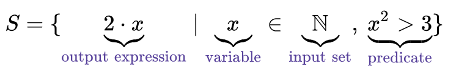
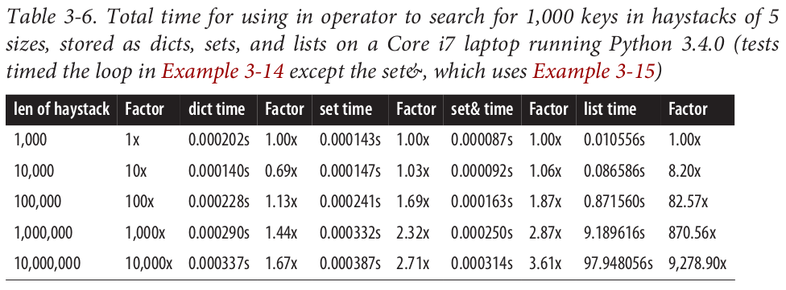
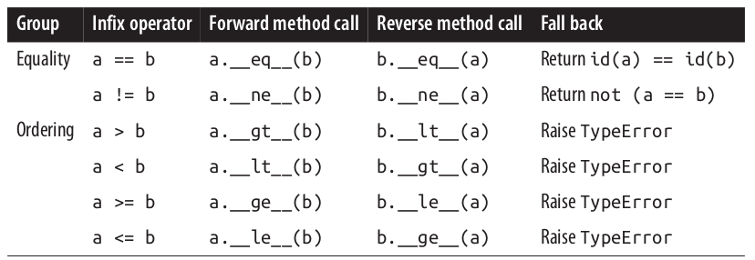
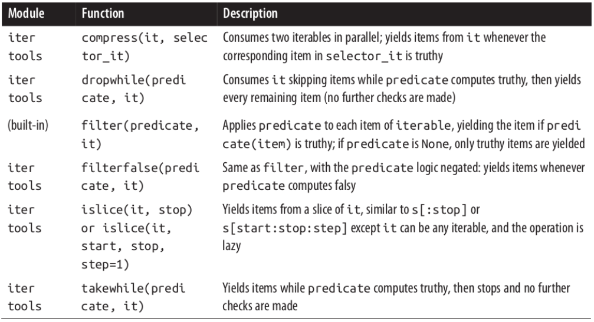
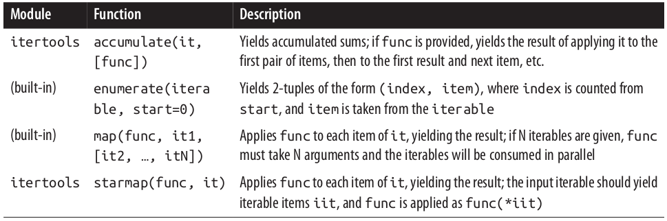
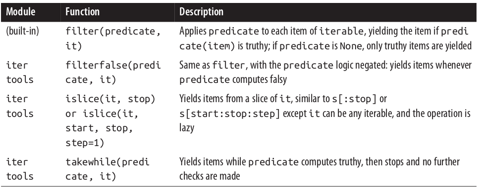
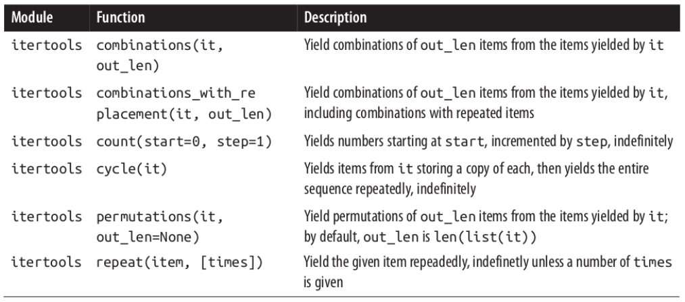
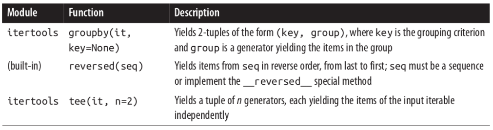
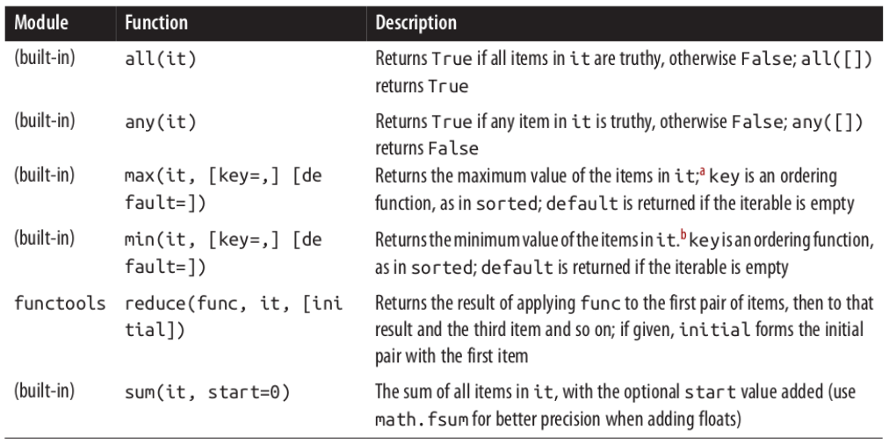

This file contains my personal notes of the excellent book *"Fluent Python", Ramaho (2015)*.

- Chapter 1: **The Python Data Model.**
- [Chapter 2](#chapter-2-data-structures): **Data Structures.** Overview of data structures, list comprehension, generators, unpacking, sorting, binary search, arrays.
- [Chapter 3](#chapter-3-dictionaries-and-sets): **Dictionaries and Sets.** Comparison between Dictionaries, Sets, and Lists. Performance evaluation.
- [Chapter 4](#chapter-4-strings-versus-bytes): **Strings VS Bytes.** How to encode/decode string/bytes.
- [Chapter 5](#chapter-5-functions-as-first-class-objects): **Functions as first-class objects.** Functional programming, Lambda functions, callable operator, annotations.
- Chapter 6: **Design Patterns with First-Class Functions.**
- [Chapter 7](#chapter-7-function-decorators-and-closures): **Function Decorators and Closures.** Definition, stacked and parameterized decorators, local variables, closures.
- [Chapter 8](#chapter-8-object-references-mutability-and-recycling): **Object References, Mutability, and Recycling.** Copies and deep copies, garbage collector, parameters as references.
- [Chapter 9](#chapter-9-pythonic-objects): **Pythonic objects.** Object representations, hashable objects, class private instances, name mangling.
- [Chapter 10](#chapter-10-sequence-hacking-hashing-and-slicing): **Sequence hacking, hashing, and slicing.** Protocols, duck typing, reducing functions (reduce, map-reduce, zip).
- [Chapter 11](http://localhost:6419/python-tips/#chapter-11-interfaces-from-protocols-to-abcs): **Interfaces: From Protocols to ABCs.** Interfaces, defining and subclassing ABCs.
- [Chapter 12](#chapter-12-inheritance-and-subclassing): **Inheritance and subclassing.** Subclassing buil-ins, multiple inheritance, Method Resolution Order (MRO).
- [Chapter 13](#chapter-13-operator-overloading): **Operator Overloading.** Unary, rich comparison, and in-place operators.
- [Chapter 14](#chapter-14-iterables-iterators-and-generators): **Iterables, Iterators, and Generators.** Iterables vs iterators, generators, sequences, lazy vs eager, standard library.
- [Chapter 15](#chapter-15-context-managers-and-else-blocks): **Context Managers and else Blocks.** The else clause, with and context manager, the context manager decorator.
- [Chapter 16](#chapter-16-coroutines): **Coroutines.** Four states, decorators, termination, return values, use of yeld from, use cases.
- [Chapter 17](#chapter-17-concurrency-with-futures): **Concurrency with Futures.** What are futures? Managing the executor map. Examples.
- [Chapter 18](#chapter-18-concurrency-with-asyncio): **Concurrency with asyncio.** Nonblocking, yielding from, examples.

Chapter 2: Data Structures
===========================

Strings and Bytes
-----------------

In Python 3, strings and bytes cannot be combined.

```python
my_string = "abc"
my_byte = b"def"

print(my_string.encode() + my_byte) # it works, string->byte
print(my_string + my_byte.decode()) # it works, byte-> string
print(my_string + my_byte) # error, does not work

```

Iterate a list in reverse
-------------------------

Use the method `reversed(my_list)`. For instance:

```python
my_list=[i for i in range(10)]
for i in reversed(my_list):
    print(i)
```

chr() and ord()
----------------

The built-in function `chr()` turns the input number into a char whereas the function `ord()` does the opposite, turning a given character into its number.

```python
chr(97) # 'a'
ord("a") # 97
```

Print through repr
---------------

The `__repr__` special method is called by the repr built-in to get the string representation of the object for inspection. 

```python
class Vector:
    def __init__(self, x=0, y=0):
        self.x = x
        self.y = y
    def __repr__(self):
        return 'Vector(%r, %r)' % (self.x, self.y)
```

If we did not implement `__repr__` , vector instances would be shown in the console like `<Vector object at 0x10e100070>`. The string returned by `__repr__` should be unambiguous and, if possible, match the source code necessary to re-create the object being represented. That is why our chosen representation looks like calling the constructor of the class (e.g., Vector(3, 4) ).


List comprehension
------------------

The [list comprehension](https://en.wikipedia.org/wiki/List_comprehension) is a syntactic construct available in  Python for creating a list based on existing lists. It follows the form of the mathematical set-builder notation (set comprehension):

<p align="center">

</p>

This translates in the following Python syntax:

```
{expression(variable) for variable in input_set [predicate][, …]}
```

- expression (optional). An output expression producing members of the new set from members of the input set that satisfy the predicate expression.
- variable (required). Variable representing members of an input set.
- input_set (required). Represents the input set.
- predicate (optional). Expression acting as a filter on members of the input set.
- [, …]] (optional). Another nested comprehension. 

Here, a few examples of list comprehension:

```python
all = [x for x in range(10)] # [0, 1, 2, 3, 4, 5, 6, 7, 8, 9]
even = [x for x in range(10) if x%2==0] # [0, 2, 4, 6, 8]
square = [x**2 for x in range(10)] # [0, 1, 4, 9, 16, 25, 36, 49, 64, 81]
even_square = [x**2 for x in range(10) if x%2==0] # [0, 4, 16, 36, 64]
```

List comprehension can be used in more complex ways by nesting other comprehensions. For instance, if we have two lists of different sizes (first list of size N and second of size M) we can combine them to get all the pairs (size NxM):

```python
colors = ['black', 'white']
sizes = ['S', 'M', 'L']
tshirts = [(color, size) for color in colors for size in sizes]
print(tshirts)
#[('black', 'S'), ('black', 'M'),
#('white', 'M'), ('white', 'L')]
```

NOTE: Listcomps are a one-trick pony: they build lists. To fill up other sequence types (e.g. arrays, tuples) a **Generator Expression** is the way to go. The next section is a brief look at genexps in the context of building nonlist sequences.

Generator Expressions
---------------------

Genexps use the same syntax as listcomps, but are enclosed in parentheses rather than brackets:

```python
a = tuple(x for x in range(10))
print(a) # (0, 1, 2, 3, 4, 5, 6, 7, 8, 9)
```

Unpacking
----------

```python
lax_coordinates = (33.9425, -118.408056)
latitude, longitude = lax_coordinates # tuple unpacking
```

An elegant application of tuple unpacking is **swapping** the values of variables without using a temporary variable:

```python
b, a = a, b
```

**Using * to grab excess items.** Defining function parameters with *args to grab arbitrary excess arguments is a classic Python feature. In Python 3, this idea was extended to apply to parallel assignment as well:

```python
a, b, *rest = range(5)
print(a) # 0
print(b) # 1
print(rest) # [2, 3, 4]
```

In the context of parallel assignment, the * prefix can be applied to exactly one variable, but it can appear in any position:

```python
a, *rest, b = range(5)
print(a) # 0
print(rest) # [1, 2, 3]
print(b) # 4
```


Slicing
-------

**Why Slices and Range Exclude the Last Item.** The Pythonic convention of excluding the last item in slices and ranges works well with
the zero-based indexing used in Python, C, and many other languages. Some convenient features of the convention are:

- It's easy to see the length of a slice or range when only the stop position is given: `range(3)` and `my_list[:3]` both produce three items.
- It's easy to compute the length of a slice or range when start and stop are given: just subtract stop - start.
- It's easy to split a sequence in two parts at any index x , without overlapping: simply get `my_list[:x]` and `my_list[x:]`.


This is no secret, but worth repeating just in case: `s[a:b:c]` can be used to specify a stride or step `c`, causing the resulting slice to skip items. The stride can also be negative, returning items in reverse. Three examples make this clear:

```python
s = 'bicycle'
s[::3] # 'bye'
s[::-1] # 'elcycib'
s[::-2] # 'eccb'
```

Sorting
--------

Both list.sort and sorted take two optional, keyword-only arguments: 

- **reverse.** If True, the items are returned in descending order (i.e., by reversing the comparison of the items). Default is False.
- **key.** A one-argument function that will be applied to each item to produce its sorting key. For example, when sorting a list of strings, `key=str.lower`can be used to perform a case-insensitive sort, and `key=len` will sort the strings by character length. The default is the identity function (i.e., the items themselves are compared).

```python
fruits = ['grape', 'raspberry', 'apple', 'banana']
sorted(fruits) # ['apple', 'banana', 'grape', 'raspberry']
fruits # ['grape', 'raspberry', 'apple', 'banana']
sorted(fruits, reverse=True) #['raspberry', 'grape', 'banana', 'apple']
sorted(fruits, key=len) # ['grape', 'apple', 'banana', 'raspberry']
sorted(fruits, key=len, reverse=True) # ['raspberry', 'banana', 'grape', 'apple']
fruits # ['grape', 'raspberry', 'apple', 'banana']
fruits.sort()
fruits # ['apple', 'banana', 'grape', 'raspberry']
```

Using key lets us sort a mixed bag of numbers and number-like strings. You just need to decide whether you want to treat all items as integers or strings:

```python
l = [28, 14, '28', 5, '9', '1', 0, 6, '23', 19]
sorted(l, key=int) # [0, '1', 5, 6, '9', 14, 19, '23', 28, '28']
sorted(l, key=str) # [0, '1', 14, 19, '23', 28, '28', 5, 6, '9']
```

**Note:** the sorting algorithm used in `sorted` and `list.sort` is [Timsort](https://en.wikipedia.org/wiki/Timsort), an adaptive algorithm that switches from insertion sort to merge sort strategies, depending on how ordered the data is. This is efficient because real-world data tends to have runs of sorted items. Timsort was first deployed in CPython, in 2002. Since 2009, Timsort is also used to sort arrays in both standard Java and Android, a fact that became widely known when Oracle used some of the code related to Timsort as evidence of Google infringement of Sun’s intellectual property. Timsort was invented by Tim Peters, a Python core developer so prolific that he is believed to be an AI, the Timbot. You can read about that conspiracy theory in Python Humor.

Bisect: binary search
----------------------

The bisect module offers two main functions: bisect and insort. They use the binary search algorithm to quickly find and insert items in any sorted sequence. The call to `bisect(haystack, needle)` does a binary search for needle in haystack --which must be a sorted sequenc-- to locate the position where needle can be inserted while main‐taining haystack in ascending order. In other words, all items appearing up to that position are less than or equal to needle . You could use the result of `bisect(haystack,needle)` as the index argument to `haystack.insert(index, needle)`. However, using `insort` does both steps, and is faster.

The behavior of bisect can be fine-tuned in two ways:

- First, a pair of optional arguments, `lo` and `hi`, allow narrowing the region in the sequence to be searched when inserting. lo defaults to 0 and hi to the len() of the sequence.
- Second, bisect is actually an alias for `bisect_right`, and there is a sister function called `bisect_left`. Their difference is apparent only when the needle compares equal to an item in the list. The `bisect_right` returns an insertion point after the existing item, and the `bisect_left` returns the position of the existing item, so insertion would occur before

```python
import bisect
haystack = [1, 4, 5, 6, 8, 12, 15, 20, 21, 23, 23, 26, 29, 30]
needle = 22
position = bisect.bisect(haystack, needle) # equivalent to bisect.bisect_right(haystack, needle)
print(position) # 9
position = bisect.bisect_left(haystack, needle) 
print(position) # 9
```

An interesting application of bisect is to perform **table lookups** by numeric values. For example, to convert test scores to letter grades:

```python
def grade(score, breakpoints=[60, 70, 80, 90], grades='FDCBA'):
    i = bisect.bisect(breakpoints, score)
    return grades[i]

scores = [33, 99, 77, 70, 89, 90, 100]
scores_graded = [grade(score) for score in scores] 
print(scores_graded) # ['F', 'A', 'C', 'C', 'B', 'A', 'A']
```

**Inserting with bisect.insort().** Sorting is expensive, so once you have a sorted sequence, it's good to keep it that way. That is why bisect.insort was created. Calling `insort(seq, item)` inserts item into seq so as to keep seq in ascending order. Like bisect , insort takes optional `lo` and `hi` arguments to limit the search to a sub-sequence. There is also an `insort_left` variation that uses `bisect_left` to find insertion points.


Array
-----

Python programmers sometimes overuse the list type because it is so handy (I know I’ve done it). If you are handling lists of numbers, arrays are the way to go. The list type is flexible and easy to use, but depending on specific requirements, there are better options. For example, if you need to store 10 million floating-point values, an array is much more efficient, because an array does not actually hold full-fledged float objects, but only the packed bytes representing their machine values—just like an array in the C language.


```python
from array import array
from random import random
floats = array('d', (random() for i in range(10**7)))
floats[-1] # 0.07802343889111107
fp = open('floats.bin', 'wb')
floats.tofile(fp) # fast saving to file
fp.close()
floats2 = array('d')
fp = open('floats.bin', 'rb')
floats2.fromfile(fp, 10**7) # fast reading from file
fp.close()
floats2[-1] # 0.07802343889111107
floats2 == floats # True
```


Chapter 3: Dictionaries and Sets
=================================

The dict type is not only widely used in our programs but also a fundamental part of the Python implementation. Because of their crucial role, Python dicts are highly optimized. **Hash tables** are the engines behind Python’s high-performance dicts. All mapping types in the standard library use the basic dict in their implementation, so they share the limitation that the **keys must be hashable** (the values need not be hashable, only the keys).

**What is hashable?** Here is part of the definition of hashable from the Python Glossary: 

*"An object is hashable if it has a hash value which never changes during its lifetime (it needs a `__hash__()` method), and can be compared to other objects (it needs an `__eq__()` method). Hashable objects which compare equal must have the same hash value."*

The atomic immutable types ( str , bytes , numeric types) are all hashable. A tuple is hashable only if all its items are hashable.

```python
tt = (1, 2, (30, 40))
hash(tt) # hashabel: 8027212646858338501
tl = (1, 2, [30, 40])
hash(tl) # not hashable: error
```

Dictionary declaration
-------------

There are various ways a Dictionary cab be declared. Here, some examples:

```python
a = dict(one=1, two=2, three=3)
b = {'one': 1, 'two': 2, 'three': 3}
c = dict(zip(['one', 'two', 'three'], [1, 2, 3]))
d = dict([('two', 2), ('one', 1), ('three', 3)])
e = dict({'three': 3, 'one': 1, 'two': 2})
a == b == c == d == e # True
```


Dictionary Comprehensions
-------------------

Comprehension can be used with both dictionaries and sets. Here, an example:

```python
DIAL_CODES = [(86, 'China'),(91, 'India'),(1, 'United States'),
              (62, 'Indonesia'),(55, 'Brazil'),(92, 'Pakistan'),
              (880, 'Bangladesh'),(234, 'Nigeria'),(7, 'Russia'),
              (81, 'Japan'),]

country_code = {country: code for code, country in DIAL_CODES}

print(country_code)
#{'China': 86, 'India': 91, 'Bangladesh': 880, 'United States': 1,
#'Pakistan': 92, 'Japan': 81, 'Russia': 7, 'Brazil': 55, 'Nigeria':
#234, 'Indonesia': 62}
```

Search in a dictionary
-----------------------

A search like `k in my_dict.keys()` is **efficient** in Python 3 even for very large mappings because `dict.keys()` returns a view, which is similar to a set, and containment checks in sets are as fast as in dictionaries. Details are documented in the “Dictionary” view objects section of the documentation. In Python 2, `dict.keys()` returns a list, so our solution also works there, but it is not efficient for large dictionaries, because `k in my_list` must scan the list.


Sets
------

A set is a collection of unique objects. Set elements must be hashable. The set type is not hashable. Like dictionary they allow fast access to elements but they do not use a key-value mechanism. They can be considered perfect for membership checks, replacing those dictionaries where a dummy value was previously used. Sets can be declared this way:

```python
my_set={1,2,3,4}
print(my_set) # {1,2,3,4}
```

A basic use case is removing duplication:

```python
l = ['spam', 'spam', 'eggs', 'spam']
set(l) # {'eggs', 'spam'}
list(set(l)) # ['eggs', 'spam']
```

The set types implement the **essential set operations** as infix operators. Given two sets `a` and `b` , 

- `a | b` computes the union.
- `a & b` computes the intersection.
- `a - b` computes the difference (relative complement).
- `a ^ b` computes the symmetric difference (complement of the intersection `a & b`).
- `a < b` returns True if `a` is a subset of `b` (likewise `a > b` returns True if superset).

Smart use of set operations can reduce both the line count and the runtime of Python programs, at the same time making code easier to read and reason about—by removing loops and lots of conditional logic. For example, imagine you have a large set of email addresses (the haystack ) and a smaller set of addresses (the needles ) and you need to count how many needles occur in the haystack. Thanks to set intersection (the & operator) you can code that in a simple line:

```python
# needles and haystack are sets
found = len(needles & haystack) # first way
found = len(needles.intersection(haystack)) # second way
```

The notation for **set comprehension** can also be used with sets.


Comparing dict, set, and list
-----------------------------

A hash table is a sparse array (i.e., an array that always has empty cells). In standard data
structure texts, the cells in a hash table are often called “buckets.” In a dict hash table,
there is a bucket for each item, and it contains two fields: a reference to the key and a
reference to the value of the item.

**Dictionary.** To fetch the value at `my_dict[search_key]`, Python calls `hash(search_key)` to obtain the hash value of `search_key` and uses the least significant bits of that number as an offset to look up a bucket in the hash table (the number of bits used depends on the current size of the table). If the found bucket is empty, `KeyError` is raised. Otherwise, the found bucket has an item (a `found_key:found_value` pair) and then Python checks whether `search_key == found_key`. If they match, that was the item sought: `found_value` is returned. If `search_key` and `found_key` do not match, this is a hash collision. In order to resolve the collision, the algorithm then takes different bits in the hash, massages them in a particular way, and uses the result as an offset to look up a different bucket. Python may determine that the hash table is too crowded and rebuild it to a new location with more room. As the hash table grows, so does the number of hash bits used as bucket offsets, and this keeps the rate of collisions low. This implementation may seem like a lot of work, but even with millions of items in a dict, many searches happen with no collisions, and the average number of collisions per search is between one and two. Under normal usage, even the unluckiest keys can be found after a handful of collisions are resolved.

**Set.** Similarly to dictionaries, set types are also implemented with a hash table, except that each bucket holds only a reference to the element (as if it were a key in a dict, but without a value to go with it). In fact, before set was added to the language, we often used dictionaries with dummy values just to perform fast membership tests on the keys.

**List.** They contain references to elements. However, differently from dictionaries and sets they do not use a hash table for mapping. It follows that retrieving a particular element from a list by using `in` has cost dependent from the length of the list (it necessary to iterate all the elements).

<p align="center">

</p>


Chapter 4: Strings versus Bytes
=============================

The concept of *string* is simple enough: a string is a sequence of characters. The problem lies in the definition of *character*. In 2015, the best definition of *character* we have is a Unicode character. Accordingly, the items you get out of a Python 3 `str` are Unicode characters, just like the items of a unicode object in Python 2, and not the raw bytes you get from a Python 2 `str`.

**Unicode standard.** It explicitly separates the identity of characters from specific byte representations. The identity of a character is a number from 0 to 1,114,111 (base 10), shown in the Unicode standard as 4 to 6 hexadecimal digits with a `U+` prefix. For example, the code point for the letter `A` is `U+0041`.

**Encoding.** An encoding is an algorithm that converts code points to byte sequences and vice versa. The actual bytes that represent a character depend on the encoding in use. The code point for A (`U+0041`) is encoded as the single byte `\x41` in the UTF-8 encoding, or as the bytes `\x41\x00` in UTF-16LE encoding. As another example, the Euro sign (`U+20AC`) becomes three bytes in UTF-8 (`\xe2\x82\xac`), but in UTF-16LE it is encoded as two bytes (`\xac\x20`). Converting from code points to bytes is encoding; converting from bytes to code points is decoding. Since byte sequences can be cryptic for humans, while Unicode `str` objects are "human" readable, it makes sense that we `decode` bytes to strings to get human-readable text, and we `encode` strings to bytes for storage or transmission.

```python
s = 'café'
len(s) # 4
b = s.encode('utf8') # b'caf\xc3\xa9'
# bytes literals start with a b prefix
# bytes b has five bytes
# “é” encoded as two bytes in UTF-8
len(b) # 5
b.decode('utf8') # 'café'
```

You see `b'caf\xc3\xa9'` with the first three bytes `b'caf'` in the printable ASCII range, the last two not. Three different displays are used, depending on each byte value:

1. For bytes in the printable ASCII range, from `space` to `~`, the ASCII character itself is used.
2. For bytes corresponding to `tab`, `newline`, `carriage return`, and `\` , the escape sequences `\t` , `\n` , `\r` , and `\\` are used.
3. For every other byte value, a hexadecimal escape sequence is used (e.g., `\x00` is the null byte).


Bytes
------

We can build `bytes` from a `str`, given an encoding. Each item of `bytes` is an integer in range(256). Slices of bytes are also bytes, even slices of a single byte. There is no literal syntax for `bytearray`: they are shown as `bytearray()` with a bytes literal as argument. A slice of `bytearray` is also a `bytearray`.

```python
cafe = bytes('café', encoding='utf_8') # b'caf\xc3\xa9'
cafe[0] # 99
cafe[:1] # b'c'
cafe_arr = bytearray(cafe) # bytearray(b'caf\xc3\xa9')
cafe_arr[-1:] # bytearray(b'\xa9')
```

The fact that `my_bytes[0]` retrieves an int but `my_bytes[:1]` returns a bytes object of length 1 should not be surprising. The only sequence type where `s[0] == s[:1]` is the `str` type. Although practical, this behavior of `str` is exceptional. For every other sequence, `s[i]` returns one item, and `s[i:i+1]` returns a sequence of the same type with the `s[1]` item inside it.


You can use familiar string methods like `endswith`, `replace`, `strip`, `translate`, `upper` , and dozens of others with binary sequences. The regular expression functions in the `re` module also work on binary sequences (if the regex is compiled from a binary sequence instead of a `str`).

Basic Encoders/Decoders
-----------------------

The Python distribution bundles more than 100 codecs (encoder/decoder) for text to byte conversion and vice versa. Each codec has a name, like 'utf_8' , and often aliases, such as 'utf8' , 'utf-8' , and 'U8' , which you can use as the encoding argument. The following are a representative set of common encodings:

- latin1 a.k.a. iso8859_1. Important because it is the basis for other encodings, such as cp1252 and Unicode itself (note how the latin1 byte values appear in the cp1252 bytes and even in the code points).
- cp1252. A latin1 superset by Microsoft, adding useful symbols like curly quotes and the € (euro); some Windows apps call it “ANSI,” but it was never a real ANSI standard.
- cp437. The original character set of the IBM PC, with box drawing characters. Incompatible with latin1 , which appeared later.
- gb2312. Legacy standard to encode the simplified Chinese ideographs used in mainland China; one of several widely deployed multibyte encodings for Asian languages.
- utf-8. The most common 8-bit encoding on the Web, by far; 3 backward-compatible with ASCII (pure ASCII text is valid UTF-8).
- utf-16le. One form of the UTF-16 16-bit encoding scheme; all UTF-16 encodings support code points beyond `U+FFFF` through escape sequences called "surrogate pairs".


```python
for codec in ['latin_1', 'utf_8', 'utf_16']:
    print(codec, 'El Niño'.encode(codec), sep='\t')
# b'El Ni\xf1o'
# b'El Ni\xc3\xb1o'
# b'\xff\xfeE\x00l\x00 \x00N\x00i\x00\xf1\x00o\x00'
```

WARNING: code that has to run on multiple machines or on multiple occasions should never depend on encoding defaults. Always pass an explicit `encoding` argument when opening text files `fp = open('cafe.txt', 'w', encoding='utf_8')`, because the default may change from one machine to the next, or from one day to the next. On GNU/Linux and OSX all of these encodings are set to UTF-8 by default, and have been for several years, so I/O handles all Unicode characters. On Windows, not only are different encodings used in the same system, but they are usually codepages like 'cp850' or 'cp1252' that support only ASCII with 127 additional characters that are not the same from one encoding to the other. Therefore, Windows users are far more likely to face encoding errors unless they are extra careful.


Coping with Unicode Encode and Decode Errors
-----------------------------


**Encode errors**

Most non-UTF codecs handle only a small subset of the Unicode characters. When converting text to bytes, if a character is not defined in the target encoding, UnicodeEncodeError will be raised, unless special handling is provided. Not every byte holds a valid ASCII character, and not every byte sequence is valid UTF-8 or UTF-16; therefore, when you assume one of these encodings while converting a binary sequence to text, you will get a `UnicodeDecodeError` if unexpected bytes are found. 


The parameter `errors` can be used for handling **encoding errors**:

- **ignore.** The `errors='ignore'` handler silently skips characters that cannot be encoded (usually a bad idea).
- **replace.** The `errors='replace'` substitutes unencodable characters with `'?'` (data is lost but users will know).
- **xmlcharrefreplace.** The `errors='xmlcharrefreplace'` replaces unencodable characters with an XML entity.


```python
city = 'São Paulo'
city.encode('utf_8') # b'S\xc3\xa3o Paulo'
city.encode('cp437', errors='ignore') # b'So Paulo'
city.encode('cp437', errors='replace') # b'S?o Paulo'
city.encode('cp437', errors='xmlcharrefreplace') # b'S&#227;o Paulo'
city.encode('cp437') # UnicodeEncodeError: 'charmap' codec can't encode character '\xe3' [...]
```

**Decode errors**

Not every byte holds a valid ASCII character, and not every byte sequence is valid UTF-8 or UTF-16; therefore, when you assume one of these encodings while converting a binary sequence to text, you will get a `UnicodeDecodeError` if unexpected bytes are found. Be careful, many 8-bit encodings like 'cp1252' , 'iso8859_1' , and 'koi8_r' are able to decode any stream of bytes without errors. If your program assumes the wrong 8-bit encoding, it will silently decode garbage.

```
octets = b'Montr\xe9al'
octets.decode('cp1252') # 'Montréal'
octets.decode('iso8859_7') # 'Montrιal'
octets.decode('koi8_r') # 'MontrИal'
octets.decode('utf_8') # UnicodeDecodeError: 'utf-8' codec can't decode byte 0xe9 [...]
octets.decode('utf_8', errors='replace') # 'Montr�al'
```

Using `replace` error handling, the `\xe9` is replaced by `�` (code point `U+FFFD`), the official Unicode REPLACEMENT CHARACTER intended to represent unknown characters.

Errors when loading a python file
---------------------------------

UTF-8 is the default source encoding for Python 3, just as ASCII was the default for Python 2 (starting with 2.5). If you load a .py module containing non-UTF-8 data and no encoding declaration, you get a message like this:

```
SyntaxError: Non-UTF-8 code starting with '\xe1' in file ola.py on line
1, but no encoding declared; see http://python.org/dev/peps/pep-0263/
for details
```

Because UTF-8 is widely deployed in GNU/Linux and OSX systems, a likely scenario is opening a `.py` file created on Windows with cp1252 . To fix this problem, add a magic coding comment at the top of the file:

```python
# coding: cp1252
print('Olá, Mundo!')
```

Now that Python 3 source code is no longer limited to ASCII and defaults to the excellent UTF-8 encoding, the best “fix” for source code in legacy encodings like 'cp1252' is to convert them to UTF-8 and not bother with the coding comments. Python 3 allows non-ASCII identifiers in source code:

```python
ação = 'PBR' # ação = stock
ε = 10**-6 # ε = epsilon
```

However, some people dislike the idea. The most common argument to stick with ASCII identifiers is to make it easy for everyone to read and edit code.


Chapter 5: Functions as first-class objects
========================================

In computer science, [functional programming](https://en.wikipedia.org/wiki/Functional_programming) is a programming paradigm where programs are constructed by applying and composing functions. It is a declarative programming paradigm in which function definitions are trees of expressions that each return a value, rather than a sequence of imperative statements which change the state of the program. In functional programming, functions are treated as first-class citizens, meaning that they can be bound to names (including local identifiers), passed as arguments, and returned from other functions, just as any other data type. This allows programs to be written in a declarative and composable style, where small functions are combined in a modular manner. 

Functions in Python
--------------------

Functions in Python are first-class objects. Programming language theorists define a “first-class object” as a program entity that can be:

- Created at runtime
- Assigned to a variable or element in a data structure
- Passed as an argument to a function
- Returned as the result of a function

```python
def factorial(n):
    ''' Documentation of the factorial function.

    It returns n!.
    '''
    return 1 if n<2 else n*factorial(n-1) # -> iterative method
```

Note that it is possible to access the documentaiton of the method by typing `factorial.__doc__` which prints the information about the method. We can also pass factorial as an argument to map . The **map function** returns an iterable where each item is the result of the application of the first argument (a function) to succesive elements of the second argument (an iterable), range(10) in this example.

```python
list(map(factorial, range(11)))
# [1, 1, 2, 6, 24, 120, 720, 5040, 40320, 362880, 3628800]
```

Higher-Order Functions
----------------------

A function that takes a function as argument or returns a function as the result is a higher-order function. One example is `map`, another is the builtin function `sorted`. For instance, we can combine `map` with the previously created method `factorial` and give the result as input to `sorted`:

```python
sorted(map(factorial, range(5)))
```

We can create a custom function to reverse the number and chain it with `map` and `sorted`. We can also pass the function as the `key` argument to the `sorted` method (any one-argument function can be used as the key). In this case the method will not change the elements of the input list but will use the method as sorting criterium:

```python
def reverse(number):
    string = str(number)
    string = string[::-1]
    return int(string)

sorted(map(reverse, range(1000,1010)))
# [1, 1001, 2001, 3001, 4001, 5001, 6001, 7001, 8001, 9001]
sorted([1234, 5678, 4321, 8765])
# [1234, 4321, 5678, 8765]
sorted([1234, 5678, 4321, 8765], key=reverse)
# [4321, 1234, 8765, 5678] elements are not changed only ordered based on 'reverse'
```

Replacements for map, filter, and reduce
----------------------------------------

Starting with Python 3.0, `reduce` is not a built-in. The `map` and `filter` functions are still built-in in Python 3, but since the introduction of list comprehensions and generator expressions, they are not as important since we can replace a verbose map or filter via a simpler list comprehension. The following two lines of code do the same thing:


```python
list(map(factorial, range(6)))
[factorial(n) for n in range(6)]
```

Similarly, for the filter function:

```python
list(map(factorial, filter(lambda n: n % 2, range(6))))
[factorial(n) for n in range(6) if n % 2]
```


Anonymous Functions
-------------------

The **lambda** keyword creates an anonymous function within a Python expression. However, the simple syntax of Python limits the body of lambda functions to be pure expressions. In other words, the body of a lambda cannot make assignments or use any other Python statement such as while, try, etc. The best use of anonymous functions is in the context of an argument list. For instance, we can sort an array of strings in reverse order writing:


```python
fruits = ['strawberry', 'fig', 'apple', 'cherry', 'raspberry', 'banana']
sorted(fruits)
# ['apple', 'banana', 'cherry', 'fig', 'raspberry', 'strawberry']
sorted(fruits, key=lambda word: word[::-1])
# ['banana', 'apple', 'fig', 'raspberry', 'strawberry', 'cherry']
```

WARNING: Outside the limited context of arguments to higher-order functions, anonymous functions are rarely useful in Python. The syntactic restrictions tend to make nontrivial lambdas either unreadable or unworkable.

Callable operator `()`
----------------------

The callable operator `()` is used by a variety of entities in Python. Given the variety of existing callable types in Python, the safest way to determine whether an object is callable is to use the `callable()` built-in. Here is given an overview of the various callable types:

- User-defined functions. Created with def statements or lambda expressions.
- Built-in functions. A function implemented in C (for CPython), like len or time.strftime .
- Built-in methods. Methods implemented in C, like `dict.get` .
- Methods. Functions defined in the body of a class.
- Classes. When invoked, a class runs its `__new__` method to create an instance, then `__init__` to initialize it, and finally the instance is returned to the caller. Because there is no new operator in Python, calling a class is like calling a function. (Usually calling a class creates an instance of the same class, but other behaviors are possible by overriding `__new__`.
- Class instances. If a class defines a `__call__` method, then its instances may be invoked as functions.
- Generator functions. Functions or methods that use the `yield` keyword. When called, generator functions return a generator object.


User-Defined Callable Types
----------------------------

Not only are Python functions real objects, but arbitrary Python objects may also be made to behave like functions. Implementing a `__call__` instance method is all it takes.

```python
import random
class BingoCage:
    def __init__(self, items):
        self._items = list(items)
        random.shuffle(self._items)
    def pick(self):
        try:
            return self._items.pop()
        except IndexError:
            raise LookupError('pick from empty BingoCage')
    def __call__(self):
        return self.pick()

bingo = BingoCage(range(3))
bingo.pick() # 1
bingo() # 0
callable(bingo) # True
```

Using the method `__call__` the class `BingoCage` beomes callable, meaning that one can use the shorthand `bingo()` in place of `bingo.pick()`

Function introspection
----------------------

In computer programming, introspection is the ability to determine the type of an object at runtime. It is one of Python’s strengths. Everything in Python is an object and we can examine those objects. Python ships with a few built-in functions and modules to help us.

A full list of attributes for the function object can be retrieved using `dir()` as follows:

```python
def dummy(): 
    pass

dir(dummy)
# ['__annotations__', '__call__', '__class__', '__closure__', '__code__',
# '__defaults__', '__delattr__', '__dict__', '__dir__', '__doc__', '__eq__',
# '__format__', '__ge__', '__get__', '__getattribute__', '__globals__',
# '__gt__', '__hash__', '__init__', '__kwdefaults__', '__le__', '__lt__',
# '__module__', '__name__', '__ne__', '__new__', '__qualname__', '__reduce__',
# '__reduce_ex__', '__repr__', '__setattr__', '__sizeof__', '__str__',
# '__subclasshook__']
```

The `__dict__` attribute can be used to store user-attributes assigned to it. This is useful as a primitive form of annotation. Assigning arbitrary attributes to functions is not a very common practice in general.

Only a subset of these attributes is **only** associated to functions:

```python
# ['__annotations__', '__call__', '__closure__', '__code__', '__defaults__',
# '__get__', '__globals__', '__kwdefaults__', '__name__', '__qualname__']
```


<p align="center">

</p>


Parameter handling
------------------

One of the best features of Python functions is the extremely flexible parameter handling mechanism, enhanced with keyword-only arguments in Python 3. Closely related are the use of `*` and `**` to explode iterables and mappings into separate arguments when we call a function.

```python
my_method(first_param, *to_tuple_params, third_param=None, **attrs):
    pass
```

Any number of arguments after the first are captured by `*to_tuple_params` as a tuple. The `third_param` parameter can only be passed as a keyword argument. Keyword arguments not explicitly named in the tag signature are captured by `**attrs` as a dict .

Keyword-only arguments are a new feature in Python 3. In the example, the `third_param` parameter can only be given as a keyword argument (it will never capture unnamed positional arguments). To specify keyword-only arguments when defining a function, name them after the argument prefixed with `*`. If you don’t want to support variable positional arguments but still want keyword-only arguments, put a `*` by itself in the signature, like this:

```python
def f(a, *, b):
    return a, b

f(1, b=2) # (1, 2)
```

Keyword-only arguments do not need to have a default value: they can be mandatory, like `b` in the previous example.


Function Annotations
---------------------

Python 3 provides syntax to attach metadata to the parameters of a function declaration and its return value. Each argument in the function declaration may have an annotation expression preceded by `:`. If there is a default value, the annotation goes between the argument name and the `=` sign. To annotate the return value, add `->` and another expression between the `)` and the `:` at the tail of the function declaration. The expressions may be of any type. The most common types used in annotations are classes, like `str` or `int` , or strings. Consider this example:

```python
def clip(text:str, max_len:'int > 0'=80) -> str:
    """Return text clipped at the last space before or after max_len
    """
    pass
```

Note how the annotation of the first parameter is `str` showing to the user that it should be a string, the annotation of the second parameter is `'int > 0'` (followed by a default value `80`). The returns value is marked with `->`, in the example it shows to the user that the returned value should be a `str` objects.

IMPORTANT: No processing is done with the annotations. They are merely stored in the `__annotations__` attribute of the function, a dict. No checks, enforcement, validation, or any other action is performed. In other words, annotations have no meaning to the Python interpreter. They are just metadata.


Chapter 7: Function Decorators and Closures
========================================

Function decorators let us *“mark”* functions in the source code to enhance their behavior in some way. This is powerful stuff, but mastering it requires understanding closures.

Decorators
----------

A decorator is a *callable* that takes another function as argument (the decorated function). The decorator may perform some processing with the decorated function, and returns it or replaces it with another function or callable object.
Assuming an existing decorator named decorate , this code:

```python
@decorate
def target():
    print('running target()')
```

Has the same effect as writing this:

```python
def target():
    print('running target()')
    target = decorate(target)
```

The end result is the same: at the end of either of these snippets, the `target` name does not necessarily refer to the original target function, but to whatever function is returned by `decorate(target)`. Strictly speaking, decorators are just syntactic sugar. You can always simply call a decorator like any regular callable, passing another function. Sometimes that is actually convenient, especially when doing metaprogramming (changing program behavior at runtime). Here another example:


```python
import time

def clock(func):
    def clocked(*args): #
        start = time.time()
        result = func(*args) #
        elapsed = time.time() - start
        print('[%0.8fs] -> %r' % (elapsed, result))
        return result
    return clocked

@clock
def factorial(n):
    return 1 if n < 2 else n*factorial(n-1) # -> iterative
    
# Calling factorial(8) actually does this:
#factorial = clock(factorial)
```

To summarize: the first crucial fact about decorators is that they have the power to replace the decorated function with a different one. The second crucial fact is that they are executed immediately when a module is loaded.

Consider this example:

```python
def deco(func):
    """deco() returns its inner function object
    """
    def inner():
        print('running inner()')
    return inner

@deco
def target():
    """target() is decorated by deco
    """
    print('running target()')

# Invoking the decorated target actually runs inner()
target() # 'running inner()'
# target is a now a reference to inner
target # <function deco.<locals>.inner at 0x10063b598>
```

Here is a more concrete example. Let's suppose we have a certain number of promotions in our e-commerce. Each promotion is a separate function. We want a special function called `best_promotion()` to check all the available promotion functions and return the best one for a given user. One way to do this would be to store all the promotions in a list `promos` and then pass this list to `best_promotion()`. However, this strategy would be problematic if at some point a new promotion is added and we forget to add it to the list. A different way to solve the issue is by using decorators to automatically fill the list:

```python
promos = []

def promotion(promo_func):
    promos.append(promo_func)
    return promo_func

@promotion
def fidelity(order):
    """5% discount
    """
    return 5

@promotion
def bulk_item(order):
    """10% discount
    """
    return 10

@promotion
def large_order(order):
    """7% discount
    """
    return 7

def best_promo(order):
    """Select best discount available
    """
    return max(promo(order) for promo in promos)
```

When the module is loaded, and each single promotion function is allocated, the decorator `@promotion` will invoke the associated function `promotion()` passing the single promotion as input. Then the `promotion()` function will populate the list `promos`. The advantages of this approach are many. The `@promotion` decorator highlights the purpose of the decorated function, and also makes it easy to temporarily disable a promotion: just comment out the decorator. Promotional discount strategies may be defined in other modules, anywhere in the system, as long as the `@promotion` decorator is applied to them.


**Stacked decorators.** When two decorators `@d1` and `@d2` are applied to a function `f` in that order, the result is the same as `f = d1(d2(f))`.

**Parameterized Decorators.** This is a bit hacky (see the book for the code). When parsing a decorator in source code, Python takes the decorated function and passes it as the first argument to the decorator function. So how do you make a decorator accept other arguments? The answer is: make a decorator factory that takes those arguments and returns a decorator, which is then applied to the function to be decorated.

Closures
---------

**Local variables**

To understand closures first we need to give a look at how local variables are allocated in Python. Consider this example:

```python
b = 6

def f2(a):
    print(a)
    print(b)
    b = 9
    
f2(3)
# print(a) -> 3
# print(b) -> UnboundLocalError: local variable 'b' referenced before assignment
```

This snippet generates an error. It may seems strange at first, because functions can access variables that have been declared outside their body, like `b=6` in this example. However, when Python compile this code it will see that `b` is present inside the body of `f2()` and by design this means that the variable is local. Note that this is a design choice. The advantage is to avoid overwriting a global variable by mistake inside a function. In other words, when we create a new function we do not have to worry if the variable names we are using internally already exist somewhere. Global variable can be read inside a function but not overwritten.

Note that using the keyword `global` it is possible to avoid this behaviour and directly act on the global variable `b` as follows:

```python
b = 6

def f2(a):
    print(a)
    global b
    print(b)
    b = 9
    
f2(3)
# print(a) -> 3
# print(b) -> 6
b
# 9
```

In the example `global b` is used before any attempt to access `b`. This tells the function that the variable `b` inside the scope is the global one. It follows that every time we modify `b` inside the function we are actually modifying the global `b`.


**Closures**

A closure is a function with an extended scope that encompasses nonglobal variables referenced in the body of the function but not defined there. It does not matter whether the function is anonymous or not; what matters is that it can access nonglobal variables that are defined outside of its body. To summarize: a closure is a function that retains the bindings of the free variables that exist when the function is defined, so that they can be used later when the function is invoked and the defining scope is no longer available. Note that the only situation in which a function may need to deal with external variables that are nonglobal is when it is nested in another function.

Consider an `avg` function to compute the mean of an ever-increasing series of values. For example, the average closing price of a commodity over its entire history. Every day a new price is added, and the average is computed taking into account all prices so far. Starting with a clean slate, this is how avg could be used:

```python
avg(10)
# 10.0
avg(11)
# 10.5
avg(12)
# 11.0
```

Where does `avg` come from, and where does it keep the history of previous values? 

The **trivial solution** would be to use a `__call__` method inside a class to make the object callable. As explained in [Chapter 5](#chapter-5-functions-as-first-class-objects) this makes a new instance of the `Average()` class callable. Let's see:

```python
class Averager():
    def __init__(self):
        self.series = []
    def __call__(self, new_value):
        self.series.append(new_value)
        total = sum(self.series)
        return total/len(self.series)
        
avg = Averager()
avg(10)
# 10.0
 avg(11)
# 10.5
avg(12)
# 11.0
```

The **closure solution** to the same problem is slightly different. 


```python
def make_averager():
    series = []
    
    def averager(new_value):
        series.append(new_value)
        total = sum(series)
        return total/len(series)
    return averager

avg = make_averager()
avg(10)
# 10.0
 avg(11)
# 10.5
avg(12)
# 11.0
```

It’s obvious where the avg of the `Averager()` class keeps the history: the `self.series` instance attribute. Where does the `avg` function in the second example find the series? Note that `series` is a local variable of `make_averager` because the initialization `series = []` happens in the body of that function. But when `avg(10)` is called, `make_averager` has already returned, and its local scope is long gone. Within `averager`, `series` is a **free variable**. This is a technical term meaning a variable that is not bound in the local scope.

In Python the closure free variables are stored in `__closure__` with each item in `avg.__closure__` corresponding to a name in `avg.__code__.co_freevars`. These items are cells, and they have an attribute called `cell_contents` where the actual value can be found.

```python
avg.__code__.co_freevars 
# ('series',)
avg.__closure__
# (<cell at 0x107a44f78: list object at 0x107a91a48>,)
avg.__closure__[0].cell_contents
# [10, 11, 12]
```


Chapter 8: Object References, Mutability, and Recycling
========================================

Difference between `==` and `is`
--------------------------------

There is a difference between `==` and `is` in Python. The `==` operator compares the values of objects (the data they hold), while `is` compares their identities. We often care about values and not identities, so `==` appears more frequently than `is` in Python code.

Variables in Python are sort of labels and not boxes. Consider an example where we create an object dictionary and assign to it two different labels `alex` and `charles`:

```python
alex = {'name': 'Charles L. Dodgson', 'born': 1832, 'balance': 950}
charles = alex

alex == charles # True
alex is charles # True
```

Note that both last two lines evaluate to `True`. The objects compare equal when using `==`, because of the `__eq__` implementation in the dict class. The `is` operator is faster than `==`, because it cannot be overloaded. In other words, `a == b` is syntactic sugar for `a.__eq__(b)`. The snippet above is an examples of **aliases**, since `charles` and `alex` are **alias**. Let's consider now a different example where we create a separate object for `charles` but with the same content of `alex`:

```python
alex = {'name': 'Charles L. Dodgson', 'born': 1832, 'balance': 950}
charles = {'name': 'Charles L. Dodgson', 'born': 1832, 'balance': 950}

alex == charles # True
alex is charles # False
```

The comparison `alex == charles` still evaluates to `True` since the content of the objects is the same. However, the last line `alex is charles` now evaluate to False, since `alex` and `charles` are two different objects.


Mutability
----------

The concept of mutability can be tricky sometimes. Consider **tuples**. Tuples, like most Python collections—lists (dicts, sets, etc.) hold references to objects. If the referenced items are mutable, they may change even if the tuple itself does not. In other words, the immutability of tuples really refers to the physical contents of the tuple data structure (i.e., the references it holds), and does not extend to the referenced objects. Here an example:

```python
t1 = (1, 2, [30, 40])
id(t1[-1])
# 4302515784
t1[-1].append(99) # (1, 2, [30, 40, 99])
id(t1[-1])
# 4302515784
```

The reference to the list inside the tuple did not change, but the content of the list itself changed. This is because the tuple is keeping references to objects and those references do not change.


Copies are shallow by default
-----------------------------

The easiest way to copy a list (or most built-in mutable collections) is to use the built-in constructor for the type itself. For example:

```python
l1 = [3, [55, 44], (7, 8, 9)]
l2 = list(l1) # creates a copy of l1
l2 == l1
# True
l2 is l1
# False
```

In this example the copies are equal, but refer to two different objects. For lists and other mutable sequences, the shortcut `l2 = l1[:]` also makes a copy.

IMPORTANT: However, using the constructor `list()` or `[:]` produces a **shallow copy** (i.e., the outermost container is duplicated, but the copy is filled with references to the same items held by the original container). This saves memory and causes no problems if all the items are immutable. But if there are mutable items (e.g. list of lists), this may lead to unpleasant surprises. Consider this example:


```python
l1 = [3, [66, 55, 44], (7, 8, 9)]
l2 = list(l1) # shallow copy

l1.append(100) # appending 100 to l1 has no effect on l2
l1[1].remove(55) # removing 55 from l1[1] affects l2
print('l1:', l1)
# l1: [3, [66, 44], (7, 8, 9), 100]
print('l2:', l2)
# l2: [3, [66, 44], (7, 8, 9)]

l2[1] += [33, 22] # += changes the list in place (affects l1)
l2[2] += (10, 11) # += on a tuple creates a new tuple (no effect on l1)
print('l1:', l1)
# l1: [3, [66, 44, 33, 22], (7, 8, 9), 100]
print('l2:', l2)
# l2: [3, [66, 44, 33, 22], (7, 8, 9, 10, 11)]
```

Deep copies
------------

The `copy` module provides the `deepcopy` and `copy` functions that return deep and shallow copies of arbitrary objects. Note that making deep copies is not a simple matter in the general case. Objects may have cyclic references that would cause a naïve algorithm to enter an infinite loop. The `deepcopy` function remembers the objects already copied to handle cyclic references
gracefully. Also, a deep copy may be too deep in some cases. For example, objects may refer to external resources or singletons that should not be copied. You can control the behavior of both copy and deepcopy by implementing the `__copy__()` and `__deepcopy__()` special methods. To illustrate the use of `copy()` and `deepcopy()` consider this example:

```python
class Bus:
    def __init__(self, passengers=None):
        if passengers is None: self.passengers = []
        else: self.passengers = list(passengers)
    def pick(self, name):
        self.passengers.append(name)
    def drop(self, name):
        self.passengers.remove(name)
        
import copy
bus1 = Bus(['Alice', 'Bill', 'Claire', 'David'])
bus2 = copy.copy(bus1)
bus3 = copy.deepcopy(bus1)
id(bus1), id(bus2), id(bus3)
# (4301498296, 4301499416, 4301499752)

bus1.drop('Bill')
bus2.passengers # ['Alice', 'Claire', 'David']
id(bus1.passengers), id(bus2.passengers), id(bus3.passengers)
# (4302658568, 4302658568, 4302657800)
bus3.passengers # ['Alice', 'Bill', 'Claire', 'David']
```


Function parameters are references
----------------------------------

The only mode of parameter passing in Python is **call by sharing**. Call by sharing means that each formal parameter of the function gets a copy of each reference in the arguments. In other words, the parameters inside the function become aliases of the actual arguments. The result of this scheme is that a function may change any mutable object passed as a parameter, but it cannot change the identity of those objects (i.e., it cannot altogether replace an object with another). Consider this example:

```python
def f(a, b):
    a += b
    return a

# Numbers are not changed
x = 1
y = 2
f(x, y) # 3
x, y # (1, 2)

# Lists are changed
# += changes the list in-place
a = [1, 2]
b = [3, 4]
f(a, b) # [1, 2, 3, 4]
a, b # ([1, 2, 3, 4], [3, 4])

# Tuples are not changed
# += create a new tuple
t = (10, 20)
u = (30, 40)
f(t, u) # (10, 20, 30, 40)
t, u # ((10, 20), (30, 40))
```

Why you should never have mutables as default parameters
--------------------------------------------------------

In the example of the bus we wrote `def __init__(self, passengers=None)` initializing the `passengers` list to `None`. Behind this there is a very important reason. You may feel smart, and directly initialize the list to an empty list like `def __init__(self, passengers=[])`. However, this last solution can create big troubles. Consider this example

```python
class HauntedBus:
    def __init__(self, passengers=[]):
        self.passengers = passengers
    def pick(self, name):
        self.passengers.append(name)
    def drop(self, name):
        self.passengers.remove(name)

bus1 = HauntedBus(['Alice', 'Bill']) # start full, list is passed, no problems
bus1.passengers # ['Alice', 'Bill']
bus1.pick('Charlie')
bus1.drop('Alice')
bus1.passengers # ['Bill', 'Charlie']

bus2 = HauntedBus() # start empty, passengers==[], problematic
bus2.pick('Carrie')
bus2.passengers # ['Carrie']

bus3 = HauntedBus() # start empty and inherit passengers from bus2
bus3.passengers # ['Carrie']
bus3.pick('Dave')

bus2.passengers # ['Carrie', 'Dave']
bus2.passengers is bus3.passengers
# True
bus1.passengers # ['Bill', 'Charlie']
```

The problem is that `HauntedBus` instances that don’t get an initial passenger list end up sharing the same passenger list among themselves! This can be solved by initializing to `None` and assigning a new list inside `__init__`, as we did previously.

Garbage collection and `del`
-----------------------------

The `del` statement deletes names, not objects. An object may be garbage collected as result of a `del` command, but only if the variable deleted holds the last reference to the object, or if the object becomes unreachable. Rebinding a variable may also cause the number of references to an object to reach zero, causing its destruction. There is a `__del__` special method, but it does not cause the disposal of the instance, and should not be called by your code. The `__del__` is invoked by the Python interpreter when the instance is about to be destroyed to give it a chance to release external resources. You will seldom need to implement `__del__` in your own code, yet some Python beginners spend time coding it for no good reason. In CPython, the primary algorithm for garbage collection is reference counting. Essentially, each object keeps count of how many references point to it. As soon as that `refcount` reaches zero, the object is immediately destroyed: CPython calls the `__del__` method on the object (if defined) and then frees the memory allocated to the object.

Weak References
---------------

The presence of references is what keeps an object alive in memory. When the reference count of an object reaches zero, the garbage collector disposes of it. But sometimes it is useful to have a reference to an object that does not keep it around longer than necessary. A common use case is a cache. Weak references to an object do not increase its reference count. The object that is the target of a reference is called the referent. Therefore, we say that a weak reference does not prevent the referent from being garbage collected. Weak references are useful in caching applications because you don’t want the cached objects to be kept alive just because they are referenced by the cache. Not every Python object may be the target, or referent, of a weak reference. Basic list and dict instances may not be referents, but a plain subclass of either can solve this problem easily


Chapter 9: Pythonic objects
============================

Object Representations
-----------------------

Every object-oriented language has at least one standard way of getting a string representation from any object. Python has two:

- `repr()` Return a string representing the object as the developer wants to see it.
- `str()` Return a string representing the object as the user wants to see it.

As you know, we implement the special methods `__repr__` and `__str__` to support `repr()` and `str()`. There are two additional special methods to support alternative representations of objects: `__bytes__` and `__format__`. The `__bytes__` method is analogous to `__str__`: it’s called by `bytes()` to get the object represented as a byte sequence. Regarding `__format__`, both the built-in function `format()` and the `str.format()` method call it to get string displays of objects using special formatting codes. If you’re coming from Python 2, remember that in Python 3 `__repr__`, `__str__`, and `__format__` must always return Unicodestrings `(type str)`. Only `__bytes__` is supposed to return a byte sequence `(type bytes)`.


`classmethod` VS `staticmethod`
------------------------------

The `classmethod` **decorator** defines a method that operates on the class and not on instances. It changes the way the method is called, so it receives the class itself as the first argument, instead of an instance. Its most common use is for alternative constructors. By convention, the first parameter of a class method should be named `cl`s (but Python doesn’t care how it’s named).

The `staticmethod` **decorator** changes a method so that it receives no special first argument. In essence, a static method is just like a plain function that happens to live in a class body, instead of being defined at the module level. The `classmethod` decorator is clearly useful, but I’ve never seen a compelling use case for `staticmethod`. If you want to define a function that does not interact with the class, just define it in the module.


```python
class Demo:
    @classmethod
    def klassmeth(*args):
         return args

    @staticmethod
    def statmeth(*args):
        return args

Demo.klassmeth() # it receives the Demo class as first argument
# (<class '__main__.Demo'>,)
Demo.klassmeth('spam')
# (<class '__main__.Demo'>, 'spam')

Demo.statmeth() # behaves just like a plain old function
# ()
Demo.statmeth('spam')
# ('spam',)
```

Hashable objects
----------------

The `__hash__` method should return an `int` and ideally take into account the hashes of the object attributes that are also used in the `__eq__` method, because objects that compare equal should have the same hash. The `__hash__` special method documentation suggests using the bitwise XOR operator `^` to mix the hashes of the components, so that’s what we do. The code for our `Vector2d.__hash__` method is the following:

```python
def __hash__(self):
    return hash(self.x) ^ hash(self.y)
```

It is good norm to protect the instance attributes when the hashing is implemented, however this is not strictly necessary. Implementing `__hash__` and `__eq__` correctly is all it takes. But the hash value of an instance is never supposed to change, if the instance change then the hash change and this is not very good if we want to retrieve the object based on its has value (now changed).
This provides an excellent opportunity to talk about private properties, which are a way to implement read-only attributes.


Class private instances
--------------

Any identifier of the form `__spam` (at least two leading underscores, at most one trailing underscore) is textually replaced with `_classname__spam`, where `classnam`e is the current class name with leading underscore(s) stripped. This mangling is done without regard to the syntactic position of the identifier, so it can be used to define class-private instance and class variables, methods, variables stored in globals, and even variables stored in instances. Consider this example:

```python
class Vector:
    def __init__(self):
        self.__x = 3.1415
    def mul(self, a):
        return self.__x * a
        
v=Vector()
v.mul(1) # 3.1415
v.__x # AttributeError: 'Vector' object has no attribute '__x'
```

Using the double underscore the variable has become private and cannot be accessed directly. How can we access the value of the variable?
The value can be returned by any internal method but there is another method we can use which is based on the decoreator `@property`. The `@property` decorator marks the getter method of a property. In this way we can simply access the private attribute. For instance:

```python
class Vector:
    def __init__(self):
        self.__x = 3.1415

    def get_x(self):
        return self.__x
        
    @property
    def x(self):
        return self.__x
        
v=Vector()
v.get_x() # 3.1415
v.x # 3.14.15
v.x() # TypeError: 'float' object is not callable
```

Name mangling
----------

Consider this scenario: someone wrote a class named `Dog` that uses a `mood` instance attribute internally, without exposing it. You need to subclass `Do`g as `Beagle`. If you create your own `mood` instance attribute without being aware of the name clash, you will clobber the `mood` attribute used by the methods inherited from `Dog`. This would be a pain to debug. To prevent this, if you name an instance attribute in the form `__mood` (two leading underscores and zero or at most one trailing underscore), Python stores the name in the instance `__dict__` prefixed with a leading underscore and the class name, so in the Dog class, `__mood` becomes `_Dog__mood`, and in Beagle it’s `_Beagle__mood`. This language feature goes by the lovely name of name mangling. Here is an example:

```python
class Vector:
    def __init__(self):
        self.__x = 3.1415
v=Vector()
v.__dict__ # {'_Vector__x': 3.1415}
v._Vector__x # 3.1415
```

Name mangling is about safety, not security: it’s designed to prevent accidental access and not intentional wrongdoing. In other words, it prevents accidental activation, not malicious use. The name mangling functionality is not loved by all Pythonistas, and neither is the
skewed look of names written as `self.__x`. Some prefer to avoid this syntax and use just one underscore prefix to “protect” attributes by convention (e.g., `self._x`). Critics of the automatic double-underscore mangling suggest that concerns about accidental attribute clobbering should be addressed by naming conventions. The single underscore prefix has no special meaning to the Python interpreter when used in attribute names, but it’s a very strong convention among Python programmers that you should not access such attributes from outside the class. 8 It’s easy to respect the privacy of an object that marks its attributes with a single `_` , just as it’s easy respect the convention that variables in `ALL_CAPS` should be treated as constants.


Chapter 10: Sequence hacking, hashing, and slicing
==================================================

Protocols
---------

In the context of object-oriented programming, a **protocol is an informal interface**, defined only in documentation and not in code. For example, the sequence protocol in Python entails just the `__len__` and `__getitem__` methods. Any class `Spam` that implements those methods with the standard signature and semantics can be used anywhere a sequence is expected. Whether `Spam` is a subclass of this or that is irrelevant; all that matters is that it provides the necessary methods.


```python
import collections
Card = collections.namedtuple('Card', ['rank', 'suit'])
class FrenchDeck:
    ranks = [str(n) for n in range(2, 11)] + list('JQKA')
    suits = 'spades diamonds clubs hearts'.split()
    def __init__(self):
        self._cards = [Card(rank, suit) for suit in self.suits
        for rank in self.ranks]
    def __len__(self):
        return len(self._cards)
    def __getitem__(self, position):
        return self._cards[position]
```

The FrenchDeck class takes advantage of many Python facilities because it implements the sequence protocol, even if that is not declared anywhere in the code. Any experienced Python coder will look at it and understand that it is a sequence, even if it subclasses object . We say it is a sequence because it behaves like one, and that is what matters. This became known as **duck typing**, after Alex Martelli’s post:


*"Don’t check whether it *is*-a duck: check whether it *quacks*-like-a duck, *walks*-like-a duck, etc, etc, depending on exactly what subset of duck-like behavior you need to play your language-games with. ( comp.lang.python , Jul. 26, 2000)"*


Because protocols are informal and unenforced, you can often get away with implementing just part of a protocol, if you know the specific context where a class will be used. For example, to support iteration, only `__getitem__` is required; there is no need to provide `__len__`.


Reducing functions
--------------------

If we want to implement a vector class of arbitrary lenght we have to rethink a few things. One crucial step is to get `__hash__` and `__eq__` to make Vector instances hashable. In the case of just 2D vectors, the `__hash__` simply computed `hash(self.x) ^ hash(self.y)`. We now would like to apply the `^` (xor) operator to the hashes of an arbitrary number of components, in
succession, like this: `v[0] ^ v[1] ^ v[2] ...` That is what the `functools.reduce` function is for.

The reducing functions `reduce`, `sum`, `any`, `all` produce a single aggregate result from a sequence or from any finite iterable object. This is similar to methods like `reduce_sum` or `reduce_mean` in tensor frameworks like PyTorch. Given a sequence of elements the reducing functions will return a single element.

**Reduce.** Let’s say we have a two-argument function `fn` and a list `lst`. When you call `reduce(fn, lst)`, `fn` will be applied to the first pair of elements `fn(lst[0], lst[1])` producing a first result, `r1`. Then `fn` is applied to `r1` and the next element `fn(r1, lst[2])` producing a second result, `r2`. Now `fn(r2, lst[3])` is called to produce `r3` ... and so on until the last element, when a single result, `rN`, is returned. Here is how you could use reduce to compute 5! (the factorial of 5):

```python
2 * 3 * 4 * 5 # the result we want: 5! == 120
# 120
import functools
functools.reduce(lambda a,b: a*b, range(1, 6))
# 120
```

The reduced xor on the multidimensional vector could be done in a similar way by using the same `reduce` method.

**Map-reduce.** This just consists in two steps: (i) apply a function to each item to generate a new series (map), then (ii) compute aggregate (reduce).

**Zip.** Having a for loop that iterates over items without fiddling with index variables is great and prevents lots of bugs, but demands some special utility functions. One of them is the `zip` built-in, which makes it easy to iterate in parallel over two or more iterables by returning tuples that you can unpack into variables, one for each item in the parallel inputs. The `zip` function is named after the zipper fastener because the physical device works by interlocking pairs of teeth taken from both zipper sides, a good visual analogy for what `zip(left, right)` does. No relation with compressed files. Here is an example of zip functionalities:

```python
zip(range(3), 'ABC') # <zip object at 0x10063ae48>

list(zip(range(3), 'ABC')) 
# [(0, 'A'), (1, 'B'), (2, 'C')]

list(zip(range(3), 'ABC', [0.0, 1.1, 2.2, 3.3])) 
# [(0, 'A', 0.0), (1, 'B', 1.1), (2, 'C', 2.2)]

from itertools import zip_longest
list(zip_longest(range(3), 'ABC', [0.0, 1.1, 2.2, 3.3], fillvalue=-1))
# [(0, 'A', 0.0), (1, 'B', 1.1), (2, 'C', 2.2), (-1, -1, 3.3)]
```


Chapter 11: Interfaces: from protocols to ABCs
==================================================

ABCs were introduced in Python 2.6. Common use of ABCs is as superclasses when you need to implement an interface. They check concrete subclasses for conformance to the interface they define, with a registration mechanism that lets developers declare that a class implements an interface without subclassing. ABCs can be programmed to automatically “recognize” arbitrary classes that conform to their interface without subclassing or explicit registration.

ATTENTION: ABCs, like descriptors and metaclasses, are tools for building frameworks. Therefore, only a very small minority of Python developers can create ABCs without imposing unreasonable limitations and needless work on fellow programmers. I don’t want to encourage you to start writing your own ABCs left and right. The risk of over-engineering with ABCs is very high.

Interfaces in Python
--------------------

Python was already highly successful before ABCs were introduced, and most existing code does not use them at all. Protocols and Duck Typing are defined as the informal interfaces that make polymorphism work in languages with dynamic typing like Python. 

How do interfaces work in a dynamic-typed language? First, the basics: even without an `interface` keyword in the language every class has an interface: the set public attributes (methods or data attributes) implemented or inherited by the class. This includes special methods, like `__getitem__` or `__add__`. By definition, protected and private attributes are not part of an interface, “protected” is merely a naming convention (the single leading `_` underscore) and private attributes are easily accessed. It is bad form to violate these conventions. However, it’s not a sin to have public data attributes as part of the interface of an object, because—if necessary—a data attribute can always be turned into a property implementing getter/setter logic without breaking client code that uses the plain `obj.attr` syntax.

A useful complementary definition of interface is: the subset of an object’s public methods that enable it to play a specific role in the system. That’s what is implied when the Python documentation mentions “a file-like object” or “an iterable,” without specifying a class.

Sequences
----------

One of the most fundamental interfaces in Python is the sequence protocol. The interpreter goes out of its way to handle objects that provide even a minimal implementation of that protocol, as the next section demonstrates.

Abstract classes from `collections.abc` (superclasses):

- Container: `__contains__` (abstract method)
- Iterable: `__iter__` (abstract method)
- Sized: `__len__` (abstract method)

Sequence (subclass): `__getitem__` (abstract method), `__contains__`, `__iter__`, `__reversed__`, `index`, `count`.


Now, take a look at the Foo class in the following example. It does not inherit from `abc.Sequence`, and it only implements one method of the sequence protocol: `__getitem__` (`__len__` is missing).

```python
class Foo:
    def __getitem__(self, pos):
        return range(0, 30, 10)[pos]
        
f = Foo()
for i in f: print(i) # 0 10 20
```

There is no method `__iter__` yet Foo instances are iterable because—as a fallback— when Python sees a `__getitem__` method, it tries to iterate over the object by calling that method with integer indexes starting with 0. Because Python is smart enough to iterate over `Foo` instances, it can also make the in operator work even if Foo has no `__contains__` method: it does a full scan to check if an item is present. In summary, given the importance of the sequence protocol, in the absence `__iter__` and `__contains__` Python still manages to make iteration and the in operator work by invoking `__getitem__`.

A good part of these exaples work because of the special treatment Python gives to anything vaguely resembling a sequence. Iteration in Python represents an extreme form of duck typing: the interpreter tries two different methods to iterate over objects.

Subclassing an ABC
------------------

The French deck example of previous chapters can be reframed as a sublass of ABC. We can leverage an existing ABC, `collections.MutableSequence`, before daring to invent our own. `FrenchDeck2` is explicitly declared a subclass of `collections.MutableSequence` as follows:


```python
import collections

Card = collections.namedtuple('Card', ['rank', 'suit'])

class FrenchDeck2(collections.MutableSequence): # Note the superclass assignment
    ranks = [str(n) for n in range(2, 11)] + list('JQKA')
    suits = 'spades diamonds clubs hearts'.split()
    def __init__(self):
        self._cards = [Card(rank, suit) for suit in self.suits
        for rank in self.ranks]
        
    def __len__(self):
        return len(self._cards)
        
    def __getitem__(self, position):
        return self._cards[position]
        
    def __setitem__(self, position, value):
        self._cards[position] = value
        
    def __delitem__(self, position):
        del self._cards[position]
        
    def insert(self, position, value):
        self._cards.insert(position, value)
```

Note that, subclassing `MutableSequence` forces us to implement `__delitem__`, an abstract method of that `ABC`, and `__setitem__` which enables shuffling. If we fail to implement any abstract method, we get a `TypeError` exception with a message such as: *Can't instantiate
abstract class FrenchDeck2 with abstract methods `__delitem__`, `insert`*. That’s why we must implement `__delitem__` and `insert`, even if our FrenchDeck2 examples do not need those behaviors: the MutableSequence ABC demands them.

From `Sequence`, `FrenchDeck2` inherits the following ready-to-use concrete methods: `__contains__`, `__iter__`, `__reversed__`, `index`, and `count`. From `MutableSequence`, it gets `append`, `reverse`, `extend`, `pop`, `remove`, and `__iadd__`.

The Numbers Tower of ABCs
-------------------------

The numbers package defines the so-called “numerical tower” (i.e., this linear hierarchy of ABCs), where Number is the topmost superclass, Complex is its immediate subclass, and so on, down to Integral :

- Number
- Complex
- Real
- Rational
- Integral

So if you need to check for an integer, use `isinstance(x, numbers.Integral)` to accept `int`, `bool` (which subclasses `int`) or other integer types that may be provided by external libraries that register their types with the numbers ABCs. And to satisfy your check, you or the users of your API may always register any compatible type as a virtual subclass of `numbers.Integral`.

Defining and Using an ABC
-------------------------

To justify creating an ABC, we need to come up with a context for using it as an extension point in a framework. So here is our context: imagine you need to display advertisements on a website or a mobile app in random order, but without repeating an ad before the full inventory of ads is shown. Now let’s assume we are building an ad management framework called ADAM. 

One of its requirements is to support user-provided nonrepeating random-picking classes. 8 To make it clear to ADAM users what is expected of a “nonrepeating random-picking” component, we’ll define an ABC.
Taking a clue from “stack” and “queue” (which describe abstract interfaces in terms of physical arrangements of objects), I will use a real-world metaphor to name our ABC: bingo cages and lottery blowers are machines designed to pick items at random from a finite set, without repeating, until the set is exhausted.

The ABC will be named Tombola, after the Italian name of bingo and the tumbling container that mixes the numbers. The Tombola ABC has four methods. 

The two abstract methods are:
- `.load(...)` : put items into the container.
- `.pick()` : remove one item at random from the container, returning it.

The concrete methods are:
- `.loaded()` : return True if there is at least one item in the container.
- `.inspect()` : return a sorted tuple built from the items currently in the container,

without changing its contents (its internal ordering is not preserved).

```python
import abc
class Tombola(abc.ABC):

    @abc.abstractmethod
    def load(self, iterable):
    """Add items from an iterable."""
    
    @abc.abstractmethod
    def pick(self):
    """Remove item at random, returning it.
    This method should raise `LookupError` when the instance is empty.
    """
    
    def loaded(self):
    """Return `True` if there's at least 1 item, `False` otherwise."""
        return bool(self.inspect())
        
    def inspect(self):
    """Return a sorted tuple with the items currently inside."""
        items = []
        while True:
            try:
                items.append(self.pick())
            except LookupError:
                break
            self.load(items)
            return tuple(sorted(items))
```


To define an ABC, subclass `abc.ABC`. An abstract method is marked with the `@abstractmethod` decorator, and often its body is empty except for a docstring. The docstring instructs implementers to raise `LookupError` if there are no items to pick. An ABC may include concrete methods. Concrete methods in an ABC must rely only on the interface defined by the ABC (i.e., other concrete or abstract methods or properties of the ABC). We can’t know how concrete subclasses will store the items, but we can build the inspect result by emptying the Tombola with successive calls to `.pick()` then use `.load(...)` to put everything back.

We now have our very own Tombola ABC. To witness the interface checking performed
by an ABC, let’s try to fool Tombola with a defective implementation:


```python
from tombola import Tombola

class Fake(Tombola):
    def pick(self):
        return 13

Fake
# <class '__main__.Fake'>
# <class 'abc.ABC'>, <class 'object'>)
f = Fake()
# Traceback (most recent call last): File "<stdin>", line 1, in <module>
#TypeError: Can't instantiate abstract class Fake with abstract methods load
```

`TypeError` is raised when we try to instantiate `Fake`. The message is very clear: `Fake` is considered abstract because it failed to implement `load`, one of the abstract methods declared in the `Tombola` ABC.


**Subclassing the Tombola ABC**

Given the Tombola ABC, we’ll now develop two concrete subclasses that satisfy its interface.
The next version of `BingoCage` class is a variation of the one used in previous chapters, using a better randomizer. This `BingoCage` implements the required abstract methods `load` and `pick`, inherits `loaded` from `Tombola`, overrides `inspect`, and adds `__call__`.


```python
import random
from tombola import Tombola

class BingoCage(Tombola):
    def __init__(self, items):
        self._randomizer = random.SystemRandom()
        self._items = []
        self.load(items)
        
    def load(self, items):
        self._items.extend(items)
        self._randomizer.shuffle(self._items)
        
    def pick(self):
        try:
            return self._items.pop()
        except IndexError:
            raise LookupError('pick from empty BingoCage')
            
    def __call__(self):
        self.pick()
```


Chapter 12: Inheritance and subclassing
========================================


Subclassing Built-In Types
--------------------------

Before Python 2.2, it was not possible to subclass built-in types such as list or dict. After that, it has been possible to do it but we must be careful. Subclassing built-in types like `dict` or `list` or `str` directly is error-prone because the built-in methods mostly ignore user-defined overrides. Instead of subclassing the built-ins, derive your classes from the collections module using `UserDict`, `UserList`, and `UserString`, which are designed to be easily extended.
The problem described in this section applies only to method delegation within the C language implementation of the built-in types, and only affects user-defined classes derived directly from those types. If you subclass from a class coded in Python, such as `UserDict` or `MutableMapping`, you will not be troubled by this.

As an example, we create a `DoppelDict` class which is a subclass of `dict`.
`DoppelDict` has a `__setitem__` method that takes the input value and duplicates it when storing (for no good reason, just to have a visible effect). It works by delegating to the superclass.

```python
class DoppelDict(dict):
    def __setitem__(self, key, value):
        super().__setitem__(key, [value] * 2)
```

Now, we can use this class to show a tricky fact. The `__init__` method inherited from `dict` ignores that `__setitem__`
is overridden. Therefore, adding a value when the object is created will not duplicate that value:

```python
dd = DoppelDict(one=1) # {'one': 1}
dd['two'] = 2 # {'one': 1, 'two': [2, 2]}
dd.update(three=3) # {'three': 3, 'one': 1, 'two': [2, 2]}
```

If you subclass `collections.UserDict` instead of `dict`, the issues are solved:

```python
import collections

class DoppelDict2(collections.UserDict):
    def __setitem__(self, key, value):
        super().__setitem__(key, [value] * 2)
```

Now, using the new class will not generate previous issues:

```python
dd = DoppelDict2(one=1) # {'one': [1, 1]}
dd['two'] = 2 # {'two': [2, 2], 'one': [1, 1]}
dd.update(three=3) # {'two': [2, 2], 'three': [3, 3], 'one': [1, 1]}
```

Multiple Inheritance 
---------------------


Any language implementing multiple inheritance needs to deal with potential naming conflicts when unrelated ancestor classes implement a method by the same name. This is called the **diamond problem**. To explain this problem we create 4 classes: `A`, `B`, `C`, `D`. Both classes `B` and `C` implement a `pong` method.

```
       A (ping)
        /\ /\
        /   \
       /     \
      /       \
B (pong)     C (pong)
     /\       /\
      \       /
       \     /
        \   /
      D (pingpong)
```

We can reproduce the diamond in Python. Both classes `B` and `C` implement a `pong` method; the only difference is that `C.pong` outputs the word PONG in uppercase.

```python
class A:
    def ping(self):
        print('ping:', self)
        
class B(A):
    def pong(self):
        print('pong:', self)
        
class C(A):
    def pong(self):
        print('PONG:', self)
        
class D(B, C):
    def ping(self):
        super().ping()
        print('post-ping:', self)
    def pingpong(self):
        self.ping()
        super().ping()
        self.pong()
        super().pong()
        C.pong(self)
```

If you call `d.pong()` on an instance of `D`, which pong method actually runs? In C++, the programmer must qualify method calls with class names to resolve this ambiguity. This can be done in Python as well:

```python
from diamond import *
d = D()
d.pong() # pong: <diamond.D object at 0x10066c278>
C.pong(d) # PONG: <diamond.D object at 0x10066c278>
```

Simply calling `d.pong()` causes the `B` version to run. You can always call a method on a superclass directly, passing the instance as an explicit argument with `C.pong(d)`.


Method Resolution Order
-----------------------

The ambiguity of a call like `d.pong()` is resolved because Python follows a specific order when traversing the inheritance graph. That order is called **MRO: Method Resolution Order**. Classes have an attribute called `__mro__` holding a tuple of references to the superclasses in MRO order, from the current class all the way to the object class. For the `D` class, this is the `__mro__`.

```
D.__mro__
# (<class 'diamond.D'>, <class 'diamond.B'>, <class 'diamond.C'>,
# <class 'diamond.A'>, <class 'object'>)
```

The recommended way to delegate method calls to superclasses is the `super()` built-in function. However, it’s also possible, and sometimes convenient, to bypass the MRO and invoke a method on a superclass directly. When calling an instance method directly on a class, you must pass `self` explicitly, because you are accessing an unbound method. For example, the `D.ping` method could be written as:

```python
...

def ping(self):
    A.ping(self) # instead of super().ping()
    print('post-ping:', self)

from diamond import D
d = D()
d.ping()
# ping: <diamond.D object at 0x10cc40630> #
# post-ping: <diamond.D object at 0x10cc40630>
```

The `ping` of `D` makes two calls. The first call is `super().ping()`; the `super` delegates the `ping` call to class `A`; `A.ping(self)` outputs `"ping"`. The second call is `print('post-ping:', self)`, which outputs `"post-ping"`.

Let’s see what happens when `pingpong` is called on an instance of `D`:

```python
from diamond import D
d = D()
d.pingpong()
d.pingpong()
ping: <diamond.D object at 0x10bf235c0> #1
post-ping: <diamond.D object at 0x10bf235c0>
ping: <diamond.D object at 0x10bf235c0> #2
pong: <diamond.D object at 0x10bf235c0> #3
pong: <diamond.D object at 0x10bf235c0> #4
PONG: <diamond.D object at 0x10bf235c0> #5
```

Call `#1` is `self.ping()`, which runs the ping method of `D`, which outputs this line and the next one.
Call `#2` is `super.ping()`, which bypasses the ping in `D` and finds the `ping` method in `A`.
Call `#3` is `self.pong()`, which finds the `B` implementation of `pong`, according to the `__mro__`.
Call `#4` is `super.pong()`, which finds the same `B.pong` implementation, also following the `__mro__`.
Call `#5` is `C.pong(self)`, which finds the `C.pong` implementation, ignoring the `__mro__`.

The MRO takes into account not only the inheritance graph but also the order in which superclasses are listed in a subclass declaration. In other words, if in `diamond.py` the `D` class was declared as `class D(C, B):`, the `__mro__` of class `D` would be different: `C` would be searched before `B`.

Dealing with Multiple Inheritance
---------------------------------

It’s easy to create incomprehensible and brittle designs using multiple inheritance. Because we don’t have a comprehensive theory, here are a few tips to avoid spaghetti class graphs. To avoid this you can follow these guidelines:

1. Distinguish interface inheritance from implementation inheritance. It’s useful to keep straight the reasons why subclassing is done in the first place. (i) Inheritance of interface creates a subtype, implying an “is-a” relationship. (ii) Inheritance of implementation avoids code duplication by reuse.
2. Make interfaces explicit with ABCs. If a class is designed to define an interface, it should be an explicit ABC. In Python ≥ 3.4, this means: subclass `abc.ABC` or another `ABC`.
3. Use mixins for code reuse. If a class is designed to provide method implementations for reuse by multiple unrelated
subclasses, without implying an “is-a” relationship, it should be an explicit *"mixin class"*. Conceptually, a mixin does not define a new type; it merely bundles methods for reuse. A mixin should never be instantiated, and concrete classes should not inherit only from a mixin. Each mixin should provide a single specific behavior, implementing few and very closely related methods.
4. Make mixins explicit by naming. There is no formal way in Python to state that a class is a mixin, so it is highly recommended that they are named with a `...Mixin` suffix. Tkinter does not follow this advice, but if it did, `XView` would be `XViewMixin`, `Pack` would be `PackMixin`, and so on.
5. An ABC may also be a mixin; the reverse is not true. Because an ABC can implement concrete methods, it works as a mixin as well. An ABC also defines a type, which a mixin does not. And an ABC can be the sole base class of any other class, while a mixin should never be subclassed alone except by another, more specialized mixin-not a common arrangement in real code. One restriction applies to ABCs and not to mixins: the concrete methods implemented in an ABC should only collaborate with methods of the same ABC and its superclasses. This implies that concrete methods in an ABC are always for convenience, because everything they do, a user of the class can also do by calling other methods of the ABC.
6. Don’t subclass from more than one concrete class. Concrete classes should have zero or at most one concrete superclass. 6 In other words, all but one of the superclasses of a concrete class should be ABCs or mixins. For example, in the following code, if `Alpha` is a concrete class, then `Beta` and `Gamma` must be ABCs or mixins: `class MyConcreteClass(Alpha, Beta, Gamma):`
7. Provide aggregate classes to users. If some combination of ABCs or mixins is particularly useful to client code, provide a class that brings them together in a sensible way. For example: `class Widget(BaseWidget, Pack, Place, Grid): pass`. The body of `Widget` is empty by `pass`, but the class provides a useful service: it brings together four superclasses so that anyone who needs to create a new widget does not need to remember all those mixins, or wonder if they need to be declared in a certain order.
8. Favor object composition over class inheritance. Once you get comfortable with inheritance, it’s too easy to overuse it. Placing objects in a neat hierarchy appeals to our sense of order; programmers do it just for fun. However, favoring composition leads to more flexible designs.


Chapter 13: Operator Overloading
================================

Operator overloading has a bad name in some circles. It is a language feature that can be (and has been) abused, resulting in programmer confusion, bugs, and unexpected performance bottlenecks. But if well used, it leads to pleasurable APIs and readable code. Python strikes a good balance between flexibility, usability, and safety by imposing some limitations:

- We cannot overload operators for the built-in types.
- We cannot create new operators, only overload existing ones.
- A few operators can’t be overloaded: `is`, `and`, `or`, `not` (but `&`, `|`, `~`, can).

Unary Operators
---------------

We consider three unary operators, shown here with their associated special methods:

1. `-` or `( __neg__ )`. Arithmetic unary negation. If `x` is `-2` then `-x == 2`.
2. `+` or `( __pos__ )`. Arithmetic unary plus. Usually `x == +x` (there are a few cases when that’s not true).
3. `~` or `( __invert__ )`. Bitwise inverse of an integer, defined as `~x == -(x+1)`. If `x` is `2` then `~x == -3`.

The Python Language Reference also lists the `abs()` built-in function as a unary operator. The associated special method is `__abs__`, as we’ve seen before. 

In the case of `-` and `+`, the result will probably be an instance of the same class as `self`; for `+`, returning a copy of `self` is the best approach most of the time. For `abs()`, the result should be a scalar number. As for `~`, it’s difficult to say what would be a sensible result if you’re not dealing with bits in an integer, it could make sense to return the negation of an SQL `WHERE` clause, for example.

We can define the three unary operators for the `Vector` class defined before:

```python
...

def __abs__(self):
    return math.sqrt(sum(x * x for x in self))
    
def __neg__(self):
   return Vector(-x for x in self)
   
def __pos__(self):
    return Vector(self)
```

We havel not implemented `__invert__`, so if the user tries `~v` on a `Vector` instance, Python will raise `TypeError` with a clear message: `“bad operand type for unary ~: 'Vector' .”`

```python
v1 = Vector([3, 4, 5])
v2 = Vector([6, 7, 8])
v1 + v2 # Vector([9.0, 11.0, 13.0])
v1 + v2 == Vector([3+6, 4+7, 5+8]) # True
```

What happens if we try to add two Vector instances of different lengths? We could raise an error, but considering practical applications (such as information retrieval), it’s better to fill out the shortest `Vector` with zeros. Given these basic requirements, the implementation of `__add__` is short and sweet:

```python
...

def __add__(self, other):
    pairs = itertools.zip_longest(self, other, fillvalue=0.0)
    return Vector(a + b for a, b in pairs)

v1 = Vector([3, 4, 5, 6])
v3 = Vector([1, 2])
v1 + v3 # Vector([4.0, 6.0, 5.0, 6.0])
```

To support operations involving objects of different types, Python implements a special dispatching mechanism for the infix operator special methods. Given an expression `a + b`, the interpreter will perform these steps

1. If `a` has `__add__`, call `a.__add__(b)` and return result unless it’s `NotImplemented`.
2. If `a` doesn’t have `__add__`, or calling it returns `NotImplemented`, check if `b` has `__radd__`, then call `b.__radd__(a)` and return result unless it’s `NotImplemented`.
3. If `b` doesn’t have `__radd__`, or calling it returns `NotImplemented`, raise `TypeError` with an unsupported operand types message.

**Reverse (right) add.** The `__radd__` method is called the “reflected” or “reversed” version of `__add__`. I prefer to call them “reversed” but other people like to think of them as the “right” special methods, because they are called on the righthand operand. Whatever “r”-word you prefer, that’s what the “r” prefix stands for in `__radd__`, `__rsub__`, and the like. Therefore, to make the mixed-type additions , we need to implement the `Vector.__radd__` method, which Python will invoke as a fall back if the left operand does not implement `__add__` or if it does but returns `NotImplemented` to signal that it doesn’t know how to handle the right operand. Do not confuse `NotImplemented` with `NotImplementedError`. The `NotImplemented`, is a special singleton value that an infix operator special method should return to tell the interpreter it cannot handle a given operand. In contrast, `NotImplementedError` is an exception that stub methods in abstract classes raise to warn that they must be overwritten by subclasses.

A simple implementation of `__radd__` for our `Vector` class could consists of switching the order to the operands (moving `self` to the left) and then call `__add__`. This applies to any commutative operator; `+` is commutative when dealing with numbers or our vectors, but it’s not commutative when concatenating sequences in Python.

```python
...

def __add__(self, other):
    pairs = itertools.zip_longest(self, other, fillvalue=0.0)
    return Vector(a + b for a, b in pairs)
    
def __radd__(self, other):
    return self + other # moving self to the left and call __add__
```

In the spirit of duck typing, we will refrain from testing the type of the other operand, or the type of its elements. We’ll catch the exceptions and return `NotImplemented`. If the interpreter has not yet reversed the operands, it will try that. If the reverse method
call returns NotImplemented , then Python will raise issue `TypeError` with a standard error message like `“unsupported operand type(s) for +: Vector and str”`.

```python
...

def __add__(self, other):
    try:
        pairs = itertools.zip_longest(self, other, fillvalue=0.0)
        return Vector(a + b for a, b in pairs)
    except TypeError:
        return NotImplemented
        
    def __radd__(self, other):
        return self + other
```

**Multiplication.** We also implement the multiplication operator, following the Numpy convention for arrays. In Numpy `*` is only defined for array and scalars, in case of two arrays we need to apply the `numpy.dot()` method. 

```python
import numbers

...

def __mul__(self, scalar):
    if isinstance(scalar, numbers.Real):
        return Vector(n * scalar for n in self)
    else:
        return NotImplemented

def __rmul__(self, scalar):
    return self * scalar
```

We can use `numbers.Real` to check if the input scalar is a valid real, otherwise we raise a `NotImplemented` error. We also implement the `__rmul__` and since also multiplication is commutative we can use the same trick used in the `__radd__` method and just switch the order of the operands.

**Matrix multiplication.** Python 3.4 does not have an infix operator for the dot product. However, Python 3.5 has a dedicated infix operator for matrix multiplication, making the `@` sign available for that purpose (e.g., `a @ b` is the dot product of `a` and `b`). The `@` operator is supported by the special methods `__matmul__`, `__rmatmul__`, and `__imatmul__`, named for matrix multiplication. Using this, we can easily implement the dot product in our `Vector` class:

```python

...

def __matmul__(self, other):
    try:
        return sum(a * b for a, b in zip(self, other))
    except TypeError:
        return NotImplemented
        
    def __rmatmul__(self, other):
        return self @ other
```

As usual we applied the same trick for the reverse `__rmatmul__` operator.


Rich Comparison Operators
-------------------------

The handling of the rich comparison operators `==`, `!=`, `>`, `<`, `>=`, `<=` by the Python interpreter is similar to what we just saw, but differs in two important aspects:

- The same set of methods are used in forward and reverse operator calls. For example, in the case of `==`, both the forward and
reverse calls invoke `__eq__`, only swapping arguments; and a forward call to `__gt__` is followed by a reverse call to `__lt__` with the swapped arguments.
- In the case of `==` and `!=`, if the reverse call fails, Python compares the object IDs instead of raising `TypeError`.

<p align="center">

</p>

We can extend the `Vector` class even more now by adding the equal `==` and not equal `!=` operators:

```python

...

def __eq__(self, other):
    if isinstance(other, Vector):
        return (len(self) == len(other) and
            all(a == b for a, b in zip(self, other)))
    else:
        return NotImplemented
        
def __ne__(self, other):
    eq_result = self == other
    if eq_result is NotImplemented:
        return NotImplemented
    else:
        return not eq_result
```

Note that both these methods do not have a reverse counterpart, but we can exploit a similar trick when implementing the `__ne__` by calling back the `__eq__` operator. We have also to manage unexpected objects and return `NotImplemented` when needed.


In-place operators
------------------

If a class does not implement the in-place operators, the augmented assignment operators are just syntactic sugar: `a += b` is evaluated exactly as `a = a + b`. That’s the expected behavior for immutable types, and if you have `__add__` then `+=` will work with no additional code. However, if you do implement an in-place operator method such as `__iadd__`, that method is called to compute the result of `a += b`. As the name says, those operators are expected to change the lefthand operand in place, and not create a new object as the result.

The in-place special methods should never be implemented for immutable types like our `Vector` class. This is fairly obvious, but worth stating anyway.


Chapter 14: Iterables, iterators, and generators
================================================

Every generator is an iterator: generators fully implement the iterator interface. But an iterator retrieves items from a collection, while a generator can produce items “out of thin air.” That’s why the Fibonacci sequence generator is a common example: an infinite series of numbers cannot be stored in a collection. However, be aware that the Python community treats iterator and generator as synonyms most of the time.

Python 3 uses generators in many places. Even the `range()` built-in now returns a generator-like object instead of full-blown lists like before. If you must build a list from range , you have to be explicit e.g. `list(range(100))`.

Iterables and Iterators
------------------------

**iterable:** any object from which the `iter` built-in function can obtain an iterator. Objects implementing an `__iter__` method returning an iterator are iterable. Sequences are always iterable; as are objects implementing a `__getitem__` method that takes 0-based indexes. Python obtains iterators from iterables. Here is a simple `for` loop iterating over a `str`. The `str` 'ABC' is the iterable here. You don’t see it, but there is an iterator behind the curtain:

```python
s = 'ABC'
for char in s:
    print(char)
# A
# B
# C
```

The most accurate way to **check** whether an object `x` is iterable is to call `iter(x)` and handle a `TypeError` exception if it isn’t. This is more accurate than using `isinstance(x, abc.Iterable)`, because `iter(x)` also considers the legacy `__getitem__` method, while the Iterable ABC does not.

**iterator:** any object that implements the `__next__` no-argument method that returns the next item in a series or raises `StopIteration` when there are no more items. Python iterators also implement the `__iter__` method so they are iterable as well. The standard interface has two methods:

- `__next__` Returns the next available item, raising `StopIteration` when there are no more items.
- `__iter__` Returns `self`; this allows iterators to be used where an iterable is expected, for example, in a for loop.


The `StopIteration` signals that the iterator is exhausted. This exception is handled internally in for loops and other iteration contexts like list comprehensions, tuple unpacking, etc. Because the only methods required of an iterator are `__next__` and `__iter__`, there is no way to check whether there are remaining items, other than to call `next()` and catch `StopInteration`. Also, it’s not possible to “reset” an iterator. If you need to start over, you need to call `iter(...)` on the iterable that built the iterator in the first place. Calling `iter(...)` on the iterator itself won’t help, because `Iterator.__iter__` is implemented by returning `self`, so this will not reset a depleted iterator. 

For instance, if we had to emulate the `for` machinery by hand with a `while` loop, this is what we’d have to write:

```python
s = 'ABC'
it = iter(s) #
while True:
    try:
        print(next(it))
    except StopIteration:
        del it
        break

# A
# B
# C
```

The best way to **check** if an object `x` is an iterator is to call `isinstance(x, abc.Iterator)`. Thanks to `Iterator.__subclasshook__`, this test works even if the class of `x` is not a real or virtual subclass of Iterator.


**Example.** We’ll start our exploration of iterables by implementing a Sentence class: you give its constructor a string with some text, and then you can iterate *word by word*. The first version will implement the sequence protocol, and it’s iterable because all sequences are iterable, as we’ve seen before, but now we’ll see exactly why.

```python
import re
import reprlib
RE_WORD = re.compile('\w+')

class Sentence:
    def __init__(self, text):
        self.text = text
        self.words = RE_WORD.findall(text)
        
    def __getitem__(self, index):
        return self.words[index]
        
    def __len__(self):
        return len(self.words)
        
    def __repr__(self):
        return 'Sentence(%s)' % reprlib.repr(self.text)
```

We can test this class:

```python
s = Sentence('"The time has come," the Walrus said,')
s # Sentence('"The time ha... Walrus said,')

for word in s:
    print(word)
    
# The
# time
# has
# come
# the
# Walrus
# said

s[5]
# 'Walrus'

list(s)
# ['The', 'time', 'has', 'come', 'the', 'Walrus', 'said']
```


Why all sequences are iterable
------------------------------

Every Python programmer knows that sequences are iterable. Now we’ll see precisely why. Whenever the interpreter needs to iterate over an object `x`, it automatically calls `iter(x)`. The iter built-in function:

1. Checks whether the object implements `__iter__`, and calls that to obtain an iterator.
2. If `__iter__` is not implemented, but `__getitem__` is implemented, Python creates an iterator that attempts to fetch items in order, starting from index `0` (zero).
3. If that fails, Python raises `TypeError`, usually saying `“C object is not iterable”` where `C` is the class of the target object. 

That is why any Python sequence is iterable: they all implement `__getitem__`. In fact, the standard sequences also implement `__iter__`, and yours should too, because the special handling of `__getitem__` exists for backward compatibility reasons and may be gone in the future (although it is not deprecated as I write this).

This is an extreme form of duck typing: an object is considered iterable not only when it implements the special method `__iter__`, but also when it implements `__getitem__`, as long as `__getitem__` accepts `int` keys starting from `0`. In the goose-typing approach, the definition for an iterable is simpler but not as flexible: an object is considered iterable if it implements the `__iter__` method. No subclassing or registration is required, because `abc.Iterable` implements the `__subclasshook__`. For example:

```python
class Foo:
    def __iter__(self):
        pass

from collections import abc
issubclass(Foo, abc.Iterable)
# True

f = Foo()
isinstance(f, abc.Iterable)
# True
```

Note that our initial `Sentence` class does not pass the `issubclass(Sentence, abc.Iterable)` test, even though it is iterable in practice. As we said, the most accurate way to check whether an object `x` is iterable is to call `iter(x)` and handle a `TypeError` exception.

A common cause of errors in building iterables and iterators is to confuse the two. To
be clear: 

- iterables have an `__iter__` method that instantiates a new iterator every time.
- Iterators implement a `__next__` method that returns individual items, and an `__iter__` method that returns `self`.

Therefore, **iterators are also iterable, but iterables are not iterators**. To make clear the difference between iterable and iterator here is an implementation of both:

```python
class Sentence:
    def __init__(self, text):
        self.text = text
        self.words = RE_WORD.findall(text)
    def __iter__(self):
        return SentenceIterator(self.words)
        
class SentenceIterator:
    def __init__(self, words):
        self.words = words
        self.index = 0        
    def __next__(self):
        try:
            word = self.words[self.index]
        except IndexError:
            raise StopIteration()
        self.index += 1
        return word
    def __iter__(self):
        return self
```

Note that implementing `__iter__` in `SentenceIterator` is not actually needed for this example to work, but the it’s the right thing to do: iterators are supposed to implement both `__next__` and `__iter__`, and doing so makes our iterator pass the `issubclass(SentenceInterator, abc.Iterator)` test. If we had subclassed `SentenceIterator` from `abc.Iterator`, we’d inherit the concrete `abc.Iterator.__iter__` method.

Generators
----------

The generator object is in fact an iterator, with `__iter__` being a generator function. Any Python function that has the `yield` keyword in its body is a generator function: a function which, when called, returns a generator object. In other words, a generator
function is a generator factory. The only syntax distinguishing a plain function from a generator function is the fact that the latter has a `yield` keyword somewhere in its body. Here is a very simple generator:

```python
def gen_123():
    yield 1
    yield 2
    yield 3
    
gen_123
# <function gen_123 at 0x...>

for i in gen_123():
    print(i)
# 1
# 2
# 3

g = gen_123()
next(g)
# 1
next(g)
# 2
next(g)
# 3
next(g)
#Traceback (most recent call last): StopIteration
```

Note that, when called as `gen_123` we see that `gen_123` is a function object. But when invoked, `gen_123()` returns a generator object. Generators are iterators that produce the values of the expressions passed to yield.
For closer inspection, we assign the generator object to `g`. Because `g` is an iterator, calling `next(g)` fetches the next item produced by `yield`. When the body of the function completes, the generator object raises a `StopIteration`.

I find it helpful to be strict when talking about the results obtained from a generator: I say that a generator yields or produces values. But it’s confusing to say a generator “returns” values. Functions return values. Calling a generator function returns a generator. A generator yields or produces values. A generator doesn’t “return” values in the usual way: the return statement in the body of a generator function causes `StopIteration` to be raised by the generator object

We can modify our `Sentence` example to be a generator:

```python
import re
import reprlib
RE_WORD = re.compile('\w+')

class Sentence:
    def __init__(self, text):
        self.text = text
        self.words = RE_WORD.findall(text)
    def __repr__(self):
        return 'Sentence(%s)' % reprlib.repr(self.text)
    def __iter__(self):
        for word in self.words:
            yield word
            return
```

Let's focus on the `__iter__` method. The `__iter__` iterates over `self.word` and it yields the current word. Note that the `return` is not needed; the function can just “fall-through” and return automatically. Either way, a generator function doesn’t raise `StopIteration` it simply exits when it’s done producing values.


```python
def gen_AB():
    print('start')
    yield 'A'
    print('continue')
    yield 'B'
    print('end.')

g = gen_AB()
next(g)
# start
# --> A
next(g)
# continue
# --> B
next(g)
# end.
next(g)
# Traceback (most recent call last): StopIteration


for c in gen_AB():
    print('-->', c)

# start
# --> A
# continue
# --> B
# end.
```

The first implicit call to `next()` in the for loop at the first `yield`, producing the value `'A'`. will print `'start'` and stop The second implicit call to `next()` in the for loop will print `'continue'` and stop at the second `yield`, producing the value `'B'`. The third call to `next()` will print `'end.'` and fall through the end of the function body, causing the generator object to raise `StopIteration`.


Lazy vs eager
-------------

The Iterator interface is designed to be lazy: `next(my_iterator)` produces one item at a time. The opposite of lazy is eager. Note that lazy evaluation and eager evaluation are actual technical terms in programming language theory.

Our Sentence implementations so far have not been lazy because the `__init__` eagerly builds a list of all words in the text, binding it to the `self.words` attribute. This will entail processing the entire text, and the list may use as much memory as the text itself. Most of this work will be in vain if the user only iterates over the first couple words. Whenever you are using Python 3 and start wondering “Is there a lazy way of doing this?”, often the answer is “Yes.”

The `re.finditer` function is a lazy version of `re.findall` which, instead of a list, returns a generator producing `re.MatchObject` instances on demand. If there are many matches, `re.finditer` saves a lot of memory. Using it, our third version of Sentence is now lazy: it only produces the next word when it is needed.

```python
import re
import reprlib
RE_WORD = re.compile('\w+')

class Sentence:
    def __init__(self, text):
        self.text = text
    def __repr__(self):
        return 'Sentence(%s)' % reprlib.repr(self.text)
    def __iter__(self):
        for match in RE_WORD.finditer(self.text):
            yield match.group()
```

Generator expressions
---------------------

A generator expression can be understood as a lazy version of a list comprehension: it does not eagerly build a list, but returns a generator that will lazily produce the items on demand. In other words, if a list comprehension is a factory of lists, a generator
expression is a factory of generators. Generator expressions are syntactic sugar: they can always be replaced by generator
functions, but sometimes are more convenient. Let's consider our `Sentence` class and let's write a new `__iter__` method based on a generator expression:

```python
class Sentence:
    def __init__(self, text):
        self.text = text
    def __repr__(self):
        return 'Sentence(%s)' % reprlib.repr(self.text)
    def __iter__(self):
        return (match.group() for match in RE_WORD.finditer(self.text))
```

The `__iter__` method here is not a generator function since it has no `yield`, but uses a generator expression to build a generator and then returns it. The end result is the same: the caller of `__iter__` gets a generator object.

In the following example the `gen_AB` generator function is used by a list comprehension, then by a generator expression:

```python
def gen_AB():
    print('start')
    yield 'A'
    print('continue')
    yield 'B'
    print('end.')

res1 = [x*3 for x in gen_AB()]
# start
# continue
# end.

for i in res1:
    print('-->', i)
# --> AAA
# --> BBB
```

The list comprehension eagerly iterates over the items yielded by the generator object produced by calling `gen_AB()`: `'A'` and `'B'`. Note the output in the next lines: `start`, `continue`, `end`. The `for` loop is iterating over the `res1` list produced by the list comprehension.

```python
res2 = (x*3 for x in gen_AB())
res2
# <generator object <genexpr> at 0x10063c240>

for i in res2:
    print('-->', i)
# start
# --> AAA
# continue
# --> BBB
# end.
```

The generator expression returns `res2`. The call to `gen_AB()` is made, but that call returns a generator, which is not consumed here. `res2` is a generator object. Only when the for loop iterates over `res2`, the body of `gen_AB` actually executes. Each iteration of the for loop implicitly calls `next(res2)`, advancing `gen_AB` to the next `yield`. Note the output of `gen_AB` with the output of the print in the `for` loop.


Generator Functions in the Standard Library
-------------------------------------------

When implementing generators, know what is available in the standard library, otherwise there’s a good chance you’ll reinvent the wheel. That’s why the next section covers several ready-to-use generator functions.

I summarize two dozen of them, from the built-in, itertools , and functools modules. For convenience, I grouped them by high-level functionality, regardless of where they are defined.

**Filtering generator functions:** they yield a subset of items produced by the input iterable, without changing the items themselves. They take a predicate, which is a one-argument Boolean function that will be applied to each item in the input to determine whether the item is included in the output.

<p align="center">

</p>

```python
def vowel(c):
    return c.lower() in 'aeiou'

list(filter(vowel, 'Aardvark'))
# ['A', 'a', 'a']

import itertools
list(itertools.filterfalse(vowel, 'Aardvark'))
# ['r', 'd', 'v', 'r', 'k']
list(itertools.dropwhile(vowel, 'Aardvark'))
# ['r', 'd', 'v', 'a', 'r', 'k']
list(itertools.takewhile(vowel, 'Aardvark'))
# ['A', 'a']
list(itertools.compress('Aardvark', (1,0,1,1,0,1)))
# ['A', 'r', 'd', 'a']
list(itertools.islice('Aardvark', 4))
# ['A', 'a', 'r', 'd']
list(itertools.islice('Aardvark', 4, 7))
# ['v', 'a', 'r']
list(itertools.islice('Aardvark', 1, 7, 2))
# ['a', 'd', 'a']
```

**Mapping generator functions:** they yield items computed from each individual item in the input iterable or iterables, in the case of `map` and `starmap`. If the input comes from more than one iterable, the output stops as soon as the first input iterable is exhausted.

<p align="center">

</p>

```python
sample = [5, 4, 2, 8, 7, 6, 3, 0, 9, 1]

import itertools
list(itertools.accumulate(sample)) # Running sum
# [5, 9, 11, 19, 26, 32, 35, 35, 44, 45]
list(itertools.accumulate(sample, min)) # Running min
# [5, 4, 2, 2, 2, 2, 2, 0, 0, 0]
list(itertools.accumulate(sample, max)) # Running max
# [5, 5, 5, 8, 8, 8, 8, 8, 9, 9]

import operator
list(itertools.accumulate(sample, operator.mul)) # Running product
# [5, 20, 40, 320, 2240, 13440, 40320, 0, 0, 0] 
list(itertools.accumulate(range(1, 11), operator.mul)) # Factorial 1! to 10!
# [5, 2, 6, 24, 120, 720, 5040, 40320, 362880, 3628800]
```

**Merging generator functions:** they yield items from multiple input iterables. `chain` and `chain.from_iterable` consume the input iterables sequentially (one after the other), while `product`, `zip`, and `zip_longest` consume the input iterables in parallel.

<p align="center">

</p>

```python
list(itertools.chain('ABC', range(2))) #
# ['A', 'B', 'C', 0, 1]
list(itertools.chain(enumerate('ABC'))) #
# [(0, 'A'), (1, 'B'), (2, 'C')]
list(itertools.chain.from_iterable(enumerate('ABC'))) #
# [0, 'A', 1, 'B', 2, 'C']
list(zip('ABC', range(5))) #
# [('A', 0), ('B', 1), ('C', 2)]
list(zip('ABC', range(5), [10, 20, 30, 40])) #
# [('A', 0, 10), ('B', 1, 20), ('C', 2, 30)]
list(itertools.zip_longest('ABC', range(5))) #
# [('A', 0), ('B', 1), ('C', 2), (None, 3), (None, 4)]
list(itertools.zip_longest('ABC', range(5), fillvalue='?'))
# [('A', 0), ('B', 1), ('C', 2), ('?', 3), ('?', 4)]
```

**Expanding generator functions:** they expand the input by yielding more than one value per input item.

<p align="center">

</p>

```python
ct = itertools.count()
next(ct)
# 0
next(ct), next(ct), next(ct)
# (1, 2, 3)

list(itertools.islice(itertools.count(1, .3), 3))
# [1, 1.3, 1.6]
cy = itertools.cycle('ABC')
next(cy)
# 'A'
list(itertools.islice(cy, 7))
# ['B', 'C', 'A', 'B', 'C', 'A', 'B']

rp = itertools.repeat(7)
next(rp), next(rp)
# (7, 7)
list(itertools.repeat(8, 4))
# [8, 8, 8, 8]
list(map(operator.mul, range(11), itertools.repeat(5)))
# [0, 5, 10, 15, 20, 25, 30, 35, 40, 45, 50]
```

**Rearranging generator functions:** they are designed to yield all items in the input iterables, but rearranged in some way. Here are two functions that return multiple generators: `itertools.groupby` and `itertools.tee`. The other generator function in this group, the `reversed` built-in, is the only one covered in this section that does not accept any iterable as input, but only sequences. This makes sense: because reversed will yield the items from last to first, it only works with a sequence with a known length. But it avoids the cost of making a reversed copy of the sequence by yielding each item as needed.

<p align="center">

</p>

```python
list(itertools.groupby('LLLLAAGGG'))
# [('L', <itertools._grouper object at 0x102227cc0>),
# ('A', <itertools._grouper object at 0x102227b38>),
# ('G', <itertools._grouper object at 0x102227b70>)]

for char, group in itertools.groupby('LLLLAAAGG'):
    print(char, '->', list(group))
# L -> ['L', 'L', 'L', 'L']
# A -> ['A', 'A',]
# G -> ['G', 'G', 'G']

animals = ['duck', 'eagle', 'rat', 'giraffe', 'bear',
'bat', 'dolphin', 'shark', 'lion']
animals.sort(key=len)
animals
# ['rat', 'bat', 'duck', 'bear', 'lion', 'eagle', 'shark',
# 'giraffe', 'dolphin']

for length, group in itertools.groupby(animals, len):
    print(length, '->', list(group))
# 3 -> ['rat', 'bat']
# 4 -> ['duck', 'bear', 'lion']
# 5 -> ['eagle', 'shark']
# 7 -> ['giraffe', 'dolphin']

for length, group in itertools.groupby(reversed(animals), len):
    print(length, '->', list(group))
# 7 -> ['dolphin', 'giraffe']
# 5 -> ['shark', 'eagle']
# 4 -> ['lion', 'bear', 'duck']
# 3 -> ['bat', 'rat']

list(itertools.tee('ABC'))
# [<itertools._tee object at 0x10222abc8>, <itertools._tee object at 0x10222ac08>]
g1, g2 = itertools.tee('ABC')
next(g1)
# 'A'
next(g2)
# 'A'
next(g2)
# 'B'
list(g1)
# ['B', 'C']
list(g2)
# ['C']
list(zip(*itertools.tee('ABC')))
# [('A', 'A'), ('B', 'B'), ('C', 'C')]
```

Iterable Functions in the Standard Library
-------------------------------------------

**Folding iterable functions:** all take an iterable and return a single result. They are known as “reducing,” “folding,” or “accumulating” functions. Actually, every one of the built-ins listed here can be implemented with functools.reduce , but they exist as built-ins because they address some common use cases more easily. Also, in the case of `all` and `any`, there is an important optimization that can’t be done with `reduce`: these functions short-circuit (i.e., they stop consuming the iterator as soon as the result is determined).

<p align="center">

</p>

```python
all([1, 2, 3])
# True
all([1, 0, 3])
# False
all([])
# True
any([1, 2, 3])
# True
any([1, 0, 3])
# True
any([0, 0.0])
# False
any([])
# False
g = (n for n in [0, 0.0, 7, 8])
any(g)
# True
next(g)
# 8
```

Chapter 15: Context Managers and else Blocks
============================================

The `else` clause
-----------------

This is no secret, but it is an underappreciated language feature: the `else` clause can be used not only in if statements but also in `for`, `while`, and `try` statements. The semantics of `for/else`, `while/else`, and `try/else` are closely related, but very different from `if/else`. Initially the word `else` actually hindered my understanding of these features, but eventually I got used to it.

In general, the `else` clause is skipped if an exception or a `return`, `break`, or `continue` statement causes control to jump out of the main block of the compound statement. For example:

- **for** the else block will run only if and when the for loop runs to completion (i.e., not
if the for is aborted with a break ).

- **while** the else block will run only if and when the while loop exits because the condition
became falsy (i.e., not when the while is aborted with a break).

- **try** the else block will only run if no exception is raised in the try block. The official docs also state: “Exceptions in the else clause are not handled by the preceding except clauses.”


Using `else` with these statements often makes the code easier to read and saves the trouble of setting up control flags or adding extra if statements. The use of `else` in loops generally follows the pattern of this snippet:


```python
for item in my_list:
    if item.flavor == 'banana': break
else:
    raise ValueError('No banana flavor found!')
```

Coupling `else` with `try` is useful mainly for clarity:

```python
try:
    dangerous_call()
except OSError:
    log('OSError...')
else:
    after_call()
```

The `after_call()` could stay inside the `try` condition without the `else` (just after `dangerous_call()`) but this would be less clear. Formally the `try` should encapsulate only the portion of code related to the possible exception.


Context Managers and with Blocks
---------------------------------

The `with` statement sets up a temporary context and reliably tears it down, under the control of a context manager object. This prevents errors and reduces boilerplate code, making APIs at the same time safer and easier to use. Python programmers are finding lots of uses for `with` blocks beyond automatic file closing.

Context manager objects exist to control a `with` statement, just like iterators exist to control a `for` statement.
The `with` statement was designed to simplify the `try/finally` pattern, which guarantees that some operation is performed after a block of code, even if the block is aborted because of an exception, a return or `sys.exit()` call. The code in the finally clause usually releases a critical resource or restores some previous state that was temporarily changed.
The context manager protocol consists of the `__enter__` and `__exit__` methods. At the start of the with, `__enter__` is invoked on the context manager object. The role of the finally clause is played by a call to `__exit__` on the context manager object at the end of the with block.

```python
with open('mirror.py') as fp:
    src = fp.read(60)

len(src)
# 60
fp
# <_io.TextIOWrapper name='mirror.py' mode='r' encoding='UTF-8'>
fp.closed, fp.encoding
# (True, 'UTF-8')
fp.read(60)
# Traceback (most recent call last):
# File "<stdin>", line 1, in <module>
# ValueError: I/O operation on closed file.
```

In the example below the `fp` variable is still available. But you can’t perform `I/O` with `fp` because at the end of the `with` block, the `TextIOWrapper.__exit__` method is called and closes the file.


```python
class LookingGlass:
    def __enter__(self):
        import sys
        self.original_write = sys.stdout.write
        sys.stdout.write = self.reverse_write
        return 'JABBERWOCKY'
        
    def reverse_write(self, text):
        self.original_write(text[::-1])
        
    def __exit__(self, exc_type, exc_value, traceback):
        import sys
        sys.stdout.write = self.original_write
        if exc_type is ZeroDivisionError:
            print('Please DO NOT divide by zero!')
            return True
```

(i) Python invokes `__enter__` with no arguments besides `self`. Hold the original `sys.stdout.write` method in an instance attribute for later use. Monkey-patch `sys.stdout.write`, replacing it with our own method. Return the `'JABBERWOCKY'` string just so we have something to put in the target variable what. (ii) The `reverse_write()` is our replacement to `sys.stdout.write` reverses the text argument and calls the original implementation. (iii) Python calls `__exit__` with `None`, if all went well; if an exception is raised, the three arguments get the exception data, as described next. It’s cheap to import modules again because Python caches them. Restore the original method to `sys.stdout.write`. If the exception is not `None` and its type is` ZeroDivisionError`, print a message and return `True` to tell the interpreter that the exception was handled. If `__exit__` returns `None` or anything but `True`, any exception raised in the with block will be propagated.

```python
from mirror import LookingGlass
with LookingGlass() as what:
    print('Alice, Kitty and Snowdrop')
    print(what)
    
# pordwonS dna yttiK ,ecilA
# YKCOWREBBAJ

what
#'JABBERWOCKY'

print('Back to normal.')
# Back to normal.
```

The context manager is an instance of `LookingGlass`; Python calls `__enter__` on the context manager and the result is bound to `what`. Print a `str`, then the value of the target variable `what`. The output of each print comes out backward. Now the with block is over. We can see that the value returned by `__enter__`, held in `what`, is the string `'JABBERWOCKY'`. Program output is no longer backward.

To better understand the functioning of the context manager we run it without a `with` block:

```python
from mirror import LookingGlass

manager = LookingGlass()
manager
# <mirror.LookingGlass object at 0x2a578ac>
monster = manager.__enter__()
monster == 'JABBERWOCKY'
# eurT
monster
# 'YKCOWREBBAJ'
manager
# ca875a2x0 ta tcejbo ssalGgnikooL.rorrim<
manager.__exit__(None, None, None)
monster
# 'JABBERWOCKY'
```

Instantiate and inspect the manager instance. Call the context manager `__enter__()` method and store result in `monster`.
Now `monster` is the string `'JABBERWOCKY'`. The `True` identifier appears reversed as `eurT` because all output via `stdout` goes through the write method we patched in `__enter__`. Call `manager.__exit__` to restore previous `stdout.write`.


Using the `@contextmanager` decorator
------------------------------------

The Python Standard Library provides the `contextlib` module which includes classes and other functions for context manager. For instance, the `@contextmanager` decorator reduces the boilerplate of creating a context manager: instead of writing a whole class with `__enter__`/`__exit__` methods, you just implement a generator with a single yield that should produce whatever you want the `__enter__` method to return. In a generator decorated with `@contextmanager`, `yield` is used to split the body of the function in two parts: everything before the `yield` will be executed at the beginning of the `while` block when the interpreter calls `__enter__`; the code after `yield` will run when `__exit__` is called at the end of the block.

We can rewrite the looking glass example as a method instead of a class, using the `@contextmanager` decorator:

```python
@contextlib.contextmanager
def looking_glass():
    import sys
    original_write = sys.stdout.write
    
    def reverse_write(text):
        original_write(text[::-1])
    
    sys.stdout.write = reverse_write
    yield 'JABBERWOCKY'
    sys.stdout.write = original_write
```

Apply the contextmanager decorator. Preserve original `sys.stdout.write` method. Define custom `reverse_write` function; original_write will be available in the closure. Replace `sys.stdout.write` with `reverse_write`. Yield the value that will be bound to the target variable in the as clause of the `with` statement. This function pauses at the `yeld` while the body of the with executes. When control exits the with block in any way, execution continues after the `yield`; finally the original `sys.stdout.write` is restored.

We can test the new method to verify that everything is similar to what has been showed before:

```python
from mirror_gen import looking_glass
with looking_glass() as what:
    print('Alice, Kitty and Snowdrop')
    print(what)
    
# pordwonS dna yttiK ,ecilA
# YKCOWREBBAJ
what
# 'JABBERWOCKY'
```


Chapter 16: Coroutines
======================

We find two main senses for the verb *“to yield”* in dictionaries: to produce or to give way. Both senses apply in Python when we use the `yield` keyword in a generator. A line such as `yield` item produces a value that is received by the caller of `next(...)`, and it also gives way, suspending the execution of the generator so that the caller may proceed until it’s ready to consume another value by invoking `next()` again. The caller pulls values from the generator.

**Definition of coroutine:** a coroutine is syntactically like a generator: just a function with the `yield` keyword in its body. However, in a coroutine, `yield` usually appears on the right side of an expression (e.g., datum = `yield` ), and it may or may not produce a value. If there is no expression after the yield keyword, the generator yields `None`. The coroutine may receive data from the caller, which uses `.send(datum)` instead of `next(...)` to feed the coroutine. Usually, the caller pushes values into the coroutine.

**Control flow:** it is even possible that no data goes in or out through the `yield` keyword. Regardless of the flow of data, `yield` is a control flow device that can be used to implement cooperative multitasking: each coroutine yields control to a central scheduler so that other coroutines can be activated.

**The yeld behaviour:** it’s crucial to understand that the execution of the coroutine is suspended exactly at the `yield` keyword. As mentioned before, in an assignment statement, the code to the right of the `=` is evaluated before the actual assignment happens. This means that in a line like `b = yield a`, the value of `b` will only be set when the coroutine is activated later by the client code. It takes some effort to get used to this fact, but understanding it is essential to make sense of the use of `yield` in asynchronous programming, as we’ll see later.

**Example:**

```python
def simple_coroutine():
    print('-> coroutine started')
    x = yield
    print('-> coroutine received:', x)

my_coro = simple_coroutine()
my_coro
# <generator object simple_coroutine at 0x100c2be10>
next(my_coro)
# -> coroutine started
my_coro.send(42)
# -> coroutine received: 42
# Traceback (most recent call last): StopIteration
```

A coroutine is defined as a generator function: with `yield` in its body. When the coroutine is designed just to receive data from the client it yields `None`, this is implicit because there is no expression to the right of the `yield` keyword. As usual with generators, you call the function to get a generator object back. The first call is `next(...)` because the generator hasn’t started so it’s not waiting in a `yield` and we can’t send it any data initially. The `send(42)` call makes the `yield` in the coroutine body evaluate to `42`; now the coroutine resumes and runs until the next `yield` or termination. In this case, control flows off the end of the coroutine body, which prompts the generator machinery to raise `StopIteration`, as usual.

The four states of a coroutine
-------------------------------

A coroutine can be in one of four states. You can determine the current state using the `inspect.getgeneratorstate(...)` function, which returns one of these strings:

- 'GEN_CREATED' Waiting to start execution.
- 'GEN_RUNNING' Currently being executed by the interpreter.
- 'GEN_SUSPENDED' Currently suspended at a yield expression.
- 'GEN_CLOSED' Execution has completed.

Because the argument to the send method will become the value of the pending `yield` expression, it follows that you can only make a call like`my_coro.send(42`) if the coroutine is currently suspended. But that’s not the case if the coroutine has never been activated when its state is 'GEN_CREATED'. That’s why the first activation of a coroutine is always done with `next(my_coro)` or call `my_coro.send(None)`, the effect is the same.

**Example:**

```python
def simple_coro2(a):
    print('-> Started: a =', a)
    b = yield a
    print('-> Received: b =', b)
    c = yield a + b
    print('-> Received: c =', c)

my_coro2 = simple_coro2(14)
from inspect import getgeneratorstate
getgeneratorstate(my_coro2)
# 'GEN_CREATED'
next(my_coro2)
# -> Started: a = 14
# 14
getgeneratorstate(my_coro2)
# 'GEN_SUSPENDED'
my_coro2.send(28)
# -> Received: b = 28
# 42
my_coro2.send(99)
# -> Received: c = 99
# Traceback (most recent call last): File "<stdin>", line 1, in <module> StopIteration
getgeneratorstate(my_coro2)
# 'GEN_CLOSED'
```

**Example (advanced):**

```python
def averager():
    total = 0.0
    count = 0
    average = None
    while True:
        term = yield average
        total += term
        count += 1
        average = total/count
        
coro_avg = averager()
next(coro_avg)
coro_avg.send(10)
# 10.0
coro_avg.send(30)
# 20.0
coro_avg.send(5)
# 15.0
```

This infinite loop means this coroutine will keep on accepting values and producing results as long as the caller sends them. This coroutine will only terminate when the caller calls `.close()` on it, or when it’s garbage collected because there are no more references to it. The `yield` statement here is used to suspend the coroutine, produce a result to the caller, and—later—to get a value sent by the caller to the coroutine, which resumes its infinite loop.


Decorators for Coroutine Priming
--------------------------------

You can’t do much with a coroutine without priming it: we must always remember to call `next(my_coro)` before `my_coro.send(x)`. To make coroutine usage more convenient, a priming decorator is sometimes used.

```python
from functools import wraps
def coroutine(func):
    """Decorator: primes `func` by advancing to first `yield`"""
    @wraps(func)
    def primer(*args,**kwargs):
        gen = func(*args,**kwargs)
        next(gen)
        return gen
    return primer
```

The decorated generator function is replaced by this primer function which, when invoked, returns the primed generator. Call the decorated function to get a generator object. Prime the generator. Return it.

```python
from coroutil import coroutine

@coroutine
def averager():
    total = 0.0
    count = 0
    average = None
    while True:
        term = yield average
        total += term
        count += 1
        average = total/count
```

Call `averager()`, creating a generator object that is primed inside the primer function of the coroutine decorator. `getgeneratorstate` reports `GEN_SUSPENDED`, meaning that the coroutine is ready to receive a value. You can immediately start sending values to `coro_avg`: that’s the point of the decorator. Import the coroutine decorator. Apply it to the `averager()` function. The body of the function is exactly the same as before.


Coroutine Termination and Exception Handling
-------------------------------------------

Since Python 2.5, generator objects have two methods that allow the client to explicitly
send exceptions into the coroutine `throw` and `close`:

- `generator.throw(exc_type[, exc_value[, traceback]])` causes the yield expression where the generator was paused to raise the exception given. If the exception is handled by the generator, flow advances to the next `yield`, and the value yielded becomes the value of the `generator.throw` call. If the exception is not handled by the generator, it propagates to the context of the caller.
- `generator.close()` causes the `yield` expression where the generator was paused to raise a `GeneratorExit` exception. No error is reported to the caller if the generator does not handle that exception or raises `StopIteration` usually by running to completion. When receiving a `GeneratorExit`, the generator must not yield a value, otherwise a `RuntimeErro`r is raised. If any other exception is raised by the generator, it propagates to the caller.


```python
class DemoException(Exception):
"""An exception type for the demonstration."""

def demo_exc_handling():
    print('-> coroutine started')
    while True:
        try:
            x = yield
        except DemoException:
            print('*** DemoException handled. Continuing...')
        else:
            print('-> coroutine received: {!r}'.format(x))
    raise RuntimeError('This line should never run.')
```

The last line is unreachable because the infinite loop can only be aborted with an unhandled exception, and that terminates the coroutine immediately.

```python
exc_coro = demo_exc_handling()
next(exc_coro)
# -> coroutine started
exc_coro.send(11)
# -> coroutine received: 11
exc_coro.send(22)
# -> coroutine received: 22
exc_coro.close()
from inspect import getgeneratorstate
getgeneratorstate(exc_coro)
# 'GEN_CLOSED'
```

If the `DemoException` is thrown into the coroutine, it’s handled and the `demo_exc_handling` coroutine continues, as in this example:

```python
exc_coro = demo_exc_handling()
next(exc_coro)
# coroutine started
exc_coro.send(11)
# coroutine received: 11
exc_coro.throw(DemoException)
# *** DemoException handled. Continuing...
getgeneratorstate(exc_coro)
# 'GEN_SUSPENDED'
```

On the other hand, if an unhandled exception is thrown into the coroutine, it stops—
its state becomes 'GEN_CLOSED' as follows:

```python
exc_coro = demo_exc_handling()
next(exc_coro)
# -> coroutine started
exc_coro.send(11)
# -> coroutine received: 11
exc_coro.throw(ZeroDivisionError)
# Traceback (most recent call last): ... ZeroDivisionError
getgeneratorstate(exc_coro)
# 'GEN_CLOSED'
```

Returning a Value from a Coroutine
------------------------------------

Some coroutines do not yield anything interesting, but are designed to return a value at the end, often the result of some accumulation.

```python
def averager():
    total = 0.0
    count = 0
    average = None
    while True:
        term = yield
        if term is None: break
        total += term
        count += 1
        average = total/count
    return Result(count, average)
    
coro_avg = averager()
next(coro_avg)
coro_avg.send(10)
coro_avg.send(30)
coro_avg.send(6.5)
coro_avg.send(None)
# Traceback (most recent call last): ... StopIteration: Result(count=3, average=15.5)
```

In order to return a value, a coroutine must terminate normally; this is why this version of averager has a condition to `break` out of its accumulating loop. Return a `namedtuple` with the `count` and `average`. Before Python 3.3, it was a syntax error to return a value in a generator function. Sending `None` terminates the loop, causing the coroutine to end by returning the result. As usual, the generator object raises `StopIteration`. The value attribute of the exception carries the value returned.

It is possible to catch the value returned by the coroutine using execption handling:

```python
coro_avg = averager()
next(coro_avg)
coro_avg.send(10)
coro_avg.send(30)
coro_avg.send(6.5)
try:
    coro_avg.send(None)
except StopIteration as exc:
    result = exc.value

result
# Result(count=3, average=15.5)
```

Using yield from
----------------

The first thing to know about `yield from` is that it is a completely new language construct. It does so much more than `yield` that the reuse of that keyword is arguably misleading. Similar constructs in other languages are called *await*, and that is a much better name because it conveys a crucial point: when a generator gen calls yield from `subgen()`, the subgen takes over and will yield values to the caller of gen ; the caller will in effect drive subgen directly. Meanwhile gen will be blocked, waiting until subgen terminates.

The main feature of `yield from` is to open a bidirectional channel from the outermost caller to the innermost `subgenerator`, so that values can be sent and yielded back and forth directly from them, and exceptions can be thrown all the way in without adding a lot of exception handling boilerplate code in the intermediate coroutines. This is what enables coroutine delegation in a way that was not possible before.

- **delegating generator:** the generator function that contains the yield from `<iterable>` expression.
- **subgenerator:** the generator obtained from the `<iterable>` part of the `yield from` expression.

Here we will see just some basic examples of the `yeld from` machinery, but non-trivial use cases are possible.

```python
def gen():
    for c in 'AB':
        yield c
    for i in range(1, 3):
        yield i

list(gen())
# ['A', 'B', 1, 2]
```

The code above can be rewritten as follows:

```python
def gen():
    yield from 'AB'
    yield from range(1, 3)

list(gen())
# ['A', 'B', 1, 2]
```

It is possible to chain iterables with yield from:

```python
def chain(*iterables):
    for it in iterables:
        yield from it

s = 'ABC'
t = tuple(range(3))
list(chain(s, t))
# ['A', 'B', 'C', 0, 1, 2]
```


Use cases
---------

Coroutines are the fundamental building block of the `asyncio` package. A simulation shows how to implement concurrent activities using coroutines instead of threads and this will greatly help when we tackle `asyncio` later on.

A **discrete event simulation (DES)** is a type of simulation where a system is modeled as a sequence of events. In a DES, the simulation “clock” does not advance by fixed increments, but advances directly to the simulated time of the next modeled event. For ex‐ ample, if we are simulating the operation of a taxi cab from a high-level perspective, one event is picking up a passenger, the next is dropping the passenger off. It doesn’t matter if a trip takes 5 or 50 minutes: when the drop off event happens, the clock is updated to the end time of the trip in a single operation. The following code shows how it would be possible to track a group of taxis. Each taxi can pick-up and drop-off passengers and they can do it in parallel. Using coroutines it is possible to keep track of each taxi activity. We can run the DES simulation instantly without waiting for the wall-clock time required for a taxi to leave and find a passanger.

```python
def taxi_process(ident, trips, start_time=0):
    """Yield to simulator issuing event at each state change"""
    time = yield Event(start_time, ident, 'leave garage')
    for i in range(trips):
        time = yield Event(time, ident, 'pick up passenger')
        time = yield Event(time, ident, 'drop off passenger')
    yield Event(time, ident, 'going home')
    # end of taxi process
```

`taxi_process` will be called once per taxi, creating a generator object to represent its operations. `ident` is the number of the taxi (e.g., 0, 1, 2 in the sample run); `trips` is the number of trips this taxi will make before going home; `start_time` is when the taxi leaves the garage. The first Event yielded is `'leave garage'`. This suspends the coroutine, and lets the simulation main loop proceed to the next scheduled event. When it’s time to reactivate this process, the main loop will send the current simulation time, which is assigned to time. This block will be repeated once for each trip. An `Event` signaling passenger `pick up` is yielded. The coroutine pauses here. When the time comes to reactivate this coroutine, the main loop will again send the current time. An `Event` signaling passenger `drop off` is yielded. The coroutine is suspended again, waiting for the main loop to send it the time of when it’s reactivated. The for loop ends after the given number of trips, and a final `'going home'` event is yielded. The coroutine will suspend for the last time. When reactivated, it will be sent the time from the simulation main loop, but here I don’t assign it to any variable because it will not be used. When the coroutine falls off the end, the generator object raises `StopIteration`.

Running this code for multiple taxis will lead to something like:

```python
taxi 0: Event(start_time, ident, 'leave garage')
taxi 0: Event(time, ident, 'pick up passenger')
taxi 1: Event(start_time, ident, 'leave garage')
taxi 2: Event(start_time, ident, 'leave garage') 
taxi 1: Event(time, ident, 'pick up passenger')
taxi 0: Event(time, ident, 'drop off passenger')
...
taxi 0: Event(time, ident, 'going home')
```

Chapter 17: Concurrency with Futures
======================================


This chapter focuses on the `concurrent.futures` library introduced in Python 3.2. The “futures” objects represent the asynchronous execution of an operation. This powerful idea is the foundation not only of `concurrent.futures` but also of the `asyncio` package.

**Example:** to handle network I/O efficiently, you need concurrency, as it involves high latency, so instead of wasting CPU cycles waiting, it’s better to do something else until a response comes back from the network. As an example we consider three simple programs to download images of 20 country flags from the Web. The first one, flags.py, runs sequentially: it only requests the next image when the previous one is downloaded and saved to disk. The other two scripts make concurrent downloads: they request all images practically at the same time, and save the files as they arrive. The `flags_threadpool.py` script uses the `concurrent.futures` package, while `flags_asyncio.py` uses `asyncio`.

The `requests` library by Kenneth Reitz is available on PyPI and is more powerful and easier to use than the `urllib.request` module from the Python 3 standard library. In fact, requests is considered a model Pythonic API. It is also compatible with Python 2.6 and up, while the `urllib2` from Python 2 was moved and renamed in Python 3, so it’s more convenient to use `requests` regardless of the Python version you’re targeting.

```python
import os
import time
import sys

# By convention non-standard libraries like `requests`
# are imported separately from the other after one empty line.
import requests 

POP20_CC = ('CN IN US ID BR PK NG BD RU JP MX PH VN ET EG DE IR TR CD FR').split()
BASE_URL = 'http://flupy.org/data/flags'
DEST_DIR = 'downloads/'

def save_flag(img, filename):
    """Save the img (a byte sequence) to filename in the DEST_DIR ."""
    path = os.path.join(DEST_DIR, filename)
    with open(path, 'wb') as fp:
    fp.write(img)

def get_flag(cc):
    """Given a country code, build the URL and download the image,
    returning the binary contents of the response."""
    url = '{}/{cc}/{cc}.gif'.format(BASE_URL, cc=cc.lower())
    resp = requests.get(url)
    return resp.content
    
def show(text):
    """Display a string and flush sys.stdout so we can see progress in a one-line display; 
    this is needed because Python normally waits for a line break to flush the stdout buffer"""
    print(text, end=' ')
    sys.stdout.flush()

def download_many(cc_list):
    for cc in sorted(cc_list):
        image = get_flag(cc)
        show(cc)
        save_flag(image, cc.lower() + '.gif')
    return len(cc_list)

def main(download_many):
    t0 = time.time()
    count = download_many(POP20_CC)
    elapsed = time.time() - t0
    msg = '\n{} flags downloaded in {:.2f}s'
    print(msg.format(count, elapsed))

if __name__ == '__main__': main(download_many)
```

If we run the script above we will get all the flags in ~7 seconds:

```
python3 flags.py
20 flags downloaded in 7.26s
```

Downloading with `concurrent.futures`
------------------------------------

The main features of the `concurrent.futures` package are the `ThreadPoolExecutor` and `ProcessPoolExecutor` classes, which implement an interface that allows you to submit callables for execution in different threads or processes, respectively. The interface is very high level and we don’t need to know about any of those details for a simple use case. If `futures.ThreadPoolExecutor` is not flexible enough for a certain job, you may need to build your own solution out of basic threading components such as `Thread`, `Lock`, `Semaphore`, etc.  possibly using the thread-safe queues of the `queue` module for passing data between threads. Those moving parts are encapsulated by `futures.ThreadPoolExecutor`.

We can rewrite the sequential flag-downloader using `concurrent.futures`. We will recycle the code used for the sequential downloader, this is a common refactoring when writing concurrent code: turning the body of a sequential for loop into a function to be called concurrently.

```python
from concurrent import futures
from flags import save_flag, get_flag, show, main
MAX_WORKERS = 20

def download_one(cc):
    image = get_flag(cc)
    show(cc)
    save_flag(image, cc.lower() + '.gif')
    return cc

def download_many(cc_list):
    workers = min(MAX_WORKERS, len(cc_list))
    with futures.ThreadPoolExecutor(workers) as executor:
        res = executor.map(download_one, sorted(cc_list))
    return len(list(res))

if __name__ == '__main__': main(download_many)
```

Reuse some functions from the flags module developed in the previous section. We set `MAX_WORKERS` as the maximum number of threads to be used in the `ThreadPoolExecutor`. The `download_one()` is a function to download a single image; this is what each thread will execute. In `download_many()` we first set the number of worker threads: use the smaller number between the maximum we want to allow `( MAX_WORKERS )` and the actual items to be processed, so no unnecessary threads are created. Secondly, we instantiate the `ThreadPoolExecutor` with that number of worker threads; the `executor.__exit__` method will call `executor.shutdown(wait=True)`, which will block until all threads are done. The `map` method is similar to the `map` built-in, except that the `download_one()` function will be called concurrently from multiple threads; it returns a generator that can be iterated over to retrieve the value returned by each function.

Where Are the Futures?
----------------------

Futures are essential components in the internals of `concurrent.futures` and of `asyncio`, but as users of these libraries we sometimes don’t see them. The flag-downloader leverages futures behind the scenes, does not touch them directly. This section is an overview of futures, with an example that shows them in action.

As of Python 3.4, there are two classes named Future in the standard library: `concurrent.futures.Future` and `asyncio.Future`. They serve the same purpose: an instance of either `Future` class represents a deferred computation that may or may not have completed. Futures encapsulate pending operations so that they can be put in queues, their state of completion can be queried, and their results (or exceptions) can be retrieved when available. 

An important thing to know about futures in general is that you and I should not create them: they are meant to be instantiated exclusively by the concurrency framework, be it `concurrent.futures` or `asyncio`. A Future represents something that will eventually happen, and the only way to be sure that something will happen is to schedule its execution. Therefore, `concurrent.futures.Future` instances are created only as the result of scheduling something for execution with a `concurrent.futures.Executor` subclass. For example, the `Executor.submit()` method takes a callable, schedules it to run, and returns a future. Client code is not supposed to change the state of a future: the concurrency framework changes the state of a future when the computation it represents is done, and we can’t control when that happens.

Both types of `Future` have a `.done()` method that is nonblocking and returns a `Boolean`
that tells you whether the callable linked to that future has executed or not. Instead of
asking whether a future is done, client code usually asks to be notified. That’s why both
`Future` classes have an `.add_done_callback()` method: you give it a callable, and the
callable will be invoked with the future as the single argument when the future is done.
There is also a `.result()` method, which works the same in both classes when the future
is done: it returns the result of the callable, or re-raises whatever exception might have
been thrown when the callable was executed. However, when the future is not done, the
behavior of the result method is very different between the two flavors of `Future`. In
a `concurrency.futures.Future` instance, invoking `f.result()` will block the caller’s
thread until the result is ready. An optional timeout argument can be passed, and if the
future is not done in the specified time, a `TimeoutError` exception is raised. In `“asyncio.Future: Nonblocking by Design”`, we’ll see that the `asyncio.Future.result` method does not support timeout, and the preferred way to get the result of futures in that library is to use `yield from` which doesn’t work with `concurrency.futures.Future` instances.
Several functions in both libraries return futures; others use them in their implementation in a way that is transparent to the user. An example of the latter is the `Executor.map` we saw before: it returns an iterator in which `__next__` calls the
result method of each future, so what we get are the results of the futures, and not the
futures themselves.

To get a practical look at futures, we can rewrite previous code to use the `concurrent.futures.as_completed` function, which takes an iterable of futures and returns an iterator that yields futures as they are done.
Using `futures.as_completed` requires changes to the `download_many()` function only.
The higher-level `executor.map` call is replaced by two for loops: one to create and
schedule the futures, the other to retrieve their results. While we are at it, we’ll add a
few print calls to display each future before and after it’s done. 

The code for `download_many()` grew in size, but now we get to inspect the mysterious futures.


```python
def download_many(cc_list):
    cc_list = cc_list[:5]
    with futures.ThreadPoolExecutor(max_workers=3) as executor:
        to_do = []
        for cc in sorted(cc_list):
            future = executor.submit(download_one, cc)
            to_do.append(future)
            msg = 'Scheduled for {}: {}'
            print(msg.format(cc, future))
        results = []
        for future in futures.as_completed(to_do):
            res = future.result()
            msg = '{} result: {!r}'
            print(msg.format(future, res))
            results.append(res)
    return len(results)
```

For this demonstration, use only the top five most populous countries slicing by `cc_list[:5]`. Hardcode `max_workers` to 3 so we can observe pending futures in the output. The `for cc in sorted(cc_list)` iterates over country codes alphabetically, to make it clear that results arrive out of order. The `executor.submit` schedules the callable to be executed, and returns a future representing this pending operation. The `to_do.append(future)` store each future so we can later retrieve them with `as_completed`. with `print(msg.format(cc, future))` we display a message with the country code and the respective future. In `for future in futures.as_completed(to_do)` the `as_completed` yields futures as they are completed. The `res = future.result()` gets the result of this future then display the future and its result in the `print`. Note that the `future.result()` call will never block in this example because the future is coming out of `as_completed`.

Running the script with the new `download_many()` function will produce an output that is similar to this one (order can vary because of random parallel execution):

```
Scheduled for BR: <Future at 0x100791518 state=running>
Scheduled for CN: <Future at 0x100791710 state=running>
Scheduled for ID: <Future at 0x100791a90 state=running>
Scheduled for IN: <Future at 0x101807080 state=pending>
Scheduled for US: <Future at 0x101807128 state=pending>
CN <Future at 0x100791710 state=finished returned str> result: 'CN'
BR ID <Future at 0x100791518 state=finished returned str> result: 'BR'
<Future at 0x100791a90 state=finished returned str> result: 'ID'
IN <Future at 0x101807080 state=finished returned str> result: 'IN'
US <Future at 0x101807128 state=finished returned str> result: 'US'
```

Experimenting with `Executor.map`
-------------------------------

The `Executor.map` function from `futures.ThreadPoolExecutor` is easy to use but it has a feature that may or may not be helpful, depending on your needs: it **returns the results exactly in the same order** as the calls are started: if the first call takes 10s to produce a result, and the others take 1s each, your code will block for 10s as it tries to retrieve the first result of the generator returned by map. After that, you’ll get the remaining results without blocking because they will be done. That’s OK when you must have all the results before proceeding, but often it’s preferable to get the results as they are ready, regardless of the order they were submitted. To do that, you need a combination of the `Executor.submit` method and the `futures.as_completed` function as we saw in previous examples.

The combination of `executor.submit` and `futures.as_completed` is more flexible than `executor.map` because you can submit different callables and arguments, while `executor.map` is designed to run the same callable on the different arguments. In addition, the set of futures you pass to `futures.as_completed` may come from more than one executor, perhaps some were created by a `ThreadPoolExecutor` instance while others are from a `ProcessPoolExecutor`.

Here, for learning purposes we see the ordered execution of `Executor.map` without using `executor.submit` and `futures.as_completed`.

```python
from time import sleep, strftime
from concurrent import futures

def display(*args):
    print(strftime('[%H:%M:%S]'), end=' ')
    print(*args)

def loiter(n):
    msg = '{}loiter({}): doing nothing for {}s...'
    display(msg.format('\t'*n, n, n))
    sleep(n)
    msg = '{}loiter({}): done.'
    display(msg.format('\t'*n, n))
    return n * 10
    
def main():
    display('Script starting.')
    executor = futures.ThreadPoolExecutor(max_workers=3)
    results = executor.map(loiter, range(5))
    display('results:', results) # .
    display('Waiting for individual results:')
    for i, result in enumerate(results):
    display('result {}: {}'.format(i, result))
```

Running the script we will get something like this:

```
$ python3 demo_executor_map.py
[15:56:50] Script starting.
[15:56:50] loiter(0): doing nothing for 0s...
[15:56:50] loiter(0): done.
[15:56:50] loiter(1): doing nothing for 1s...
[15:56:50] loiter(2): doing nothing for 2s...
[15:56:50] results: <generator object result_iterator at 0x106517168>
[15:56:50] loiter(3): doing nothing for 3s...
[15:56:50] Waiting for individual results:
[15:56:50] result 0: 0
[15:56:51] loiter(1): done.
[15:56:51] loiter(4): doing nothing for 4s...
[15:56:51] result 1: 10
[15:56:52] loiter(2): done.
[15:56:52] result 2: 20
[15:56:53] loiter(3): done.
[15:56:53] result 3: 30
[15:56:55] loiter(4): done.
[15:56:55] result 4: 40
```

This run started at `15:56:50`. The first thread executes `loiter(0)`, so it will sleep for 0s and return even before the second thread has a chance to start. `loiter(1)` and `loiter(2)` start immediately (because the thread pool has three workers, it can run three functions concurrently). The results returned by `executor.map` is a `generator`; nothing so far would block, regardless of the number of tasks and the `max_workers` setting. Because `loiter(0)` is done, the first worker is now available to start the fourth thread for `loiter(3)`. This is where execution may block, depending on the parameters given to the loiter calls: the `__next__` method of the results generator must wait until the first future is complete. In this case, it won’t block because the call to `loiter(0)` finished before this loop started. Note that everything up to this point happened within the same second: `15:56:50`. `loiter(1)` is done one second later, at `15:56:51`. The thread is freed to start `loiter(4)`. The result of `loiter(1)` is shown: 10. Now the for loop will block waiting for the result of `loiter(2)`. The pattern repeats: `loiter(2)` is done, its result is shown; same with `loiter(3)`. There is a 2s delay until `loiter(4)` is done, because it started at `15:56:51` and did nothing for 4s.


Chapter 18: Concurrency with asyncio
=====================================

This chapter introduces *asyncio*, a package that implements concurrency with coroutines driven by an event loop. It’s one of the largest and most ambitious libraries ever added to Python. Guido van Rossum developed asyncio outside of the Python repository and gave the project a code name of “Tulip”, so you’ll see references to that flower when researching this topic online. For example, the main discussion group is still called python-tulip.


`asyncio` uses a stricter definition of “coroutine.” A coroutine suitable for use with the asyncio API must use `yield from` and not `yield` in its body. Also, an asyncio coroutine should be driven by a caller invoking it through yield from or by passing the coroutine to one of the `asyncio` functions such as `asyncio.async(...)` and others covered in this chapter. Finally, the `@asyncio.coroutine` decorator should be applied to coroutines.

In the following example we use `asyncio` to animate a spinner while waiting for the completion of a task:

```python
import asyncio
import itertools
import sys

@asyncio.coroutine
def spin(msg):
    write, flush = sys.stdout.write, sys.stdout.flush
    for char in itertools.cycle('|/-\\'):
        status = char + ' ' + msg
        write(status)
        flush()
        write('\x08' * len(status))
        try:
            yield from asyncio.sleep(.1)
        except asyncio.CancelledError:
            break
    write(' ' * len(status) + '\x08' * len(status))

@asyncio.coroutine
def slow_function():
    # pretend waiting a long time for I/O
    yield from asyncio.sleep(3)
    return 42

@asyncio.coroutine
def supervisor():
    spinner = asyncio.async(spin('thinking!'))
    print('spinner object:', spinner)
    result = yield from slow_function()
    spinner.cancel()
    return result

def main():
    loop = asyncio.get_event_loop()
    result = loop.run_until_complete(supervisor())
    loop.close()
    print('Answer:', result)

if __name__ == '__main__': main()
```

Coroutines intended for use with `asyncio` should be decorated with `@asyncio.coroutine`. The use of the `@asyncio.coroutine` decorator is not mandatory, but highly recommended: it makes the coroutines stand out among regular functions, and helps with debugging by issuing a warning when a coroutine is garbage collected without being yielded from, which means some operation was left unfinished and is likely a bug. This is not a priming decorator.

Use `yield from asyncio.sleep(.1)` instead of just `time.sleep(.1)`, to sleep without blocking the event loop. Never use `time.sleep(...)` in asyncio coroutines unless you want to block the main thread, therefore freezing the event loop and probably the whole application as well. If a coroutine needs to spend some time doing nothing, it should `yield from asyncio.sleep(DELAY)`.

If `asyncio.CancelledError` is raised after spin wakes up, it’s because cancellation was requested, so exit the `loop.slow_function` is now a coroutine, and uses `yield from` to let the event loop proceed while this coroutine pretends to do I/O by sleeping. The `yield from asyncio.sleep(3)` expression handles the control flow to the main loop, which will resume this coroutine after the sleep delay. `supervisor` is now a coroutine as well, so it can drive `slow_function` with `yield from`. `asyncio.async(...)` schedules the spin coroutine to run, wrapping it in a `Task` object, which is returned immediately. Display the `Task` object. The output looks like `<Task pending coro=<spin() running at spinner_asyncio.py:12>>`. Drive the `slow_function()`. When that is done, get the returned value. Meanwhile, the event loop will continue running because `slow_function` ultimately uses `yield from asyncio.sleep(3)` to hand control back to the main loop. A Task object can be cancelled; this raises `asyncio.CancelledError` at the yield line where the coroutine is currently suspended. The coroutine may catch the exception and delay or even refuse to cancel. Get a reference to the event loop. Drive the supervisor coroutine to completion; the return value of the coroutine is the return value of this call.


Nonblocking by Design
---------------------

Like its concurrent.futures.Future counterpart, the `asyncio.Future` class provides `.done()`, `.add_done_callback(...)`, and `.results()` methods, among others.

In `asyncio.Future`, the `.result()` method takes no arguments, so you can’t specify a timeout. Also, if you call `.result()` and the future is not done, it does not block waiting for the result. Instead, an `asyncio.InvalidStateError` is raised.


Using yield from with a future automatically takes care of waiting for it to finish, without blocking the event loop—because in asyncio , `yield from` is used to give control back to the event loop.

In summary, because `asyncio.Future` is designed to work with `yield from`, these methods are often not needed:

- You don’t need `my_future.add_done_callback(...)` because you can simply put whatever processing you would do after the future is done in the lines that follow `yield from my_future` in your coroutine. That’s the big advantage of having coroutines: functions that can be suspended and resumed.
- You don’t need `my_future.result()` because the value of a yield from expression on a future is the result (e.g., `result = yield from my_future`).


Yielding from Futures, Tasks, and Coroutines
--------------------------------------------

In `asyncio`, there is a close relationship between futures and coroutines because you can get the result of an `asyncio.Future` by yielding from it. This means that `res = yield from foo()` works if `foo` is a coroutine function (therefore it returns a coroutine object when called) or if `foo` is a plain function that returns a `Future` or `Task` instance. This is one of the reasons why coroutines and futures are interchangeable in many parts of the asyncio API.

In order to execute, a coroutine must be scheduled, and then it’s wrapped in an `asyncio.Task`. Given a coroutine, there are two main ways of obtaining a `Task`:

- `asyncio.async(coro_or_future, *, loop=None)` This function unifies coroutines and futures: the first argument can be either one. If it’s a `Future` or `Task`, it’s returned unchanged. If it’s a coroutine, async calls `loop.create_task(...)` on it to create a `Task`. An optional event loop may be passed as the `loop=` keyword argument; if omitted, async gets the loop object by calling
`asyncio.get_event_loop()`.
- `BaseEventLoop.create_task(coro)` This method schedules the coroutine for execution and returns an `asyncio.Task` object. If called on a custom subclass of `BaseEventLoop`, the object returned may be an instance of some other `Task`-compatible class provided by an external library.


Example
-------

As an example we implement a new version of the flag-downloader showed in the previous chapter:

```python
import asyncio

import aiohttp
from flags import BASE_URL, save_flag, show, main

@asyncio.coroutine
def get_flag(cc):
    url = '{}/{cc}/{cc}.gif'.format(BASE_URL, cc=cc.lower())
    resp = yield from aiohttp.request('GET', url)
    image = yield from resp.read()
    return image

@asyncio.coroutine
def download_one(cc):
    image = yield from get_flag(cc)
    show(cc)
    save_flag(image, cc.lower() + '.gif')
    return cc

def download_many(cc_list):
    loop = asyncio.get_event_loop()
    to_do = [download_one(cc) for cc in sorted(cc_list)]
    wait_coro = asyncio.wait(to_do)
    res, _ = loop.run_until_complete(wait_coro)
    loop.close()
    return len(res)

if __name__ == '__main__': main(download_many)
```

Coroutines should be decorated with `@asyncio.coroutine`. Blocking operations are implemented as coroutines, and your code delegates to them via `yield from` so they run asynchronously. 

Reading the response contents with `image = yield from resp.read()` is a separate asynchronous operation. `download_one` must also be a coroutine, because it uses `yield from`. The only difference from the sequential implementation of `download_one` are the words `yield from`; the rest of the function body is exactly as before. 

With `loop = asyncio.get_event_loop()` we get a reference to the underlying event-loop implementation. 
In `to_do = [download_one(cc) for cc in sorted(cc_list)]` we build a list of generator objects by calling the `download_one` function once for each flag to be retrieved. 

In `wait_coro = asyncio.wait(to_do)` the `wait()` is not a blocking function. It’s a coroutine that completes when all the coroutines passed to it are done (that’s the default behavior of wait; see explanation after this example). 

In `res, _ = loop.run_until_complete(wait_coro)` we execute the event loop until `wait_coro` is done; this is where the script will block while the event loop runs. We ignore the second item returned by `run_until_complete`. The reason is explained next. 

Shut down the event loop with `loop.close()`.

There are a lot of new concepts to grasp in asyncio but the overall logic is easy to follow if you employ a trick suggested by Guido van Rossum himself: squint and pretend the yield from keywords are not there. If you do that, you’ll notice that the code is as easy to read as plain old sequential code.


