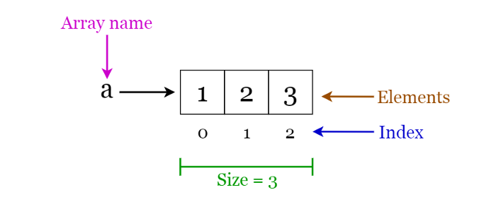

# Arrays

An **array** is a structure of fixed-size, which can hold items of the same data type. It can be an array of integers, an array of floating-point numbers, an array of strings or even an array of arrays (such as 2-dimensional arrays). Arrays are indexed, meaning that random access is possible.


###### Fig 1. Visualization of basic Terminology of Arrays
_____________

We'll cover the following:
* [1. Array Operations](#array-operations)
* [2. Applications of Arrays](#applications-of-arrays)

##### Array operations
- Traverse: Go through the elements and print them.
- Search: Search for an element in the array. You can search the element by its value or its index
- Update: Update the value of an existing element at a given index

**Inserting** elements to an array and **deleting** elements from an array cannot be done straight away as arrays are fixed in size. If you want to insert an element to an array, first you will have to create a new array with increased size (current size + 1), copy the existing elements and add the new element. The same goes for the deletion with a new array of reduced size.

##### Applications of arrays
- Used as the building blocks to build other data structures such as array lists, heaps, hash tables, vectors and matrices.
- Used for different sorting algorithms such as insertion sort, quick sort, bubble sort and merge sort.

```python
class Array(object):
    ''' sizeOfArray: denotes the total size of the array to be initialized
       arrayType: denotes the data type of the array(as all the elements of the array have same data type)
       arrayItems: values at each position of array
    '''
    def __init__(self, sizeOfArray, arrayType = int):
        self.sizeOfArray = len(list(map(arrayType, range(sizeOfArray))))
        self.arrayItems =[arrayType(0)] * sizeOfArray    # initialize array with zeroes
        self.arrayType = arrayType

    def __str__(self):
        return ' '.join([str(i) for i in self.arrayItems])

    def __len__(self):
        return len(self.arrayItems)

    # magic methods to enable indexing
    def __setitem__(self, index, data):
        self.arrayItems[index] = data

    def __getitem__(self, index):
        return self.arrayItems[index]

    # function for search
    def search(self, keyToSearch):
        for i in range(self.sizeOfArray):
            if (self.arrayItems[i] == keyToSearch):      # brute-forcing
                return i                                 # index at which element/ key was found

        return -1                                        # if key not found, return -1
    
    # function for updating an element at a specific index
    def update(self, keyToUpdate, position):
        if(self.sizeOfArray > position):
            self.arrayItems[position] = keyToUpdate
        else:
            print('Array size is:', self.sizeOfArray)
    
    # function to traverse an array
    def traverse(self):
        for arrayItem in self.arrayItems:
            print(arrayItem)

    # function for inserting an element
    def insert(self, keyToInsert, position):
        if(self.sizeOfArray > position):
            for i in range(self.sizeOfArray - 2, position - 1, -1):
                self.arrayItems[i + 1] = self.arrayItems[i]
            self.arrayItems[position] = keyToInsert
        else:
            print('Array size is:', self.sizeOfArray)

    # function to delete an element
    def delete(self, position):
        if(self.sizeOfArray > position):
            for i in range(position, self.sizeOfArray - 1):
                self.arrayItems[i] = self.arrayItems[i + 1]
            self.arrayItems[i + 1] = self.arrayType(0)
        else:
            print('Array size is:', self.sizeOfArray)

if __name__ == '__main__':
    a = Array(10, int)
    print(len(a))
    a.insert(2, 2)
    a.traverse()
    a.insert(3, 1)
    a.traverse()
    a.insert(4,7)
    a.traverse()
    a.delete(7)
    a.traverse()
    a.update(2, 0)
    a.traverse()
    print(len(a))
```

- **Module:** [Arrays.py](Arrays.py)
- **Jupyter Notebook:** [Arrays.ipynb](Arrays.ipynb)