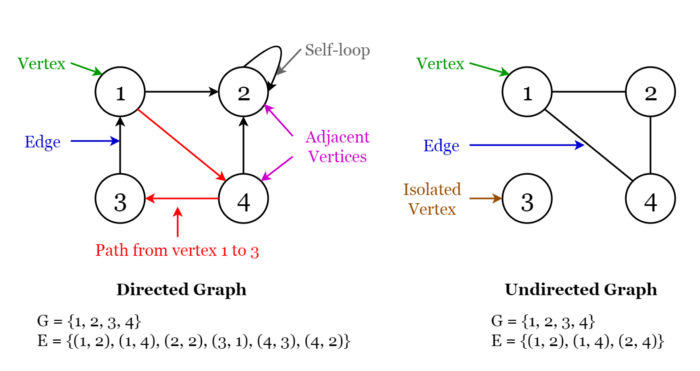

## Graphs

A **graph** consists of a finite set of **vertices** or **nodes** and a set of **edges** connecting these vertices.

The **order** of a graph is the number of vertices in the graph. The **size** of a graph is the number of edges in the graph.

Two nodes are said to be **adjacent** if they are connected to each other by the same edge.

We'll cover the following:
* [1. Directed Graphs](#directed-graphs)
* [2. Undirected Graphs](#undirected-graphs)
* [3. Applications of Graphs](#applications-of-graphs)

##### Directed Graphs
A graph ```G``` is said to be a **directed graph** if all its edges have a direction indicating what is the start vertex and what is the end vertex.

We say that ```(u, v)``` is incident from or leaves vertex ```u``` and is incident to or enters vertex ```v```.

**Self-loops**: Edges from a vertex to itself.

##### Undirected Graphs
A graph ```G``` is said to be an **undirected graph** if all its edges have no direction. It can go in both ways between the two vertices.

If a vertex is not connected to any other node in the graph, it is said to be **isolated**.


###### Fig 9. Visualization of Terminology of Graphs
_____________

##### Applications of graphs
- Used to represent social media networks. Each user is a vertex, and when users connect they create an edge.
- Used to represent web pages and links by search engines. Web pages on the internet are linked to each other by hyperlinks. Each page is a vertex and the hyperlink between two pages is an edge. Used for Page Ranking in Google.
- Used to represent locations and routes in GPS. Locations are vertices and the routes connecting locations are edges. Used to calculate the shortest route between two locations.

- **Module:** [Graph.py](Graph/Graph.py)
- **Jupyter Notebook:** [Graph.ipynb](Graph/Graph.ipynb)