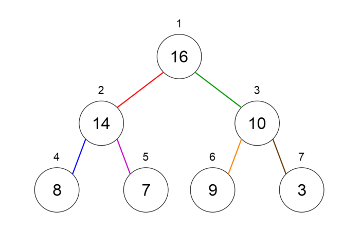

## Heaps

A **Heap** is a special case of a binary tree where the parent nodes are compared to their children with their values and are arranged accordingly.
Let us see how we can represent heaps. Heaps can be represented using trees as well as arrays. Figures 7 and 8 show how we can represent a binary heap using a binary tree and an array.

###### Fig 7. Binary Tree Representation of a Heap

###### Fig 8. Array Representation of a Heap
_____________

Heaps can be of 2 types.
- Min Heap — the key of the parent is less than or equal to those of its children. This is called the min-heap property. The root will contain the minimum value of the heap.
- Max Heap — the key of the parent is greater than or equal to those of its children. This is called the max-heap property. The root will contain the maximum value of the heap.

##### Applications of heaps
- Used in heapsort algorithm.
- Used to implement priority queues as the priority values can be ordered according to the heap property where the heap can be implemented using an array.
- Queue functions can be implemented using heaps within O(log n) time.
- Used to find the kᵗʰ smallest (or largest) value in a given array.

- **Module:** [Heap.py](Heap.py)
- **Jupyter Notebook:** [Heap.ipynb](Heap.ipynb)