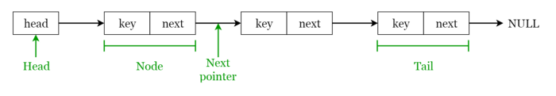

# Linked Lists

A **linked list** is a sequential structure that consists of a sequence of items in linear order which are linked to each other. Hence, you have to access data sequentially and random access is not possible. Linked lists provide a simple and flexible representation of dynamic sets.
Let’s consider the following terms regarding linked lists. You can get a clear idea by referring to Figure 2.

- Elements in a linked list are known as nodes.
- Each node contains a key and a pointer to its successor node, known as next.
- The attribute named head points to the first element of the linked list.
- The last element of the linked list is known as the tail.

###### Fig 2. Visualization of basic Terminology of Linked Lists
_____________

We'll cover the following:
* [1. Types of Linked Lists](#following-are-the-various-types-of-linked-lists-available)
  - [Singly Linked List](#singly-linked-list)
  - [Double Linked List](#doubly-linked-list)
  - [Circular Linked List](#circular-linked-list)  
* [2. Linked List Operations](#linked-list-operations)
* [3. Applications of Linked Lists](#applications-of-linked-lists)

##### Following are the various types of linked lists available.
- Singly linked list — Traversal of items can be done in the forward direction only.
- Doubly linked list — Traversal of items can be done in both forward and backward directions. Nodes consist of an additional pointer known as prev, pointing to the previous node.
- Circular linked lists — Linked lists where the prev pointer of the head points to the tail and the next pointer of the tail points to the head.

##### Linked list operations
- Search: Find the first element with the key k in the given linked list by a simple linear search and returns a pointer to this element
- Insert: Insert a key to the linked list. An insertion can be done in 3 different ways; insert at the beginning of the list, insert at the end of the list and insert in the middle of the list.
- Delete: Removes an element x from a given linked list. You cannot delete a node by a single step. A deletion can be done in 3 different ways; delete from the beginning of the list, delete from the end of the list and delete from the middle of the list.

##### Applications of linked lists
- Used for symbol table management in compiler design.
- Used in switching between programs using Alt + Tab (implemented using Circular Linked List).

###### Singly Linked List
- **Module:** [SinglyLinkedList.py](SinglyLinkedList.py)
- **Jupyter Notebook:** [Linked Lists.ipynb](Linked Lists.ipynb)

###### Doubly Linked List
- **Module:** [DoublyLinkedList.py](DoublyLinkedList.py)
- **Jupyter Notebook:** [Linked Lists.ipynb](Linked Lists.ipynb)

###### Circular Linked List
- **Module:** [circular_linked_list.py](circular_linked_list.py)
