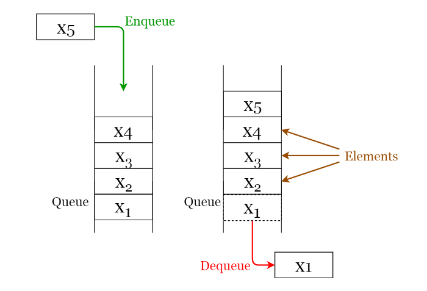

## Queues

A **queue** is a **FIFO** (First In First Out — the element placed at first can be accessed at first) structure which can be commonly found in many programming languages. This structure is named as “queue” because it resembles a real-world queue — people waiting in a queue.


We'll cover the following:
* [1. Queue Operations](#queue-operations)
* [2. Queue Implementation](#queue-implementation)
* [3. Applications of Queues](#applications-of-queues)
* [4. Types of Queues](#special-types-of-queues)
  - [Priority Queue](#priority-queues)
    - [How Priority Queues Work](#-how-priority-queues-works)
    - [Defining the Priority](#-defining-the-priority)
  - [Deque AKA Double Ended Queue](#deque-double-ended-queue)
  - [Circular Queue](#circular-queue)  

##### Queue operations
Given below are the 2 basic operations that can be performed on a queue. Please refer to Figure 4 to get a better understanding of the queue operations.
- Enqueue: Insert an element to the end of the queue.
- Dequeue: Delete the element from the beginning of the queue.

###### Fig 4. Visualization of Basic Operations of Queues
_____________

##### Queue Implementation
As with stacks, a queue can be implemented either using an array or a linked list.

##### Applications of queues
- Used to manage threads in multithreading.
- Used to implement queuing systems (e.g.: priority queues).

- **Module:** [Queue.py](Queue.py)
- **Jupyter Notebook:** [Queue.ipynb](Queue.ipynb)
 
##### Special Types of queues

###### Priority Queues
Some languages offer a version of a queue, called a **priority queue**. This allows you to arrange elements in the queue based on their priority.
```
It’s a queue, where items with higher priority step ahead of items with lower priority in the queue.
```

####### How Priority Queues Works
When you add items that have the same priority, they will queue as normal in a first in, first out order. If something comes along with a higher priority, then it will go ahead of them in the queue.

####### Defining The Priority
You can define based on what an element has higher, lower, or equal priority. This done by implementing a comparator or a compare function (as when sorting arrays), where you provide your own logic for comparing the priority between elements.

- **Module:** [PriorityQueue.py](PriorityQueue.py)
- **Jupyter Notebook:** [Queue.ipynb](Queue.ipynb)

###### Deque (Double-ended queue)
The deque, pronounced “DEK”, is used when we want to leverage the power of the queue and the stack, where you can add or remove from start or end.
```
It’s a queue and a stack at the same time.
```

- **Module:** [Deque.py](Deque.py)
- **Jupyter Notebook:** [Queue.ipynb](Queue.ipynb)

###### Circular Queue
The **circular queue** is a linear data structure in which the operations are performed based on **FIFO** (First In First Out) principle and the last position is connected back to the first position to make a circle. It is also called **"Ring Buffer"**.

One of the benefits of the circular queue is that we can make use of the spaces in front of the queue. In a normal queue, once the queue becomes full, we cannot insert the next element even if there is a space in front of the queue. But using the circular queue, we can use the space to store new values.

- **Module:** [CircularQueue.py](CircularQueue.py)
- **Jupyter Notebook:** [Queue.ipynb](Queue.ipynb)
- **Resources:**
https://leetcode.com/problems/design-circular-