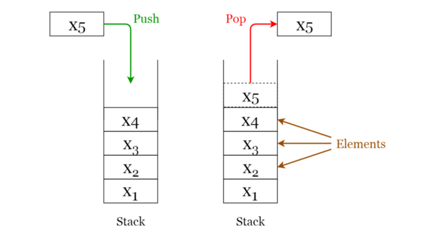

# Stacks

A **stack** is a **LIFO** (Last In First Out — the element placed at last can be accessed at first) structure which can be commonly found in many programming languages. This structure is named as “stack” because it resembles a real-world stack — a stack of plates.

##### Stack operations
Given below are the 2 basic operations that can be performed on a stack. Please refer to Figure 3 to get a better understanding of the stack operations.
- Push: Insert an element on to the top of the stack.
- Pop: Delete the topmost element and return it.

###### Fig 3. Visualization of basic Operations of Stacks
_____________

Furthermore, the following additional functions are provided for a stack in order to check its status.
- Peek: Return the top element of the stack without deleting it.
- isEmpty: Check if the stack is empty.
- isFull: Check if the stack is full.

##### Stack Implementation
A stack can be easily implemented either using an array or a linked list.

##### Stacks Vs Arrays Vs Linked Lists
Working with stack is simpler than working with arrays or linked lists, because there is less you can do with a stack.

This is an intentionally limited, an intentionally restricted data structure. All we do is push and pop and maybe peek. And if you’re trying to do anything else with this stack, you’re using the wrong data structure.

##### Applications of stacks
- Used for expression evaluation (e.g.: shunting-yard algorithm for parsing and evaluating mathematical expressions).
- Used to implement function calls in recursion programming.

- **Module:** [Stack.py](Stack.py)
- **Jupyter Notebook:** [Stack.ipynb](Stack.ipynb)
