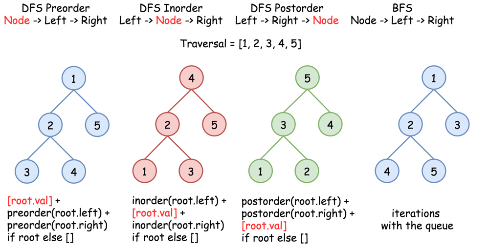

# Tree Traversals



What we will cover:
1. [All DFS traversals in Python in 1 line](#all-dfs-traversals-preorder-inorder-postorder-in-python-in-1-line) 
1. [Morris Traversal - TC:O(N) ; SC:O(1) ](#morris-traversal)
   - [Morris Traversal - Inorder Traversal](#morris-traversal---inorder-traversal)
   - [Morris Traversal - Preorder Traversal](#morris-traversal---preorder-traversal)
   - [Morris Traversal - Postorder Traversal](#morris-traversal---postorder-traversal) 
1. [Traversal using Stack Data Structure - TC:O(N) ; SC:O(N) ](#using-a-stack)
   - [Using a stack - Inorder Traversal](#using-a-stack---inorder-traversal)
   - [Using a stack - Preorder Traversal](#using-a-stack---preorder-traversal)
   - [Using a stack - Postorder Traversal](#using-a-stack---postorder-traversal) 

## All DFS traversals (preorder, inorder, postorder) in Python in 1 line

```python
def preorder(root):
  return [root.val] + preorder(root.left) + preorder(root.right) if root else []
```
```python
def inorder(root):
  return  inorder(root.left) + [root.val] + inorder(root.right) if root else []
```
```python
def postorder(root):
  return  postorder(root.left) + postorder(root.right) + [root.val] if root else []
```

## Morris Traversal

Morris Traversal is a way of traversing BST with O(1) space and O(n) time.
It's a little hard to understand but the basic idea is to link predecessor back to current node
so that we can trace back to top of BST. It's also a little tricky to see how it is O(n)
since finding predecessor is often O(logn). The answer is , we don't have to find predecessor
for every node, only the nodes with valid left child. It will be obvious if you draw a tree to
see that every edge is only visited constant time.

* TC: `O(n)`
* SC: `O(1)`

### Morris Traversal - Inorder Traversal 
```python
def inorderTraversal(self, root):
        result=[]
        node=root
        while node!=None:
            if node.left==None:
                result.append(node.val)
                node=node.right
            else:
                pre=node.left
                while pre.right!=None and pre.right!=node:
                    pre=pre.right
                if pre.right==None:
                    pre.right=node
                    node=node.left
                else:
                    pre.right=None
                    result.append(node.val)
                    node=node.right
        return result
```

### Morris Traversal - Preorder Traversal

Preorder, basically the same, just one line of change#

```python
def preorderTraversal(self, root):
        result=[]
        node=root
        while node!=None:
            #print(node.val)
            if node.left==None:
                result.append(node.val)
                node=node.right
            else:
                pre=node.left
                while pre.right!=node and pre.right!=None:
                    pre=pre.right
                if pre.right==None:
                    result.append(node.val)
                    pre.right=node
                    node=node.left
                else:
                    pre.right=None
                    node=node.right
        return result
```

### Morris Traversal - Postorder Traversal

Postorder can be simple as well. Just do everything reversely comparing to the preorder one. 
By this I mean we go right child node and use deque to append left to result. Here is the code:

```python
from collections import deque

def postorderTraversal(self, root):
        res = deque()

        while root:
            if root.right:
                temp = root.right
                while temp.left and temp.left != root:
                    temp = temp.left
                if not temp.left:
                    res.appendleft(root.val)
                    temp.left = root
                    root = root.right
                else:
                    temp.left = None
                    root = root.left
            else:
                res.appendleft(root.val)
                root = root.left

        return res
```

Or, without using deque ... For post-order, begin with current and if current.right is empty - 
start looking towards left. If not, find left most predecessor and link the left of this 
predecessor back to current. (In short, flip the lefts in in-order to rights and keep inserting 
nodes to the beginning of the visited list ) :

```python
def postorderTraversal(root):
   if not root:
       return []
   current = root
   post_order_list = []
   while current:
       if not current.right:
           post_order_list.insert(0, current.val)
           current = current.left
       else:
           # find left most of the right sub-tree
           predecessor = current.right
           while (predecessor.left) and (predecessor.left != current):
               predecessor = predecessor.left
           # and create a link from this to current
           if not predecessor.left:
               post_order_list.insert(0, current.val)
               predecessor.left = current
               current = current.right
           else:
               predecessor.left = None
               current = current.left
   return post_order_list
```

## Using a stack

* TC: `O(n)`
* SC: `O(h)` [ where, `h` is the height of the tree ]

### Using a stack - Inorder Traversal

In inorder, the order should be

`left -> root -> right`

But when we use stack, the order should be reversed:

`right -> root -> left`

**Inorder Traversal**

```python
class Solution2(object):
    def inorderTraversal(self, root):
        """
        :type root: TreeNode
        :rtype: List[int]
        """
        result, stack = [], [(root, False)]
        while stack:
            root, is_visited = stack.pop()  # the last element
            if root is None:
                continue
            if is_visited:
                result.append(root.val)
            else:  # inorder: left -> root -> right
                stack.append((root.right, False))
                stack.append((root, True))
                stack.append((root.left, False))
        return result
```

### Using a stack - Preorder Traversal

In pre-order, the order should be

`root -> left -> right`

But when we use stack, the order should be reversed:

`right -> left -> root`

**Preorder Traversal**

```python
class Solution:
    def preorderTraversal(self):
        res, stack = [], [(root, False)]
        while stack:
            node, visited = stack.pop()  # the last element
            if not node:
                continue
            if visited:
                res.append(node.val)
            else:  # preorder: root -> left -> right
                stack.append((node.right, False))
                stack.append((node.left, False))
                stack.append((node, True))
        return res
```

### Using a stack - Postorder Traversal

In postorder, the order should be

`left -> right -> root`

But when we use stack, the order should be reversed:

`root -> right -> left`

**Postorder Traversal**

```python
class Solution:
    def postorderTraversal(self, root):
        res, stack = [], [(root, False)]
        while stack:
            node, visited = stack.pop()  # the last element
            if not node:
                continue
            if visited:
                res.append(node.val)
            else:  # postorder: left -> right -> root
                stack.append((node, True))
                stack.append((node.right, False))
                stack.append((node.left, False))
        return res
```

##Related LeetCode Problems:
* [LeetCode - Problem 94 - Binary Tree Inorder Traversal](https://leetcode.com/problems/binary-tree-inorder-traversal/)
* [LeetCode - Problem 144 - Binary Tree Preorder Traversal](https://leetcode.com/problems/binary-tree-preorder-traversal/)
* [LeetCode - Problem 145 - Binary Tree Postorder Traversal](https://leetcode.com/problems/binary-tree-postorder-traversal/)