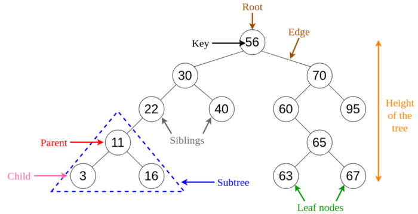

# Trees

A **tree** is a hierarchical structure where data is organized hierarchically and are linked together. This structure is different than a linked list whereas, in a linked list, items are linked in a linear order.
Various types of trees have been developed throughout the past decades, in order to suit certain applications and meet certain constraints. Some examples are binary search tree, B tree, treap, red-black tree, splay tree, AVL tree and n-ary tree.

We'll cover the following:
* [1. Binary Search Tree](#binary-search-trees)
* [2. Applications of Trees](#applications-of-trees)

##### Binary Search Trees
A **binary search tree (BST)**, as the name suggests, is a binary tree where data is organized in a hierarchical structure. This data structure stores values in sorted order.

Every node in a binary search tree comprises the following attributes.
1. key: The value stored in the node.
1. left: The pointer to the left child.
1. right: The pointer to the right child.
1. p: The pointer to the parent node.

A binary search tree exhibits a unique property that distinguishes it from other trees. This property is known as the binary-search-tree property.

Let `x` be a node in a binary search tree.
- If `y` is a node in the left subtree of `x`, then `y.key ≤ x.key`
- If `y` is a node in the right subtree of `x`, then `y.key ≥ x.key`

###### Fig 6. Visualization of Basic Terminology of Trees.
_____________

##### Applications of trees
- Binary Trees: Used to implement expression parsers and expression solvers.
- Binary Search Tree: used in many search applications where data are constantly entering and leaving.
- Heaps: used by JVM (Java Virtual Machine) to store Java objects.
- Treaps: used in wireless networking.

- **Module:** [Tree.py](Trees/Tree.py)
- **Module:** [BinarySearchTree.py](Trees/BinarySearchTree.py)
- **Jupyter Notebook:** [Tree.ipynb](Trees/Tree.ipynb)
