# Advanced Data Structures

**Data Structures** are a specialized means of organizing and storing data in computers in such a way that we can perform operations on the stored data more efficiently. Out of the numerous data structures present, binary search trees play an important role when it comes to efficient operations.

___________________

##1. Self-Balancing Binary Search Trees

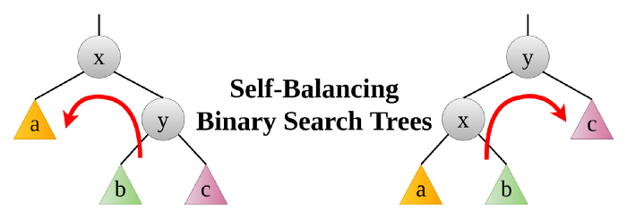
_____________

##### What are Binary Search Trees?

A **binary search tree (BST)** is a **binary tree** where data is organized in a hierarchical structure.

A binary search tree exhibits a unique property known as the binary-search-tree property.

Let `x` be a node in a binary search tree.
- If `y` is a node in the left subtree of `x`, then `y.key ≤ x.key`
- If `y` is a node in the right subtree of `x`, then `y.key ≥ x.key`

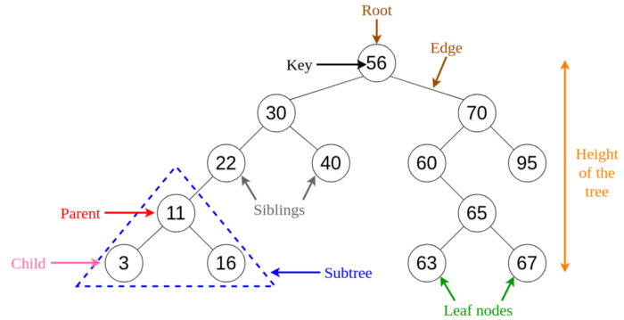
###### Fig 1. Visualization of Basic Terminology of Binary Search Trees.
_____________

##### What are Self-Balancing Binary Search Trees?
A self-balancing binary search tree (BST) is a binary search tree that automatically tries to keep its height as minimal as possible at all times (even after performing operations such as insertions or deletions).

If you have gone through the Big-O Algorithm Complexity Cheat Sheet, you can see that the average time complexity of BST operations is `Θ(h)`, where h is the height of the tree. Hence having the height as small as possible is better when it comes to performing a large number of operations. Hence, self-balancing BSTs were introduced which automatically maintain the height at a minimum. However, you may think having to self-balance every time an operation is performed is not efficient, but this is compensated by ensuring a large number of fast operations which will be performed later on the BST.

A binary tree with height h can have at most ```2⁰+2¹+···+2ʰ = 2⁽ʰ⁺¹⁾−1``` nodes.
```
n ≤ 2⁽ʰ⁺¹⁾ − 1
h ≥ ⌈log₂(n+1) - 1⌉ ≥ ⌊log₂(n)⌋
```
Hence, for self-balancing BSTs, the minimum height must always be log₂(n) rounded down. Moreover, a binary tree is said to be balanced if the height of left and right children of every node differ by either **-1**, **0** or **+1**. This value is known as the balance factor.

> ___Balance factor = Height of the left subtree - Height of the right subtree___
>

##### How do Self-Balancing Binary Search Trees Balance?
When it comes to self-balancing, BSTs perform **rotations** after performing insert and delete operations. Given below are the two types of rotation operations that can be performed to balance BSTs without violating the binary-search-tree property.

##### 1. Left rotation
When we left rotate about node ___x___, node ___y___ becomes the new root of the subtree. Node ___x___ becomes the left child of node ___y___ and subtree ___b___ becomes the right child of node ___x___.

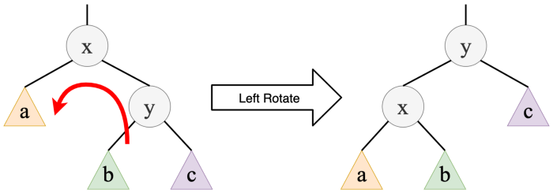
###### Fig 2. Left rotation on node x
_____________

##### 2. Right rotation
When we right rotate about node ___y___, node ___x___ becomes the new root of the subtree. Node ___y___ becomes the right child of node ___x___ and subtree ___b___ becomes the left child of node ___y___.

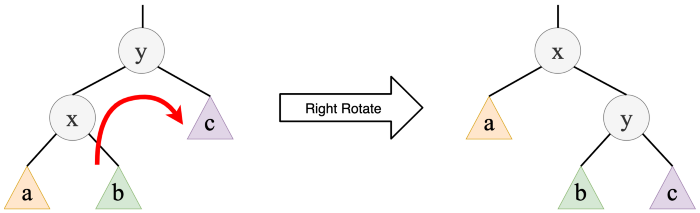
###### Fig 3. Right rotation on node y
_____________

Note that, once you have done rotations, the in-order traversal of nodes in both the previous and final trees are the same and the binary-search-tree property holds.

##### Types of Self-Balancing Binary Search Trees
Given below are a few types of BSTs that are self-balancing.
1. AVL trees
1. Red-black trees
1. Splay trees
1. Treaps

##### Applications of Self-Balancing Binary Search Trees
Self-balancing BSTs are used to construct and maintain ordered lists, such as priority queues. They are also used for associative arrays where key-value pairs are inserted according to an ordering based only on the key.
Many algorithms in computational geometry make use of self-balancing BSTs to solve problems such as the line segment intersection problem efficiently. Moreover, self-balancing BSTs can be extended to perform new operations which can be used to optimize database queries or other list-processing algorithms.

##### 1a. AVL Trees as an Example of Self-Balancing BSTs
**Adelson-Velskii and Landis (AVL)** trees are binary trees which are balanced. All the node in an AVL tree stores their own balance factor.

```
In an AVL tree, the balance factor of every node is either -1, 0 or +1.
```

In other words, the difference between the height of the left subtree and the height of the right subtree cannot be more than 1 for all of the nodes in an AVL tree.

##### Example AVL Tree
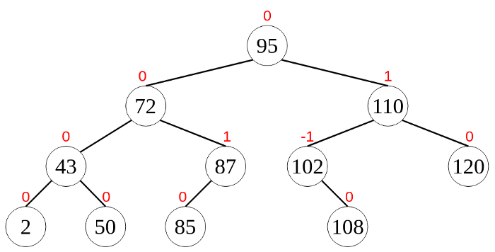
###### Fig 4. Example AVL Tree
_____________

In Figure 4, the values in red colour above the nodes are their corresponding balance factors. You can see that the balance factor condition is satisfied in all the nodes of the AVL tree shown in Figure 4.

##### Rotations in AVL Trees
After performing insertions or deletions in an AVL tree, we have to check whether the balance factor condition is satisfied by all the nodes. If the tree is not balanced, then we have to do rotations to make it balanced.

Rotations performed on AVL trees can be of four main types that are grouped under two categories. They are,
1. **Single rotations — Left (LL) Rotation and Right (RR) Rotation**
1. **Double rotations — Left Right (LR) Rotation and Right Left (RL) Rotation**

The diagrams given below will explain each rotation type.

**1. Single Left Rotation (LL Rotation)**
In this type of rotation, we move all the nodes to the left by one position.
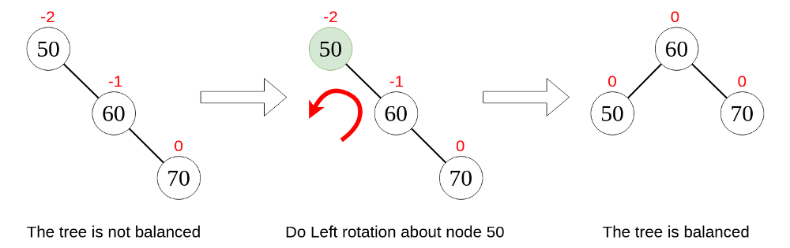
###### Fig 5. LL Rotation
_____________

**2. Single Right Rotation (RR Rotation)**
In this type of rotation, we move all the nodes to the right by one position.
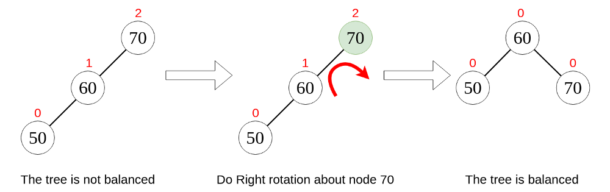
###### Fig 6. RR Rotation
_____________

**3. Left Right Rotation (LR Rotation)**
As the name implies, this type of rotation consists of a left rotation and a right rotation.
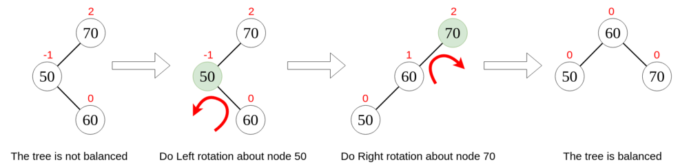
_____________

**4. Right Left Rotation (RL Rotation)**
This type of rotation consists of a right rotation followed by a left rotation.
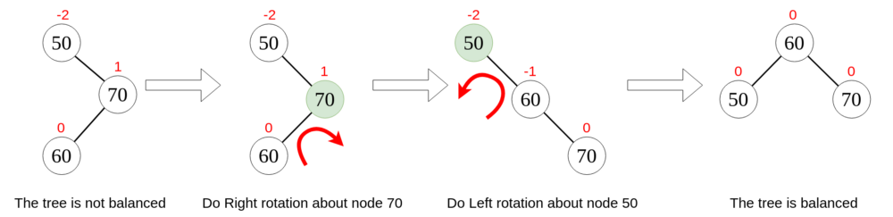
_____________

##### Inserting an Element to an AVL Tree
Consider the AVL tree given in Figure 4. We want to add a new node 105 to this tree. Figure 9 denotes the steps carried out to insert the new node and rebalance the tree.
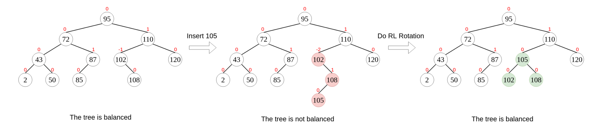
_____________

After adding node 105, there will be altogether 12 nodes in the tree. If we calculate the height possible for the tree to be balanced,

```
h ≥ ⌈log₂(n+1) — 1⌉
h ≥ ⌈log₂(12+1) — 1⌉
h ≥ ⌊log₂(12)⌋ = ⌊3.58496250072⌋ = 3
```

However, the height of the resulting tree after insertion has a height of 4. Moreover, the balance factor of node 102 is -2. From these facts, we can see that the resulting tree after insertion is not balanced. Hence, we have to balance it by doing rotations. You can see that the subtree rooted from node 102 should be rotated and an RL rotation should be used. After performing this rotation, we get a balanced tree with a height of 3.

- **Module:** [AVL_Rec.py](Self_Balancing_Binary_Search_Trees/AVL_Rec.py)
- **Unit Test:** [Test AVL Recursive.py](Self_Balancing_Binary_Search_Trees/Test AVL Recursive.py)

##2. Disjoint Set (Union/Find)

The **disjoint-set data structure (union-find structure)** keeps track of sets that are partitioned into non-overlapping subsets. This disjoint-set structure can be implemented using:
- Arrays
- Trees

##### Methods
1. Union(a,b): This function takes two indexes and merges their root nodes if they have not been previously merged.
1. Find(a,b): This function checks if​ two indexes lie in the same set or in two different sets.
1. makeSet(a): This function makes a new set with the specified element.

##### Illustration
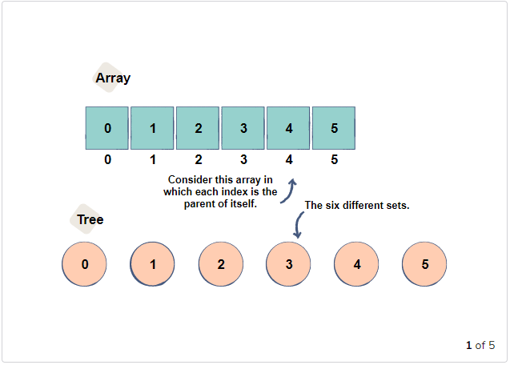
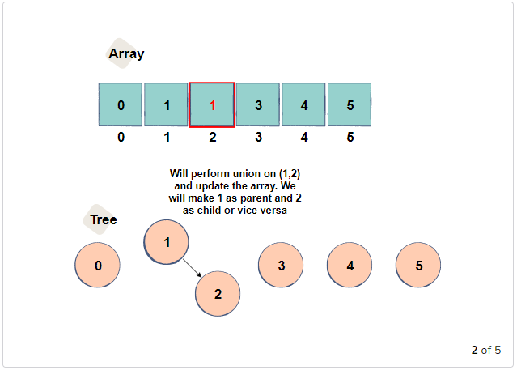
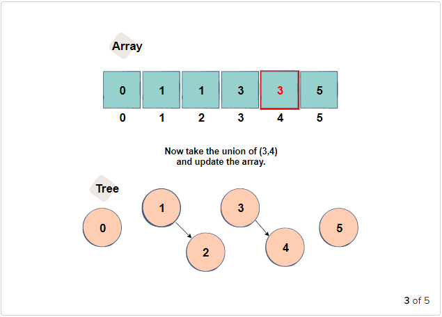
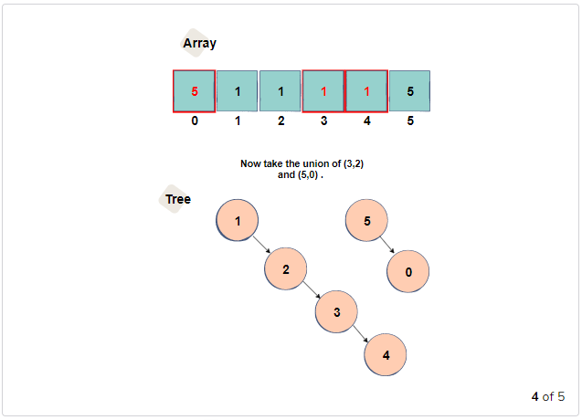
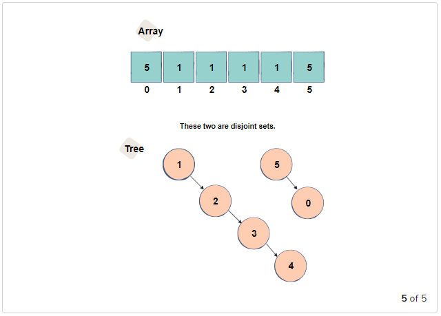
_____________

Since we are left with the two disjoint sets given below, we can use the array to find out if the two indexes lie in the same set or in ​two different sets. If the two indexes have the same parent, then they lie in the same set; otherwise, they are in disjoint sets.

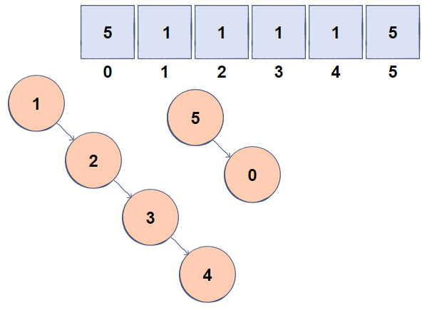
_____________

##### Example
Let’s take an example. Let’s say that a disjoint set of A = 3, 4 is already created. In this case, the first entry element, 3, becomes the root node, and 3 is the value representing A. It is as follows.

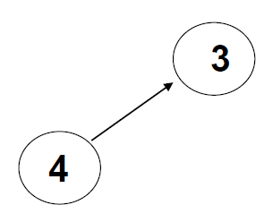
_____________

find (4) means to print the representative value of the set to which 4 belongs. So in this example, it will be 3. Similarly, find (3) and the output is 3.

Let’s say we have another disjoint set, B = 1,2. The representative value of B is the root node 3. When joining A and B, the root nodes are connected. It is as follows.

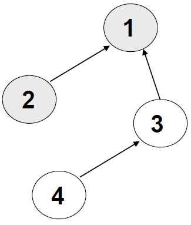
_____________

The root node of the newly created disjoint set is 1. So, for example, if you perform find (4) to output a representative value of a set containing 4, the result is 1.

###### Implemented as an array
Let’s implement the three basic operations of a disjoint set as an array. Let A = 3,4, B = 1,2 Let’s say that two disjoint sets have already been created.

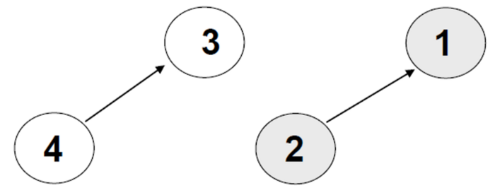
_____________

If you implement it as an array: N refers to the input elements. S indicates whether the input element is the root node or where the parent node is. For example, 3 and 1 are root nodes, so the value of S corresponding to them is 0. The parent node of 4 is marked as the first element of N, that is, 3. Similarly, the parent node of 2 is the third element of N,
```
N = [3,4,1,2]
S = [0, 1, 0, 3]
```

If union operation is performed, S changes as follows.
```
S=[0,1,1,3]
```


_____________

So what is the computational complexity of the union (x, y) operation? There are three main stages to consider.
1. You need to find the disjoint set that x belongs to: find (x)
1. You need to find the set to which y belongs: find (y)
1. Combine the found sets.

However, the computational complexity of the find operation is O (logn) when the number of elements in the disjoint set is n. Repeatedly traversing the parent node to find the root node. For example, if there is a disjoint set consisting of 3–4–5–2–1 in a row from the leaf node to the root, find (3) must traverse the edge four times as high as the tree, I can find it. The path compression is the way to perform the find operation more efficiently, but I will take a little time to deal with it.
Let’s say you’ve run the find operation twice to find the join set. Now it is time to combine these two. There are union-by-size and union-by-height methods to combine, which we’ll cover in the next section.

###### Union
When combining any two disjoint sets, it is efficient to combine sets with fewer elements into many sets of subtrees (union-by-size). Similarly, a set with a small height of the tree must be combined into a large set of subtrees (union-by-height). In order to improve the efficiency of the find operation, it is necessary to perform the find operation in the next union operation. The number of elements and the height of the tree tend to be proportional and the computational complexity of the find operation is highly dependent on them.

Implementing union-by-size and union-by-height is straightforward. You can change the root node information of array S. In the root node, we replace it with the following, unlike the old one,
- ___union-by-size___ :− size of tree
- ___union-by-height___ :− height of tree

In short, the two disjoint sets found in the find operation are compared in terms of the number of atoms or the height of the disjoint sets. This allows subsequent find operations to be performed more efficiently.
The computational complexity of union-by-size and union-by-height is O (1). Because find has already found the root node of two disjoint sets in the find operation, it compares the number of atoms or heights stored in these two root node locations in S. Replace the value of S corresponding to the root node of the smaller of the two to point to the index of the larger root node. All these operations correspond to O (1).

###### Path compression
path compression is to make all nodes point to the root as follows: S stores the root node instead of the parent node index. When you perform a find operation, you need to go back as far as the height of the tree to find the root node. This is to alleviate this inefficiency. Once you perform path compression, you can reduce the computational complexity of the find operation that finds the root node.

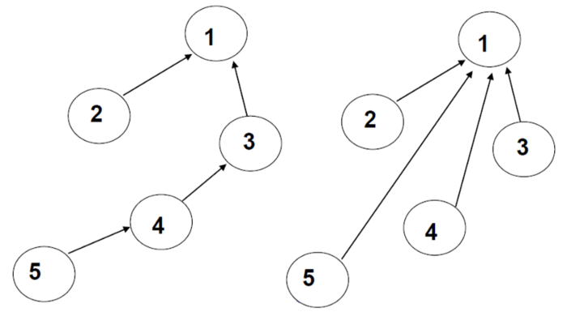
_____________

- **Module:** [DisjointSets.py](Disjoint_Set_AKA_Union_Find/DisjointSets.py)

##4. Fenwick Tree ( AKA Binary Indexed Tree or BIT )

A **Fenwick tree** or **binary indexed tree** is a data structure that helps compute prefix sums efficiently. Computing prefix sums are often important in various other algorithms, not to mention several competitive programming problems. For example, they are used to implement the arithmetic coding algorithm. Fenwick trees were invented by Peter M. Fenwick in 1994.

##### Prefix Sums

> DEFINITION
> 
> The n<sup>th</sup> prefix sum of an array is the sum of the first nn elements of the array.

This idea is also referred to as partial sums or cumulative sums.

> EXAMPLE
>
> What is the prefix sum of positive integers?
> _____________
> They are triangular numbers as shown in the diagram below.
> 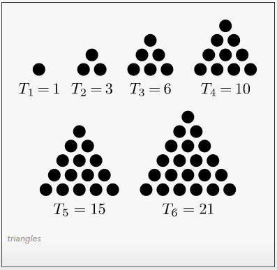
_____________

##### Naive Approach
_____________

The simplest way to compute the i<sup>th</sup> prefix sum is to just scan over the first `i` elements of the array whilst adding them.

```python
def prefix(arr,i):
   s = 0
   for j in xrange(i):
      s += arr[j]
   return s
```

This computes the prefix table in O(n)O(n) time. However, this is a little too much when the table has to be frequently updated, since the prefix tables have to be computed over and over again.

We can do better using a Fenwick tree.

##### Motivation
_____________

Let's say that we have a 16 element array which forms the leaves of the following binary tree:

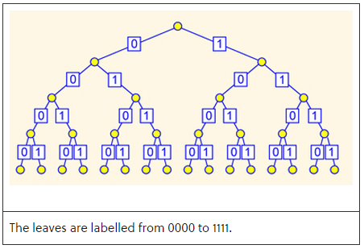
_____________

Let us imagine that the parent nodes contain the sum of the children nodes everywhere throughout the tree. That'd mean that the root node has the sum of all the elements in the array.

Key Idea: The interesting observation is that to produce the sum of the first ii elements we only need to know (and check) just `O(log i)` nodes.

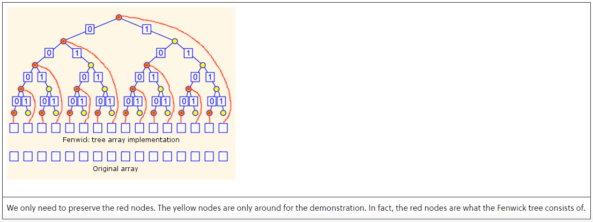
_____________

> EXAMPLE
>
> How would you find the `1010-th` prefix sum?
> _____________
> We use the red nodes labelled 1010, 100 and 0.
_____________


##### Algorithm Sketch
_____________

For the sake of simplicity, we will assume that we are working with 1-based arrays.

Example:

Here is what the Fenwick tree on the array `[0, 1, 2, 3, 4, 5, 6, 7, 8, 9, 10, 11, 12, 13, 14, 15, 16]` would look like when embedded in an 1-based array:

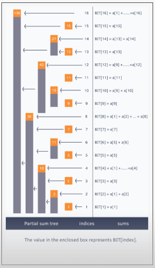

We have already seen the motivation behind the data structure. Now, we need to see how it can be built, updated and queried.
_____________


##### Update
_____________
To increment the i<sup>th</sup> position by `x`:

1. Express ___i<sub>1</sub> = i = 2<sup>j<sub>1</sub></sup> + 2<sup>j<sub>2</sub></sup> + ... + 2<sup>j<sub>n</sub></sup>, where j<sub>1</sub> < j<sub>2</sub> < ... < j<sub>n</sub>___
    1. Increment the ___i<sub>1</sub><sup>th</sup>___ position of the tree by ___x___.
1. Let ___i<sub>2</sub> = 2<sup>j<sub>1</sub>+1</sup> + 2<sup>j<sub>2</sub></sup> + ... + 2<sup>j<sub>n</sub></sup>, where j's are set as before___
1. Replace ___i<sub>1</sub>___ by ___i<sub>2</sub>___ and loop from step 1 until ___i<sub>1</sub>___ exceeds the length of the array/tree.

As discussed before, this runs in `O(log N)` where `N` is the length of the Fenwick tree.

The above can be a little confusing, but the essential idea here is that we're notifying the parent "responsible" nodes of the changes. If you are really baffled, sketching through the idea with pen and paper can really help.

To create a Fenwick tree for an array, simply create and fill an empty tree with zeroes and then update the tree with all the array positions one by one. Thus, for an array with `N` entries, it takes `O(N log N)` operations to setup its Fenwick tree.

##### Query
_____________
To increment the i<sup>th</sup> prefix sum:

1. Set the accumulator to 0.
1. Express ___i = 2<sup>j<sub>1</sub></sup> + 2<sup>j<sub>2</sub></sup> + ... + 2<sup>j<sub>n</sub></sup>, where j<sub>1</sub> < j<sub>2</sub> < ... < j<sub>n</sub>___
    
    2.1. Increment the accumulator by the value in the ___(2<sup>j<sub>1</sub></sup> + 2<sup>j<sub>2</sub></sup> + ... + 2<sup>j<sub>n</sub></sup>)<sup>th</sup>___ position of the tree.
    
    2.2. Increment the accumulator by the value in the ___(2<sup>j<sub>2</sub></sup> + ... + 2<sup>j<sub>n</sub></sup>)<sup>th</sup>___ position of the tree.
    
        .
    
        .
    
        .
    
    2.___n___. Increment the accumulator by the value in the ___(2<sup>j<sub>n</sub></sup>)<sup>th</sup>___ position of the tree.
    
1. Return the current value of the accumulator.

This is no surprise, just simply adding up whatever we already stored during the update. This runs in `O(log N)` too.

##### A Bit Manipulation Trick
_____________
The happy coincidence that computers internally use the binary system to represent integers brings us to a very interesting bit manipulation trick that makes it easy for us to implement the above algorithms.

Notice that we need to express integers as powers of two very frequently, and usually work with the lowest power in the above algorithms. Now, this lowest power is really the last set bit of the integer.

> Example
>
>   ___12 = 2<sup>3</sup> + 2<sup>2</sup> = (1100)<sub>2</sub>___
>
> Here, the place value of the last bit is 100.
>

Obviously, we could write a loop to find this but it turns out that there is a better (simpler) way to do this. It turns out that `a & (-a)` does a very good job of the same.

> Example
>
> Let us work out the same thing with 12.
> 
> We have ___a = 0b1100___, the complement of which is ___0b0011___.
> 
> Thus ___-a = 0b0011 + 0b0001___ or ___0b0100___.
>
> ```python
> --+-------------------------  
> 1 | >>> 12&-12
> 2 | 4
> --+-------------------------
> ```

This should work for any integer. Here is a generalisation

> Theorem
>
> The highest power of two which is not more than ___a___ is given by ___a & (-a)___. 
>
_____________

> Proof
>
> Let's say that ___a___ is an integer with the binary representation ___s10<sup>n</sup>___.
>
> Now, the complement of ___a___ is ___s'01<sup>n</sup>___.
>
> Hence, ___-a___ or the two's complement of ___a___ is ___s'01<sup>n</sup>___ (because by adding a 1, the 1's roll over and the 0 turns 1).
>
> Now, we have the bitwise-and of ___a___ and ___-a___ = ___s100___.... & ___s'100___... = ___10<sup>n</sup>___ since the ___s___ and ___s'___ cancel out.
_____________

##### Implementation
_____________
The implementations are straightforward, except that using the 1-based array can be easily mishandled.

```python
class Fenwick():
    def update(self, i, x):                     #add x to the ith position
        while i <= self.x:
            self.BIT[i-1] += x                  #because we're working with an 1-based array 
            i += i & (-i)                       #magic! don't touch!
    def query(self, i):                         #find the ith prefix sum
        s = 0
        while i > 0:
            s += self.BIT[i-1]
            i -= i & (-i)
        return s
    def __init__(self, l=[]):                   #initialize the fenwick tree
        self.N = len(l)
        self.BIT = [0 for i in xrange(self.N)]
        for i in xrange(1,self.N+1):
            self.update(i, l[i-1])
```

- **Module:** [fenwick_tree.py](Fenwick_Tree_AKA_BIT_Tree/fenwick_tree.py)

##5. Segment Tree

Segment Tree is basically a binary tree used for storing the intervals or segments. Each node in the Segment Tree represents an interval. Consider an array A of size N and a corresponding Segment Tree T:

1. The root of T will represent the whole array A[0:N-1].
1. Each leaf in the Segment Tree T will represent a single element A[i] such that 0 <= i < N.
1. The internal nodes in the Segment Tree T represents the union of elementary intervals A[i:j] where 0 <= i < j < N.

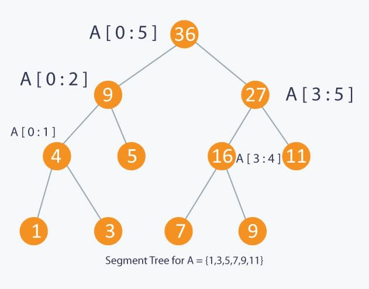
_____________


##### Usage
_____________
**SegTree** is a data structure that can help us solve the following problem statement extracted from GeeksforGeeks:

Given an array `arr[0 . . . n-1]`. We should be able to:
1. Find the sum of elements from index `l` to `r` where `0 <= l <= r <= n-1`
1. Change value of a specified element of the array to a new value `x`. We need to do `arr[i] = x` where `0 <= i <= n-1`.

Or the formal definition from cp-algorithms:

We have an array `a[0…n−1]`, and the Segment Tree must be able to find the sum of elements between the indices `l` and `r` (i.e. computing the sum `∑ri=la[i]`), and also handle changing values of the elements in the array (i.e. perform assignments of the form `a[i]=x`).

The first solution that can come in our minds is to loop from the `l` to the `r` index summing the values of the array and to update the value just update the value on the array directly. The first operation takes `O(n)` and the second `O(1)`.

A second approach can be to store on another array the sum from index ___i___ to the ___i<sup>th</sup>___, storing all the sums of the segments, now after the array creation, the sum operation takes `O(1)`, since they are stored, but the update functions takes `O(n)`.

Now, the Segment Tree allows us to get the sum of any interval in `O(log n)` and update any value in `O(log n)`.

##### Implementation
_____________
There are two main implementations of a segment tree, a recursive one and an iterative one, we are going to focus this text on the recursive one and provide an iterative implementation at the end with a link to a discussion about the memory usage of each type.

Warning: you should try to implement the Segment Tree first before moving to the solution

Motivated by this medium question on Leetcode:

The LeetCode Question 307 (Range Sum Query - Mutable) is a great initial motivation to build a SegmentTree. 
The question asks you to build a structure and methods to get the sum of an interval and to be able to update any value in it. As we discussed before, the Segment Tree allows us to do that in great performance.

First of all: Whats the easiest way to store a segmention tree?
Like a Heap [], we can store it in an array. We start by storing our root element in index `0` and for each index `i`, it's left child is at index `2*i + 1`, it's right child is at index `2*i + 2` and it's parent is at index `(i - 1) / 2`.

And important difference from the Heap, is that a segment tree is full binary tree (every node has 0 or 2 children) and that means that if the input array is not a power of 2, when storing at an array, we may have gaps between the nodes. If `n` is a power of `2`, the size of the segtree array will be `2n-1`. If not, the size will be `2x - 1` where `x` is the smallest power of `2` greater than `n` and we place dummy nodes to fill the gaps between the nodes.

Example: 
For input array `[1, 3, 5, 7, 9, 11]`, the segment tree will be: `[36, 9, 27, 4, 5, 16, 11, 1, 3,DUMMY, DUMMY, 7, 9, DUMMY, DUMMY]`.

- Construct Let's go back to the actual code. We start by creating a recursive method build that will construct our SegTree with a bottom-up approach. This method will receive two indexes tl and tr that represents a segment of our input array. If the segment is of lenght 1, then we simply store the leaf node. If not, it divides the segment into two halves and call itself on both halves. When the recursion returns, the sum of the segment is stored in the current node v of the segtree array.

    The arguments are:
- v : the current node of the segtree array.
- tl : left index of the segment in the input array.
- tr: right index of the segment in the input array.

- Updating a value:
The update operation is also done recursively. We receive the index pos to be updated, and, similar with the build method, we split a segment into two halves. The difference though, is that we only call the recursive method on the half where the pos is. Doing that, we eventually reach the segment of lenght 1 that is exactly the node we are updating with the new value val. When the recursion returns, we update the current node value with the sum of it's both children.

    The arguments are:
- v : the current node of the segtree array.
- tl : left index of the segment in the input array.
- tr: right index of the segment in the input array.
- pos : position to be updated
- val : new value

- Querying the sum:
From the root node and going recursively, we start by checking if the desired sum indexes l and r are equal with the segment of the current node v. If its exactly the same range, the value of the node is exactly the value of the sum from l to r. If not, call the method on both children of v (also updating the segment representing the called node) and sum the result.

- The arguments are:
- v : the current node of the segtree array.
- tl : left index of the segment in the input array.
- tr: right index of the segment in the input array.
- l : left index of the desired sum
- r : right index of the desired sum

Important: On every recursive call, we manually adjust the segment tl to tr that represents the called node.

```python
class NumArray:
    def __init__(self, nums: List[int]):
        if len(nums) > 0:
            self.n = len(nums)
            self.nums = nums
            self.arr = [0] * (4 * self.n)
            self.build(1, 0, self.n - 1)
        #print(self.arr)

    def build(self, v, tl, tr ):
        if (tl == tr):
            self.arr[v] = self.nums[tl]
        else:
            tm = (tl + tr) // 2;
            self.build(v*2, tl, tm)
            self.build(v*2+1, tm+1, tr)
            self.arr[v] = self.arr[v*2] + self.arr[v*2+1]

    def _update(self, v, tl, tr, pos, val):
        if tl == tr:
            self.arr[v] = val
        else:
            mid = (tl + tr) // 2
            if pos <= mid:
                self._update(v * 2, tl, mid, pos, val)
            else:
                self._update(v * 2 + 1, mid + 1, tr, pos, val)

            self.arr[v] = self.arr[v * 2] + self.arr[v * 2 + 1]

    def update(self, i: int, val: int) -> None:
        self._update(1, 0, self.n -1, i, val)

    def _sum(self, v, tl, tr, l, r): 
        if (l > r): 
            return 0
        if l == tl and r == tr:
            return self.arr[v]

        tm = (tl + tr) // 2
        return self._sum(v*2, tl, tm, l, min(r, tm)) + self._sum(v*2+1, tm+1, tr, max(l, tm+1), r)

    def sumRange(self, i: int, j: int) -> int:
        return self._sum(1, 0, self.n - 1,   i, j)
```

- **Module:** [segment_tree.py](Segment_Tree/segment_tree.py)

##6. Sparse Table

Sparse Table is a data structure, that allows answering range queries. It can answer most range queries in `O(logn)`, but its true power is answering range minimum queries (or equivalent range maximum queries). For those queries it can compute the answer in `O(1)` time.

The only drawback of this data structure is, that it can only be used on immutable arrays. This means, that the array cannot be changed between two queries. If any element in the array changes, the complete data structure has to be recomputed.

#### Doing range minimum queries using a sparse table.
**Range Minimum Query (RMQ)** finds the least element in an array between a range of indices.

The idea of this algorithm is to build a sparse table in a bottom-up manner using dynamic programming.

- The row numbers in the sparse table indicate the array indices.
- The column numbers indicate the range of size 2^(column) from the index. Using the sparse table reduces the query time to O ( 1 ).

##### Base case for building a sparse table
The base case values are filled in column 0 for every row. i.e For column 0 the range size is 2^0 i.e Just 1 number.
This indicates that the least element in the array from any index in the range of size 1 is the element itself.

##### Example of building a sparse table

- Sparse table [ 0 ] [ 1 ] represents the minimum array element from index 0 and range 2^1.
i.e 2 numbers from and including 0 are covered in this index range. i.e 0 till 1.
Thus table [ 0 ] [ 1 ] = minimum of ( table [ 0 ] [ 0 ] , table [ 1 ] [ 0 ] ).
- Sparse table [ 2 ] [ 2 ] represents the minimum array element from index 2 and range 2^2
i.e 4 numbers from and including 2 are covered in this index range. i.e 2 till 5.
Thus table [ 2 ] [ 2 ] = minimum of elements from ( 2 … 3 , 4 … 5 ) i.e minimum of ( table [ 2 ] [ 1 ] , table [ 4 ] [ 1 ] ).
```
Array :   4   6   8   7   3   2   9   5   1
Index :   0   1   2   3   4   5   6   7   8
```

Sparse table

| Columns →   | 0        | 1                | 2                | 3                |
| :---------- | :------- | :--------------- | :--------------- | :--------------- |
| Rows        | Length = | Length = 2^1 (2) | Length = 2^2 (4) | Length = 2^3 (8) |
|  ↓	      | 2^0 (1)  |                  |                  |                  |
|             | Base     |                  |                  |                  |
|             | case     |                  |                  |                  |
|             | values   |                  |                  |                  |
| 0           | table [ 0 ] [ 0 ] = 4 | table [ 0 ] [ 1 ] = 4 i.e min ( table [ 0 ] [ 0 ] , table [ 1 ] [ 0 ] ) i.e min ( Array [ 0 . . 1 ] ) | table [ 0 ] [ 2 ] = 4 i.e min ( table [ 0 ] [ 1 ] , table [ 2 ] [ 1 ] ) i.e min ( Array [ 0 . . 3 ] ) | table [ 0 ] [ 3 ] = 2 i.e min ( table [ 0 ] [ 2 ] , table[ 4 ] [ 2 ] ) i.e min ( Array [ 0 . . 7 ] ) |
| 1           | table [ 1 ] [ 0 ] = 6 | table [ 1 ] [ 1 ] = 6 i.e min ( table [ 1 ] [ 0 ] , table [ 2 ] [ 0 ] ) i.e min ( Array [ 1 . . 2 ] ) | table [ 1 ] [ 2 ] = 3 i.e min ( table [ 1 ] [ 1 ] , table [ 3 ] [ 1 ] ) i.e min ( Array [ 1 . . 4 ] ) | table [ 1 ] [ 3 ] = 1 i.e min ( table [ 1 ] [ 2 ] , table[ 5 ] [ 2 ] ) i.e min ( Array [ 1 . . 8 ] ) |
| 2           | table [ 2 ] [ 0 ] = 8 | table [ 2 ] [ 1 ] = 7 i.e min ( table [ 2 ] [ 0 ] , table [ 3 ] [ 0 ] ) i.e min ( Array [ 2 . . 3 ] ) | table [ 2 ] [ 2 ] = 2 i.e min ( table [ 2 ] [ 1 ] , table [ 4 ] [ 1 ] ) i.e min ( Array [ 2 . . 5 ] ) |  |
| 3           | table [ 3 ] [ 0 ] = 7 | table [ 3 ] [ 1 ] = 3 i.e min ( table [ 3 ] [ 0 ] , table [ 4 ] [ 0 ] ) i.e min ( Array [ 3 . . 4 ] ) | table [ 3 ] [ 2 ] = 2 i.e min ( table [ 3 ] [ 1 ] , table [ 5 ] [ 1 ] ) i.e min ( Array [ 3 . . 6 ] ) |  |
| 4           | table [ 4 ] [ 0 ] = 3 | table [ 4 ] [ 1 ] = 2 i.e min ( table [ 4 ] [ 0 ] , table [ 5 ] [ 0 ] ) i.e min ( Array [ 4 . . 5 ] ) | table [ 4 ] [ 2 ] = 2 i.e min ( table [ 4 ] [ 1 ] , table [ 6 ] [ 1 ] ) i.e min ( Array [ 4 . . 7 ] ) |  |
| 5           | table [ 5 ] [ 0 ] = 2 | table [ 5 ] [ 1 ] = 2 i.e min ( table [ 5 ] [ 0 ] , table [ 6 ] [ 0 ] ) i.e min ( Array [ 5 . . 6 ] ) | table [ 5 ] [ 2 ] = 1 i.e min ( table [ 5 ] [ 1 ] , table [ 7 ] [ 1 ] ) i.e min ( Array [ 5 . . 8 ] ) |  |
| 6           | table [ 6 ] [ 0 ] = 9 | table [ 6 ] [ 1 ] = 5 i.e min ( table [ 6 ] [ 0 ] , table [ 7 ] [ 0 ] ) i.e min ( Array [ 6 . . 7 ] ) |  |  |
| 7           | table [ 7 ] [ 0 ] = 5 | table [ 7 ] [ 1 ] = 1 i.e min ( table [ 7 ] [ 0 ] , table [ 8 ] [ 0 ] ) i.e min ( Array [ 7 . . 8 ] ) |  |  |
| 8           | table [ 8 ] [ 0 ] = 1 |  |  |  |

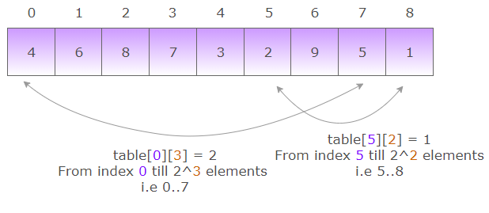
_____________

##### Finding the minimum value in a given range
_____________
The trick is to find two sub-ranges within the query range such that they cover the entire range. If the range in the query is “left..right”, we choose the largest 2^p block that fits within left and right. Thus if 2^p is the largest block within **( left .. right )**, then the first part is **( left .. left + 2^p - 1 )** and the second part is **( right + 1 - (2^p) .. right )**.


##### Example of range minimum query
_____________
For i = 2 and j = 7. Within range 2 … 7, the largest 2^p block would be of size 2^2. Thus,
Part 1 : 2 … ( 2 + 2^2 - 1) i.e from 2 … 5. of length ( 5 + 1 - 2 ) : 4. This is represented by sparse table [ 2 ][ 2 ].
Part 2 : ( 7 + 1 - 2^2 ) … 7. i.e from 4 … 7 of length ( 7 + 1 - 2^2 ) : 4. This is represented by sparse table [ 4 ][ 2 ].
So the RMQ ( 2, 7 ) = minimum ( table [ 2 ][ 2 ] , table [ 4 ][ 2 ] ) = 2.

**Time complexity of Range Minimum Queries using Sparse Table** : **O ( n . log (n) )**. Sparse table has **‘n’** rows and **‘log n’** columns. The sparse table takes **O ( n . log (n) )** time to fill up.

- **Module:** [sparse_table.py](Sparse_Table/sparse_table.py)

