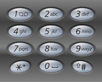

# Backtracking

## Properties and Applications

To generalize the characters of backtracking:

1. **No Repetition and Completion:**
It is a systematic generating method that avoids repetitions and missing any possible right solution. This property makes it ideal for solving combinatorial problems such as combination and permutation which requires us to enumerate all possible solutions.
1. **Search Pruning:**
Because the final solution is built incrementally, in the process of working with partial solutions, we can evaluate the partial solution and prune branches that would never lead to the acceptable complete solution: either it is invalid configuration, or it is worse than known possible complete solution.

In this blog, the organization is as follows:

1) **Show Property 1:** We will first show how backtrack construct the complete solution incrementally and how it backtrack to its previous state.

* On implicit graph: We use **permutation** and **combination** as examples.
* On Explicit Graph: Enumerating all pahts between the source and target vertex in a graph drawing.

2) Show Property 2: We demonstrate the application of search pruning in backtracking through CSP problems such as sudoku.

## Permutation

Before I throw you more theoretical talking, let us look at an example: Given a set of integers {1, 2, 3}, enumerate all possible permutations using all items from the set without repetition. A permutation describes an arrangement or ordering of items. It is trivial to figure out that we can have the following six permutations: [1, 2, 3], [1, 3, 2], [2, 1, 3], [2, 3, 1], [3, 1, 2], and [3, 2, 1].


> Fig 1: The graph of Permutation with backtracking
>

This is a typical combinatorial problem, the process of generating all valid permutations is visualized in Fig. 1. To construct the final solution, we can start from an empty ordering shown at the first level, [ ]. Then we try to add one item where we have three choices :1, 2, and 3. We get three partial solutions [1], [2], [3] at the second level. Next, for each of these partial solutions, we have two choices, for [1], we can either put 2 or 3 first. Similarly, for [2], we can do either 1 and 3, and so on. Given `n` distinct items, the number of possible permutations are `n*(n-1)*…*1 = n!`.

## Implicit Graph

In the graph, each node is either a partial or final solution. If we look it as a tree, the internal node is a partial solution and all leaves are final solutions. One edge represents generating the next solution based on the current solution. The vertices and edges are not given by an explicitly defined graph or trees, the vertices are generated ___on the fly___ and the edges are implicit relation between these nodes.

## Backtracking and DFS

The implementation of the state transfer we can use either BFS or DFS on the implicit vertices. DFS is preferred because theoretically it took O(log n!) space used by stack, while if use BFS, the number of vertices saved in the queue can be close to n!. With recursive DFS, we can start from node [], and traverse to [1,2], then [1,2,3]. Then we backtrack to [1,2], backtrack to [1], and go to [1, 3], to [1, 3, 2]. To clear the relation between backtracking and DFS, we can say **backtracking is a complete search technique and DFS is an ideal way to implement it**.

We can generalize Permutation, Permutations refer to the permutation of `n` things taken `k` at a time without repetition, the math formula is *(n-2)*...*k). In Fig.1, we can see from each level `k` shows all the solution of `A_{n}^{k}`. The generation of `A_{n}^{k}` is shown in the following Python Code:

```python
def A_n_k(a, n, k, depth, used, curr, ans):
  '''
  Implement permutation of k items out  of n items
  depth: start from 0, and represent the depth of the search
  used: track what items are  in the partial solution from the set of n
  curr: the current partial solution
  ans: collect all the valide solutions
  '''
  if depth == k: #end condition
    ans.append(curr[::]) # use deepcopy because curr is tracking all partial solution, it eventually become []
    return
  
  for i in range(n):
    if not used[i]:
      # generate the next solution from curr
      curr.append(a[i])
      used[i] = True
      print(curr)
      # move to the next solution
      A_n_k(a, n, k, depth+1, used, curr, ans)
      
      #backtrack to previous partial state
      curr.pop()
      print('backtrack: ', curr)
      used[i] = False
  return
```
> [permutation_with_backtracking.py](https://gist.github.com/liyin2015/db05ecfec37cc8a52867120bb395a0e7#file-permutation_with_backtracking-py)
>

Give the input of `a=[1,2,3]`, we call the above function with the following code:

```python
a = [1, 2, 3]
n = len(a)
ans = [[None]]
used = [False] * len(a)
ans = []
A_n_k(a, n, n, 0, used, [], ans)
print(ans)
```

The output is:

```python
[[1, 2, 3], [1, 3, 2], [2, 1, 3], [2, 3, 1], [3, 1, 2], [3, 2, 1]]
```

In the process, we add `print` before and after the recursive function call:

```python
[1]
[1, 2]
[1, 2, 3]
backtrack:  [1, 2]
backtrack:  [1]
[1, 3]
[1, 3, 2]
backtrack:  [1, 3]
backtrack:  [1]
backtrack:  []
[2]
[2, 1]
[2, 1, 3]
backtrack:  [2, 1]
backtrack:  [2]
[2, 3]
[2, 3, 1]
backtrack:  [2, 3]
backtrack:  [2]
backtrack:  []
[3]
[3, 1]
[3, 1, 2]
backtrack:  [3, 1]
backtrack:  [3]
[3, 2]
[3, 2, 1]
backtrack:  [3, 2]
backtrack:  [3]
backtrack:  []
```

## Two Passes

Therefore, we can say backtrack visit these implicit vertices in **two passes:** First forward pass to build the solution incrementally, second backward pass to backtrack to previous state. We can see within these two passes, the `curr` list is used as all vertices, and it start with `[]` and end with `[]`. This is the character of backtracking.

## Time Complexity of Permutation

In the example of permutation, we can see that backtracking only visit each state once. The complexity of this is similar to the graph traversal of O(|V|+|E|), where , because it is a tree structure, |E| = |v|-1. This actually makes the permutation problem NP-hard.

[Backtracking with LeetCode Problems — Part 2: Combination and all paths with backtracking](https://medium.com/@lisulimowicz/backtracking-with-leetcode-problems-part-2-705c9cc70e52).

[Backtracking with LeetCode Problems — Part 3: Constraint Satisfaction Problems with Search Pruning](https://medium.com/p/b225f19e0d51/edit).

## LeetCode Examples
[17. Letter Combinations of a Phone Number](https://leetcode.com/problems/letter-combinations-of-a-phone-number/description/)

Given a digit string, return all possible letter combinations that the number could represent.

A mapping of digit to letters (just like on the telephone buttons) is given below.



```
Input:Digit string "23"
Output: ["ad", "ae", "af", "bd", "be", "bf", "cd", "ce", "cf"].
```

**Note:**
Although the above answer is in lexicographical order, your answer could be in any order you want.


Solution: this is not exactly backtracking problem, however, we recursively add the next digit to the previous combinations. Time complexity will be O(3^n), which came from O(3+3²+3³+…+3^n). The difference is we know it is possible solution, if we keep searching the graph, it works (no constraint)

```python
def letterCombinations(self, digits):
        """
        :type digits: str
        :rtype: List[str]
        """
        mapping = {'2': 'abc', '3': 'def', '4': 'ghi', '5': 'jkl', 
                   '6': 'mno', '7': 'pqrs', '8': 'tuv', '9': 'wxyz'}
        
        def combine(rst, remain_digits):
            #end condition
            if len(remain_digits)==0:
                return rst
            if len(rst)==0:
                rst=['']
            nxt_rst=[]
            digit = remain_digits.pop(0)
            for r in rst:
                for c in mapping[digit]:
                    nxt_rst.append(r+c)                    
            return combine(nxt_rst,remain_digits) #nxt_rst = r+c
        
        return combine([],list(digits)) #first is current result
```

With backtrack:

[78. Subsets](https://leetcode.com/problems/subsets/description/)

Given a set of **distinct** integers, `nums`, return all possible subsets (the power set).

**Note:** The solution set must not contain duplicate subsets.

For example,
If ___**nums**___ = `[1,2,3]`, a solution is:

```python
[
  [3],
  [1],
  [2],
  [1,2,3],
  [1,3],
  [2,3],
  [1,2],
  []
]
```

Solution: because we dont care about the order, it is a combination (not a permutation). here we just use index+1 to pointer to the beignning of the possible paths. temp refers the curr: to record what we use, but when we return after the recursive call, we need to pop out. and keep adding the next element.


> time complexity is O(n*2^n), space complexity is O(2^n). How to get them?
>

```python
def subsets(self, nums):
        """
        :type nums: List[int]
        :rtype: List[List[int]]
        """
        
        #here we need a global wise list, each time we just append to the result
        rslt=[]
        
        def dfs(temp, idx):
            rslt.append(temp[:]) #pass temp[:] with shollow copy so that we wont change the result of rslt when temp is changed
            for i in range(idx, len(nums)):
                temp.append(nums[i])
                #backtrack
                dfs(temp, i+1)
                temp.pop()
                
                
        dfs([],0)
        return rslt
```

[46. Permutations](https://leetcode.com/problems/permutations/description/)

Given a collection of **distinct** numbers, return all possible permutations.

For example,

`[1,2,3]` have the following permutations:

```python
[
  [1,2,3],
  [1,3,2],
  [2,1,3],
  [2,3,1],
  [3,1,2],
  [3,2,1]
]
```

Solution: The permutation is similar as the last power set, the difference is we use each element at least and only one time, and we dont care about the order. So for the remaining elements, it is different.


```python
def permute(self, nums):
        """
        :type nums: List[int]
        :rtype: List[List[int]]
        """
        #here we need a global wise list, each time we just append to the result
        rslt=[]
        
        def dfs(temp, elements):
            #gather rslt
            if len(elements)==0:
                rslt.append(temp[:]) #still remember to use temp[:]
            for e in elements:
                temp.append(e)
                #backtrack
                next_elements=elements[:]
                next_elements.remove(e)
                elements.pop()
                dfs(temp, next_elements)
                temp.pop()
                
                
        dfs([],nums) #first is the current result
        return rslt
```

[More Summary](https://leetcode.com/problems/permutations/discuss/18284/Backtrack-Summary:-General-Solution-for-10-Questions!!!!!!!!-Python-(Combination-Sum-Subsets-Permutation-Palindrome))

[47. Permutations II](https://leetcode.com/problems/permutations-ii/description/)

Given a collection of numbers that might contain duplicates, return all possible unique permutations.

For example,

`[1,1,2]` have the following unique permutations:

```python
[
  [1,1,2],
  [1,2,1],
  [2,1,1]
]
```

Solution: The difference with the other permutation is, each time, we only append the unique element to temp.


```python
def permuteUnique(self, nums):
        """
        :type nums: List[int]
        :rtype: List[List[int]]
        """
        #here we need a global wise list, each time we just append to the result
        rslt=[]
        
        def dfs(temp, elements):
            #gather rslt
            if len(elements)==0:
                rslt.append(temp[:]) #still remember to use temp[:]
            for e in list(set(elements)): #this is the only difference
                temp.append(e)
                #backtrack
                next_elements=elements[:]
                next_elements.remove(e)
                dfs(temp, next_elements)
                temp.pop()
                
                
        dfs([],nums)
        return rslt
```

[301. Remove Invalid Parentheses](https://leetcode.com/problems/remove-invalid-parentheses/description/)

Remove the minimum number of invalid parentheses in order to make the input string valid. Return all possible results.

Note: The input string may contain letters other than the parentheses `(` and `)`.

**Examples:**

```
"()())()" -> ["()()()", "(())()"]
"(a)())()" -> ["(a)()()", "(a())()"]
")(" -> [""]
```

Solution: at the beignning, check the number of left parathese and the right parentheses need to be removed. Then use DFS (try all possible ways) with back tracking to get all possible solutions (when l, r decrease to zero, check if it is valid). To be noted: ___we need to avoid duplicates___


```python
def removeInvalidParentheses(self, s):
        """
        :type s: str
        :rtype: List[str]
        """
        def isValid(s):
            left_paren_count = 0
            for c in s:
                if c=='(':
                    left_paren_count+=1
                elif c==')':
                    if left_paren_count==0:
                        return False
                    left_paren_count-=1
                else:
                    continue
            return left_paren_count==0
        
        def getCount(s):
            rslt = True
            l, r = 0, 0 #extrac l or r parenthesis
            for c in s:
                l+=c=='('
                if c==')':
                    if l==0:
                        r+=1
                    else:
                        l-=1
            return (l,r)
        
        rslt =[]
        
        def dfs(s, idx, l, r):
            if l==0 and r==0:               
                if isValid(s): 
                    rslt.append(s)
                return 
            #delete extra l or r, every time we only delete one  
            for i in range(idx,len(s)):
                c=s[i]
                if i-1>=idx and c==s[i-1]: #to avoid duplication
                    continue
                if c==')':
                    new_s = s[:i]+s[i+1:]
                    dfs(new_s, i,l,r-1)
                if c=='(':
                    new_s = s[:i]+s[i+1:]
                    dfs(new_s, i,l-1,r)
          
        l, r = getCount(s)
        dfs(s,0, l,r)
        return rslt
```
