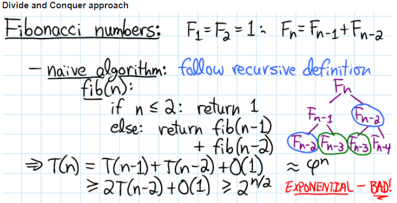

# Divide and Conquer

Divide and Conquer works by dividing the problem into sub-problems, conquer each sub-problem recursively and combine these solutions.

### Reference
- [Stackoverflow - Answer to -___Difference between Divide and Conquer Algo and Dynamic Programming___](https://stackoverflow.com/a/13538715)
- [MIT Lecture Notes](http://courses.csail.mit.edu/6.006/spring08/notes/lecture19.pdf)

