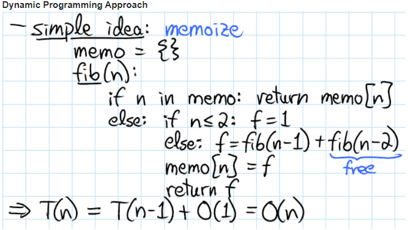

# Dynamic Programming

Dynamic Programming is a technique for solving problems with overlapping subproblems. Each sub-problem is solved only once and the result of each sub-problem is stored in a table ( generally implemented as an array or a hash table) for future references. These sub-solutions may be used to obtain the original solution and the technique of storing the sub-problem solutions is known as memoization.

You may think of `DP = recursion + re-use`

### Reference
- [Stackoverflow - Answer to -___Difference between Divide and Conquer Algo and Dynamic Programming___](https://stackoverflow.com/a/13538715)
- [MIT Lecture Notes](http://courses.csail.mit.edu/6.006/spring08/notes/lecture19.pdf)

