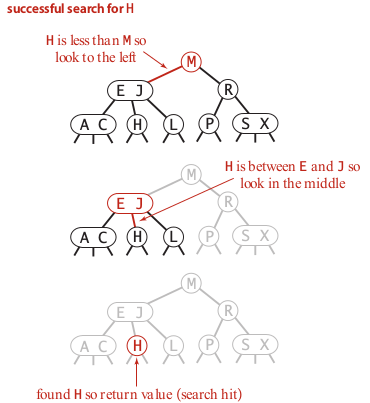
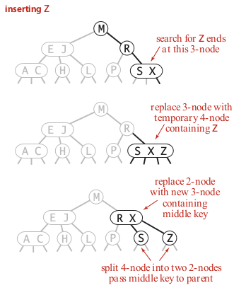

The balanced search trees a.k.a. [self-balancing binary search tree](https://en.wikipedia.org/wiki/Self-balancing_binary_search_tree) are a particular data structure used to solve the problem of unbalanced trees that arises when using standard binary trees. Idealy, a perfect binary tree should have log(n) height, and the time taken to find a node in the worst case should be log(N).
The time taken to reach a node is then proportional to the height of the tree, for this reason it is desirable to keep the height small. In standard binary trees it is possible to have degenerated trees having an extreme height. For example, if the items are inserted in sorted key order the resulting tree degenerates in a linked list having heigh N. The list `[54,55,56,57,58]` contains elements disposed in a sorted order. When the elements are inserted in a standard binary tree each node is linked on the right side of the previous one, leading to a tree of depth 5. The balanced trees solve the problem performing some operations during the key insertion, in order to keep the height proportional to log(N). Unfortunately, maintaining a perfect balanced tree has an high overhead and it is necessary to find a compromise between balance requirement and performance.

Implementation
---------------

**2-3 balanced search trees**: this type of tree can have 2-nodes (1 key, 2 links) or 3-nodes (2 keys, 3 links). 
As usual a link to an empty node is called a null link. The **search** procedure in case of a 2-node is the same used in standard binary trees. In the particular case of a 3-node we must move on the left if the searched value is less than the left value of the node, and move on the right if the searched value is greater than the right value of the node. It is necessary to move on the centre if the searched value is in between the two values associated to the node.

The operation of **insert** associated to a 2-node is easy to do. We scan the tree until the null link is reached (meaning the key is not in the tree), then we simply add the key into the 2-node making a 3-node, that's all. However when the terminal node is a 3-node there is much work to do and we can differentiate between three different cases:

1. *tree having only a single 3-node as root*: this is the easiest case and solving it is easy. We put the new key inside the 3-node creating a 4-node (3 keys, 4 links). Then we take the central key and we use it to create a parent node, whereas the side keys become the children.

2. *the 3-node has a 2-node as parent*: in this case we can proceed similarly to the previous case. The 3-node becomes a 4-node and the central key is used as a parent and integrated in the above 2-node, the original 3-node is then split generating two 2-nodes. After the operation the original parent node (that was a 2-node) now is a 3-node, whereas the child (that was a 3-node) now is represented by two separate 2-nodes.

3. *the 3-node has a 3-node as parent*: in this case the process described in the previous case is repeated multiple times until the parent node is a 2-node. This process can generate a problem when the root node is reached. In this case the temporary 4-node is associated to the root but it cannot be digested by an upper level. To solve the issue it is possible to split the 4-node into a parent node (that becomes the new root) and two children, similarly to what has been done in the case 1. The root splitting is the only case when the *height of the tree increase of one level*, and it happens when all the nodes along the search path are 3-nodes.

The use of all these local transformations preserve the global properties that the tree is balanced and ordered. Unlike standard binary trees, the 2-3 trees grow up from the bottom. The starting root node is pushed to the bottom and new nodes are added on the top of it. Using a 2-3 tree the heigh resulting from inserting 1 billion keys is between 19 and 30. 

The **drawbacks** associated to the 2-3 trees is that there is a lot of code involved and writing a 2-3 tree data structure is not easy because different cases should be considered. For instance having different node types (2-node, 3-node, 4-node) is cumbersome, there are many splitting cases to handle, it is necessary to move-up the tree when the parent is a 4-node.
It would be better to have a balanced tree with less overhead, this is possible using **Red-Black balanced trees** that are described in the next module.

Methods
--------

`put(key, value)`: insert a new pair of key-value. It must not be allowed to associate a `None` (python) value.

`get(key)`: return the value associated with the key. If the key does not exist it is possible to return `None`.

`remove(key)`: remove the key and the associated value.

Applications
------------

1. Dictionaries: which is the application that also gives the name to the data structure (key=word, value=definition)
2. Account management: it can be used to process transactions (key=account-id, value=transaction detail)
3. Web search: find relevant pages based on keywords (key=keyword, value=web-pages)

Quiz
-----

Material
--------
- **Coursera Algorithms Part 1**: week 4
- **Algorithms**, Sedgewick and Wayne (2014): Chapter 3.3 "Balanced Search Trees"
