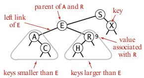

The [binary search trees](https://en.wikipedia.org/wiki/Binary_search_tree) (BSTs) are a particular type of [symbol tables](https://en.wikipedia.org/wiki/Symbol_table) data structure that combines the flexibility of insertion in a linked list with the efficiency of search in an ordered array. Specifically, using two links per node (instead of the one link per node found in linked lists) leads to a very efficient implementation. In a binary search tree each node has a key, a value, a left link, and a right link.

In the standard implementation the binary search tree has a node with lower key linked on the left, and the node with an higher key linked on the right.
Differently from the [binary heap](https://en.wikipedia.org/wiki/Binary_heap) data structure studied in the priority queue module, the binary tree has a structure where a parent node can have a lower weight compared to the child. For example, in a binary heap the root must always be the largest element, this is not true for a binary tree.

**Ordering.** Unlike linear data structures (Array, Linked List, Queues, Stacks, etc) which have only one logical way to traverse them, trees can be traversed in different ways. Following are the generally used ways for traversing trees:

- Depth First Traversals: (i) Inorder (Left, Root, Right), (ii) Preorder (Root, Left, Right), (iii) Postorder (Left, Right, Root).
- Breadth First or Level Order Traversal.

In case of BSTs, *inorder traversal* gives nodes in non-decreasing order. To get nodes of BST in non-increasing order, a variation of inorder traversal where inorder traversal is reversed can be used.

Implementation
--------------

1.  (binary search). The main problem is with the deletion operation (Hibbard deletion) that is the only method used today. The Hibbard deletion unbalance the three leading to sqrt(N) height.

Methods
--------

`put(key, value)`: insert a new pair of key-value. It must not be allowed to associate a `None` (python) value.

`get(key)`: return the value associated with the key. If the key does not exist it is possible to return `None`.

`remove(key)`: remove the key and the associated value.

`rank(key, lo, hi)`: (ordered array) the method is used in ordered array to search for a specific key using binary search. If the key is in the array it returns the index.

Applications
------------

1. Dictionaries: which is the application that also gives the name to the data structure (key=word, value=definition)
2. Account management: it can be used to process transactions (key=account-id, value=transaction detail)
3. Web search: find relevant pages based on keywords (key=keyword, value=web-pages)

Quiz
-----

Material
--------
- **Coursera Algorithms Part 1**: week 4
- **Algorithms**, Sedgewick and Wayne (2014): Chapter 3.2 "Binary Search Trees"
