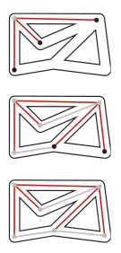
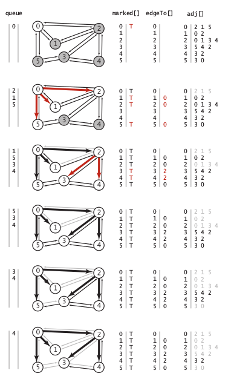
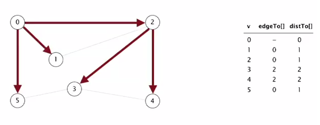

The [breadth-first search](https://en.wikipedia.org/wiki/Breadth-first_search) is an algorithm for traversing or searching tree or graph data structures. It starts at a specific node called **search key** and explores the neighbor nodes first, before moving to the next level neighbours. Differently from the depth-first search this algorithm is **not recursive**, instead it uses a queue to store all the adjacent node and mark them. Taking in consideration the same maze example used in previous module, we can think of breadth-first search as a group of searchers exploring by fanning out in all directions, each unrolling his or her own ball of string. When more than one passage needs to be explored, we imagine that the searchers split up to expore all of them; when two groups of searchers meet up, they join forces (using the ball of string held by the one getting there first).

<p align="center">

</p>

The idea is to add the unvisited node into a FIFO queue and mark it as visited. The it is necessary to pop an element from the queue, look to all the neighbours and add the unvisited to the queue and mark them. Repeat this process untill all the nodes are marked. The algorithm solves the problem of finding the **shortest path** between the starting node and all the other nodes. The time complexity needed for finding the shortest path is proportional to E+V.


Implementation
---------------

As in the previous module we suppose that the graph is stored as an adjacency-list. We use teh `edgeto_list[]` to save the incoming connections to a node (like in depth-first) and a `distto_list[]` data structure to keep track of the distance. We also need a FIFO `queue` object to store the marked nodes. In python we can use a `deque()` data structure and use the method `append()` to insert element in the queue and `popleft()` to get back the first element that was insert. As usual we keep track of the marked nodes in a list `marked_list[]`.

```Python
def breadth_first_search(s):
    queue = deque()
    queue.append(s)
    marked_list[s] = True
    print(s) #mark the starting node
    while(len(queue) != 0):
        v = queue.popleft() #important to pop-left (FIFO)
        adjacent_list = vertex_list[v] #get adjacent nodes
        for v_adj in adjacent_list:
            if marked_list[v_adj] == False:
                queue.append(v_adj)
                marked_list[v_adj] = True
                edgeto_list[v_adj] = v
                print(v_adj) #print marked node

```

The following is a representation of the trace of the algorithm on a given graph:

<p align="center">

</p>

The result of calling the algorithm from the vertex 0 of a graph is the following:

<p align="center">

</p>

Methods
--------

`breadth_first_search(v)`: iterative function to deep search in an adjacent-list of vertices.


Applications
------------

1. routing: find the shortest path between nodes
2. social networks: minimum degrees of separation between people

Quiz
-----


Material
--------
- **Coursera Algorithms Part 1**: week 4
- **Algorithms**, Sedgewick and Wayne (2014): Chapter 4.1 "Undirected Graph"
