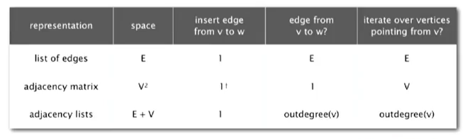
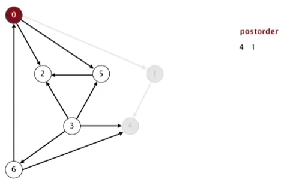
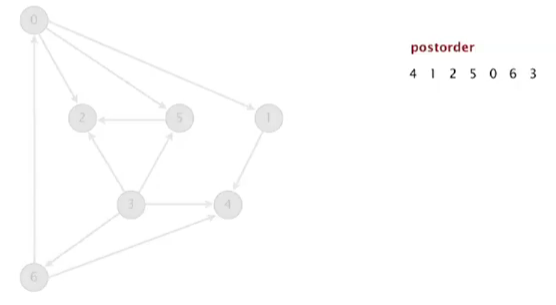
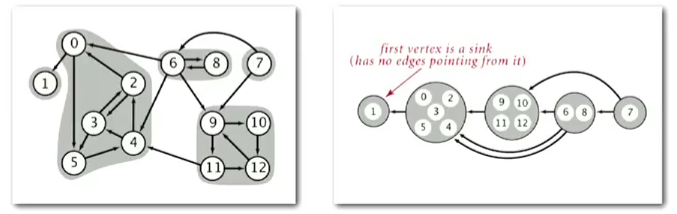

A directed graph or [digraph](https://en.wikipedia.org/wiki/Directed_graph) ) is a graph that is a set of vertices connected by edges, where the edges have a direction associated with them.The implementation strategy is the same seen for graph, and the best option remains to store the connections in a list of lists (adjacency-list). The value stored for each vertex is the list of nodes to witch it is pointing (outgoing edges). For this reason the time complexity to find all the connections going to a node (incoming edges) is V+E because it is necessary to scann all the vertices and all the associated nodes. This image represent the properties of each data-structure implementation for digraphs:

<p align="center">

</p>

**Search**: the first problem we analyse is finding all vertices reachable from a starting node `s` along directed paths. To solve this problem we can use **depth-first search** and the same code implemented for graphs. We can also reuse the code of **breadth-first search** since it is exactly the same. Using depth-first we can find the shortest path. For instance if we have a set of vertices {3, 4, 10} and we want to find which one has the shortest path to the vertex 6, we can run the breadth-first algorithm.

**Topological sort**: this is another application and consists in finding a topological order in a digraph. The edges represents constraints and relationships between the nodes. It is important that the digraph has no cycle. If there is a cycle somewhere then it is not possible to establish a hierarchy between nodes. To solve this problem it is possible to run a depth-first search and then return vertices in reverse postorder. The postorder is simply a list containing the nodes in which the depth-search terminates. For instance, starting from 0>1>4 we reach the end and we puth 4 into the postorder stack `[4]`. Then we go back to previous node 2 and we check if there we can run a depth-search from there. It turns out we cannnot, meaning that we can store also 1 in the postorder stack `[4, 1]`. We can go back to 0 now and the depth-search in this case can continue, because there are other nodes connected to 0, we cannot put it into the postorder stack for the moment. 

<p align="center">

</p>

The research continue until all the nodes have been marked. The stack will be full and it will contain the order to follow.

<p align="center">

</p>


The implementation of the algorithm is straightforward and only requires to add a single line of code to the standard depth-first search algorithm. The last line in the method is the one responsible of storing the dead node into the stack. The last line is called when the `adjacent_list[]` of nodes is spent, meaning that the root `v` does not have any more children and can be stored in postorder:

```Python
def depth_first_search(v):
    if marked_list[v] == False:
        marked_list[v] = True
        adjacent_list = vertex_list[v]
        for v_adj in adjacent_list:
            if marked_list[v_adj] == False:
                edgeto_list[v_adj] = v
                depth_first_search(v_adj)
        postorder_list.append(v) #this line does the postorder 
```

**Strong components**: two vertices `v` and `w` are said to be strongly connected if there is a connection from `v` to `w` and from `w` to `v`. A strong component is a set of vertices that are strongly connected. There may be multiple strong components in the same digraph, depending on its structure. There are different algorithms to solve this problem, but one of the most simple is the **Kosaraju-Sharir algorithm** which is based on depth-search. For this algorithm we will need to use the method `reverse()` which switch all the edges in a digraph in the opposite direction. An important property of strong components is that they remain the same also in the reverse graph. The algorithm is represented in this image:

<p align="center">

</p>

The first phase consists in running a topological sort using the postorder algorithm on the reverse digraph. The second phase consists in running a depth-search from each node contained in the reverse postorder list using the original graph (not the reversed graph). The starting node in the postorder list can have multiple unmarked children connected. All the children are assigned to the same component. When the search along one path is finished it is possible to pass to the next unmarked node contained in the postorder list and repeat the process incrementing the component counter. This algorithm is easy to implement but it has some bottlenecks due to the fact that is necessary to run depth-search twice and it is also necessary to compute the reverse graph. The implementation is very similar to the one used for the connected components in the undirected graph. The only difference is that the iteration is done on the `postorder_list[]` instead of the original list:

```Python
for v in postorder_list:
    if marked_list[v] == False:
        cc_list[v] = cc_counter #assign the ID to the starting node
        depth_first_search(v) #depth search from the starting node
        cc_counter += 1 #increment the ID counter
```

Obviously to obtain the `postorder_list[]` it is necessary to reverse the graph and find the topological order. It is important to notice that it is also possible to run the first phase on the original graph and the second phase on the inverted graph. This will give the strong connected components if the reverse graph. However we said that a graph and its reverse have the same strong connected components.

Implementation
---------------

Methods
--------

`add_edge(s, v)`: add an edge between two nodes

`reverse()`: return the digraph with all the edges switched

Applications
------------

- Garbage collection: in each programming language the garbage collector is implemented as a digraph, where each accessible reference (e.g. an object) is a root and all the references connected to it (e.g. object properties) are sub-nodes of a digraph. Using the mark-sweep algorithm it is possible to mark all reachable nodes, and reallocate the one that have not been marked during the sweep (they are garbage).

- web pages hyper-links: they are organised as digraph, and each website points to other websites.

Quiz
-----


Material
--------
- **Coursera Algorithms Part 1**: week 4
- **Algorithms**, Sedgewick and Wayne (2014): Chapter 4.1 "Undirected Graph"
