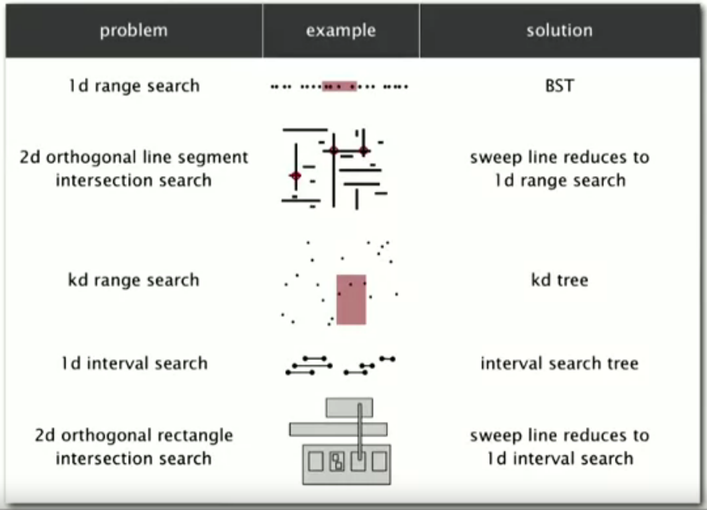

The [binary search trees](https://en.wikipedia.org/wiki/Binary_search_tree) (BSTs) are a particular type of [symbol tables](https://en.wikipedia.org/wiki/Symbol_table) data structure that combines the flexibility of insertion in a linked list with the efficiency of search in an ordered array. BSTs can be used in many geometric applications. Here is an overview of these geometric applications:

Implementation
--------------

Methods
--------

Applications
------------

Quiz
-----

Material
--------
- **Coursera Algorithms Part 1**: week 5
- **Algorithms**, Sedgewick and Wayne (2014): Chapter 3.2 "Binary Search Trees"
