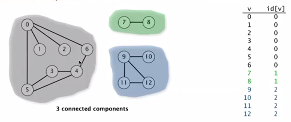

A [graph](https://en.wikipedia.org/wiki/Graph_(abstract_data_type)) is a set of vertices and a collection of edges that each connect a pair of vertices.

A **path** in a graph is a sequence of vertices connected by edges. A simple path is one with no repeated vertices. A **cycle** is a path with at least one edge whose first and last vertices are the same. A **simple cycle** is a cycle with no repeated edges or vertices (except the requisite repetition of the first and last vertices). The **length** of a path or a cycle is its number of edges.

A **tree** is an acyclic connected graph. A disjoint set of trees is called a **forest**. A **spanning tree** of a connected graph is a subgraph that contains all of that graph’s vertices and is a single tree. A **spanning forest** of a graph is the union of spanning trees of its connected components.

A graph is **connected** if there is a path from every vertex to every other vertex in the graph. A graph that is **not connected** consists of a set of **connected components**, which are maximal connected subgraphs. The following is a graph with 3 connected components:

<p align="center">

</p>

It is possible to find the number of connected components using the **union-find** discussed in the first module, or using the depth-first search algorithm discussed in the next modules.

Implementation
---------------

To store graphs we need to keep in mind space and time constraints.
First we must have the **space** to accommodate the types of graphs that we are likely to encounter in applications. Second we want to develop **time** efficient implementations of Graph instance methods. There are three possible way to represent graphs:

1. **adjacency matrix**: we can represent connections between V nodes with a matrix of size V*V. A particular entry in the matrix identify the presence of a connection between two nodes. The problem with this rapresentation is the space. We need V^2 space to store the graph.

2. **array of edges**: we can keep track of all the edges of the graph storing them into an array. For instance we can have a list of tuple `[(2,5), (0,3), (5,4), (0,1)]`. The positive thing is that the space usage is equal to V.
The problem with this representation is the time. We need to iterate the entire array to do the most common operations like add and remove an edge.

3. **array of adjacency lists**: we define an array of size V where each entry represent a specific vertex. In this array we store lists, representing the neighbours of that vertex. This representation is a tradeoff between space and time and it is the best one. We can add new edges in constant time and iterate through adjacent vertices in constant time per adjacent vertex. Space usage proportional to V+E.
The following image is an adjacency-list example:

<p align="center">

</p>

A simple `Graph` object based on the adjacency-list criteria can be created in python:

```Python
class Graph():
    def __init__(self, V):
        self.vertex_list = [[] for _ in range(V)]

    def add_vertex(v):
        self.vertex_list.append([])

    def add_edge(s, v):
        self.vertex_list[s].append(v)
```


Methods
--------

`add_edge(s, v)`: add an edge between two nodes

Applications
------------


Quiz
-----


Material
--------
- **Coursera Algorithms Part 1**: week 4
- **Algorithms**, Sedgewick and Wayne (2014): Chapter 4.1 "Undirected Graph"
