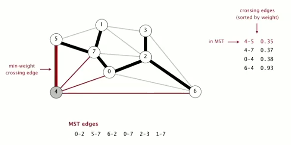
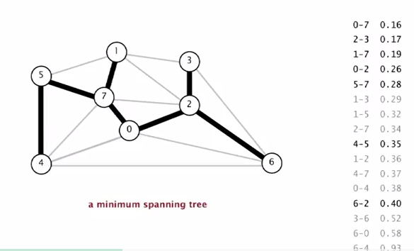
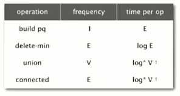
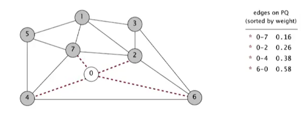
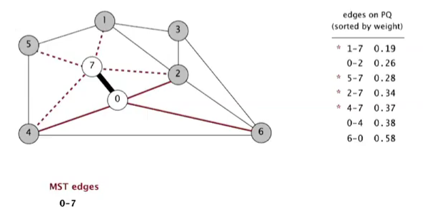
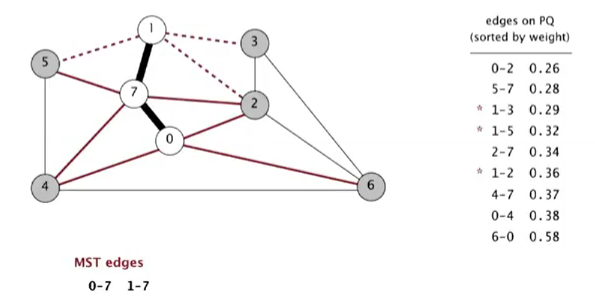
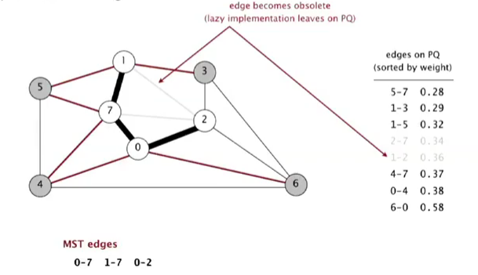
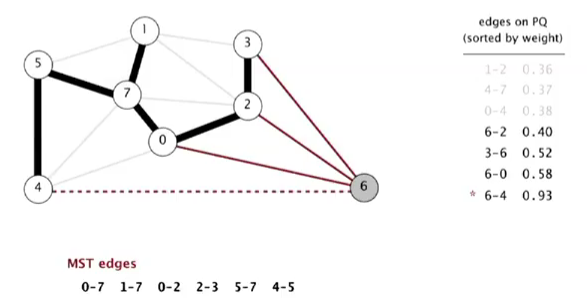
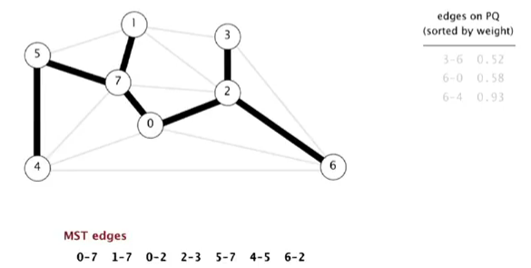

A [minimum spanning tree](https://en.wikipedia.org/wiki/Minimum_spanning_tree) or minimum weight spanning tree is a subset of the edges of a connected, edge-weighted (un)directed graph that connects all the vertices together, without any cycles and with the minimum possible total edge weight. 

<p align="center">

</p>


To understand the implementation of the algorithm it is necessary to define some properties. A **cut** in a graph is a partititon of its vertices into two non-empty sets. A **crossing edge** is any edge connecting a node in a set with a node in the other set. The cut and crossing edges are particularly important in the greedy algorithm.


Implementation
---------------


1. **Greedy algorithm**: this algorithm only works in the particular case of a graph having edges with all different weights. The idea is to look for the edge having lowest weight and save it. The property at the core of the algorithm is the following: given a cut, the crossing edge of minimum weight is part of the minimum spanning tree. The algorithm starts with a graph with no edges marked black. The first step is to compute a random cut. The crossing edge with minimum weight is marked black and added to the minimum-spanning tree. Now it is necessary to find a new cut that does not have any marked crossing edge. Once this new cut have been found, we can take the crossing edge of minimum weight and add it to the tree. The process continue until V-1 edges have been marked black. The minimum spanning tree is complete. The following is an image representing the computation of the last edge (4-5) of the minimum spanning tree:


<p align="center">

</p>


2. **Kruskal's algorithm**: this is an old algorithm (1956) that is based on simple principia. The first step is to sort all the edges by descending weights. The second step consists of a search through the edges, marking all the edges that do not create a cycle with the other marked edges. The first edge can be marked and directly included in the minimum spanning tree because it is the edge with the lowest weight and for sure is part of the tree. The following image is the result of applying the algorithm:

<p align="center">

</p>

The grey edges are the ones that have been discarded, whereas the black edges are the one that have been marked because they did not created cycles. The proof of the correctness of the algorithm demonstrates that it is a special case of the Greedy algorithm. When an edge is marked black it is because it is a crossing edge in a cut (if the edge create a loop is not a crossing edge). Now there is a problem, how can we be sure that the marked edge is the one with lowest weight among the other crossing edges? We are sure because the edges have been disposed in decreasing order, and the marked ones are for sure crossing edges having lowest weight. 

The most efficient data structure for storing edges in decreasing order is a priority queue. The edges are added to the queue that will automatically sort them based on the lowest weight.
The most efficient data structure for checking if adding and edge will create a cycle is the **union-find** discussed in the first module. This data structure allows a complexity of log(V) for checking the cycle, whereas using a depth-first search will take complexity V (see table below for complexity required by each step of the algorithm). The idea is to keep a set for each connected component. When a new connection is checked is necessary to look if the two nodes are in the same component, if this happens it means the connection will create a cycle. The following is a python-like pseudocode of the algorithm:

```python
#First we add the edges to the priority queue
for vertex in vertex_list:
    for tuple in vertex:
        priority_queue.push(tuple)

while(len(priority_queue) > 0):
    s, v, w = priority_queue.return_min() #enquee the minimum element
    if union_find.is_connected(s, v) == False: #check if vertices are not in the same component
        union_find.connect(s, v) #add the two vertices in the same component
        mst_list.append(s, v, w) #add the tuple to the minimum spanning tree
```

The time complexity of the algorithm is *E log(E)* and it is easy to understand why looking to a table with the complexity required by any passage:

<p align="center">

</p>

It is possible to see that the larger complexity is the *log(E)* required by the delete-min operation in the priority-queue, and this operation must be repeated *E* times leading to *E log(E)* total complexity.


3. **Prim's algorithm**: this is another algorithm for evaluating the minimum spanning tree. To use the algorithm we need a priority queue data structure, that is used to store temporary edges. Using the priority queue the edges are automatically sorted from minimum to maximum weight. The idea is to add to the queue only the edges having exactly **one endpoint** in the minimum spanning tree that we are growing. This principle is very important and is the core of the algorithm. We start the search from node 0 of the given graph *G*. We consider all the edges that connect 0 to the neighbours and we select the one having minimum weight (in this case 0-7). This edge is added to *T*:

<p align="center">

</p>

The next step consists in considering the connections from the node 7 to the neighbours. All the edges from 7 are added to the priority queue.
Then it is asked to return the minimum weight edge. In this case the edge with minimum weight is the one going to node 1:

<p align="center">

</p>

The edge 1-7 is added to the minimum spanning tree. The search continue pushing in the priority queue all the neighbours edges of node 1:

<p align="center">

</p>

The next step is particular, because we have to consider the edge with minimum weight in the queue. This edge is 0-2 meaning that it is necessary to turn our attention to node 2 that has not been marked yet. The edge 0-2 is added to the minimum spanning tree:

<p align="center">

</p>

When we marked node 2 some edges became obsolete and they could be removed from the queue because the do not respect the endpoint principia. However here we are implementing a **lazy** version of the algorithm and we keep these connections in the queue (it does not affect the algorithm). The algorithm continue until the last node (in our example is 6) is added to the minimum spanning tree.

<p align="center">

</p>

For the last node some connections are already in the queue (solid red) while others have been added (6-4, dashed red). It is important to notice that before arriving to the next minimum weight (6-2) it will be necessary to remove from the priority queue some obsolete edges (1-2, 4-7, 0-4).

<p align="center">

</p>

The following is a python-like pseudocode for the implementation of the lazy Prim's algorithm:

```python
marked_list = [False, False, False, ...] #list of marked nodes
mst_list = [] #minimum spanning tree list, will contain the edges
priority_queue_list = dequeue() #the queue for the temporary edges

#The node 0 edges are added to the queue
add_to_queue(Node 0, priority_queue_list)

#Main loop
while(len(priority_queue_list)>0):
    #pop one edge from the queue
    #Note: it is possible to use the Edge() class instead of tuple
    (v, w) = priority_queue_list.popleft()
    #Going forward to the next step only if at list one node is not endpoint
    if not marked_list[v] and marked_list[w]:
        mst_list.append(e) #the edge can be added to the list
        #Check which one of the two nodes is not-marked and add its neighbours
        if marked_list[v]: add_to_queue(v, priority_queue_list)
        if marked_list[w]: add_to_queue(w, priority_queue_list)
```

The *time complexity* of the lazy version of Prim's algorithm is in the worst case *E log(E)* because it is necessary to visit all the edges (E) and the binary heap (priority queue) associate to each one of them. There is a more efficient solution proposed by **Eager**

Methods
--------

A rough solution to implement a weighted graph is our usual adjacency list, where for each node we store a list of tuple `(s, v, w)` representing the starting node, the end node and the connection weight.

To implement this kind of weighted graph it may be possible to define a new class called `Edge()` that takes as parameters the starting vertex `s` the end vertex `v` and the weight `w`. Some methods can be associated to this class. For instance a method `return_either()` that returns the head vertex of the edge. Another method `return_other(v)` will return the other vertex contained in the edge (if passing `s` returns `v`, if passing `v` returns `s`). The either and other methods are useful because we are going to store the same edges twice, and associate it with two vertices in the adjacency-list. A method `compare_weight(Edge e)` can be implemented in order to compare the weight of the current object with the weight of another edge.

The graph itself can be implemented into a class called `WeightedGraph(V)` that takes in input the total number of vertices. A method called `add_edge(Edge e)` will include an edge object into the class. The edge can be stored into our usual adjacency-list. The edge object must be associated to both the vertices that are into it.

Applications
------------

1. 

Quiz
-----


Material
--------
- **Coursera Algorithms Part 2**: week 
- **Algorithms**, Sedgewick and Wayne (2014): Chapter  ""
