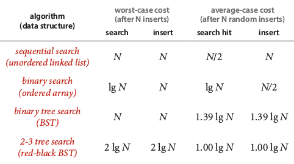
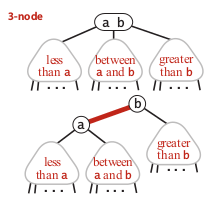
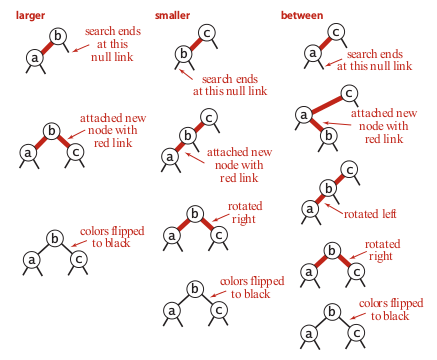

The [red-black](https://en.wikipedia.org/wiki/Red%E2%80%93black_tree) balanced search trees are a particular data structure used to solve the problem of unbalanced trees and to avoid the overhead of 2-3 balanced tree. Red-black trees are both 2-3 trees and standard binary trees. From standard trees they take the simplicity of the search method, whereas from the 2-3 trees they take the balanced insertion method. However, respect to standard trees the red-black trees do not get unbalanced if the key are inserted in increasing order, and they do not have all the problems we found in the 2-3 trees (e.g. there are not multiple node types and splitting cases). Comparing this data structure with the ones studied in previous modules we can see the advantages in term of complexity:

This data structure guarantees a **time complexity** of O(log N) in all the operations of search, insert, and delete. The **space complexity** is almost identical to a standard tree, because the only additional information required is the colour of the link, that can be stored in a single bit. 

We think of the links as being of two different types: **red links**, which bind together two 2-nodes to represent 3-nodes, and **black links** which bind together the 2-3 tree. In 2008, Sedgewick introduced a simpler version of the red–black tree called the left-leaning red–black tree by eliminating a previously unspecified degree of freedom in the implementation. In this implementation (the same discussed here) all red links must lean left except during inserts and deletes.

There are three main properties that must hold in order to have a red-black tree:

- Red links lean left.
- No node has two red links connected to it.
- The tree has perfect black balance: every path from the root to a null link has the same number of black links

The red-black trees, while not perfectly balanced, are always nearly so, regardless of the order in which the keys are inserted. This fact immediately follows from the correspondence with 2-3 trees and the defining property of 2-3 trees (perfect balance). The **height** of a red-black tree with N nodes is no more than 2 log N. The **worst case** is a 2-3 tree that is all 2-nodes except that the leftmost path is made up of 3-nodes. The path taking left links from the root is twice as long as the paths of length log N that involve just 2-nodes. However the **average length** of a path from the root to a node is ~1.00 log N.

Implementation
---------------

An additional Boolean property called `colour` can be added to the standard code of a balanced tree. Since each node has only one and only one incoming link, it is possible to embed the property inside the node itself. If the incoming link is red then `node.colour=Red` (where `Red` is the boolean `True`). An additional method called `isRed(node)` can be used to return the colour of the node. By convention the null links are black. The adjustments to the tree are governed by three fundamental operations:

1. **left rotation**: it is used in order to correct missplaced red links (right-leaning red links). The rotation switches the orientation of red links through the methods `rotateLeft()`. The left rotation is used when we have a right-leaning red link that needs to be rotated to lean to the left. The idea is to switch the head node `h` right link with the left link of its child node `x`, then assign to the empty left link of `x` the parent node `h`. After those operations it is necessary to reset the colours associated with the two nodes. The colour associated to `h` becomes equal to the previous colour associated to `h` (we set `x.colour=h.colour`). The incoming connection to `h` is red for sure (we set `h.colour=Red`), because the node has been placed on the right side of `x` and the right nodes are red for convention. 

2. **right rotation**: is done in special cases using the method `rotateRight()`. It is important to notice that this is a temporary operation, and the red link is only temporary moved to the right. This operation is used when there are two red links in a row on the left side of a tree. A rotate right is used to temporary adjust the tree, moving the node that is located in between the two red links from the left side to the right side (see third case in image below).

3. **flip colours**: this operation is done when both children are red. In this case they are both flipped to black, and the incoming link is flipped as well (to red if black, and to black if red).

The rotations and flipping operations are all used during the creation of the tree. Here we can see three cases:

All the above operations are only used in the method `put()` and in the method `remove()`, the other methods are the same used in standard binary trees. In particular, it is important to notice that he `get()` method does not examine the node colour, so the balancing mechanism adds no overhead. Search is faster than in elementary binary trees because the tree is balanced.

Methods
--------

`put(key, value)`: insert a new pair of key-value. It must not be allowed to associate a `None` (python) value.

`get(key)`: return the value associated with the key. If the key does not exist it is possible to return `None`.

`remove(key)`: remove the key and the associated value.

`isRed()`: check the colour of the node

`rotateLeft()`: implementation of the rotate left operation

`rotateRight()`: implementation of the rotate right operation

Applications
------------

1. [computational geometry](https://en.wikipedia.org/wiki/Computational_geometry): many data structures used in computational geometry can be based on red–black trees.
2. scheduler: the [Completely Fair Scheduler](https://en.wikipedia.org/wiki/Completely_Fair_Scheduler) used in current Linux kernels uses red–black trees. 

Quiz
-----

Material
--------
- **Coursera Algorithms Part 1**: week 4
- **Algorithms**, Sedgewick and Wayne (2014): Chapter 3.3 "Balanced Search Trees"
