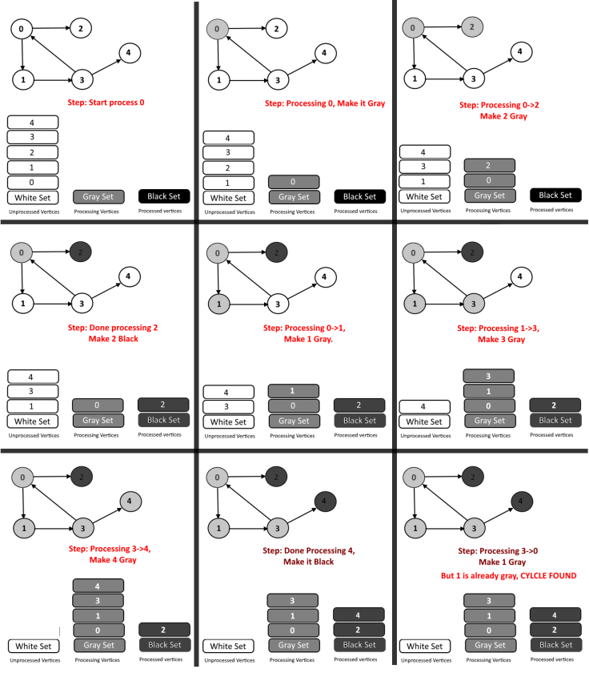

Given a directed graph it is possible to use the [Depth-First Search (DFS)](https://en.wikipedia.org/wiki/Depth-first_search) algorithm for finding loops or providing a topological sorting of vertices. There may be two type of cycles:

1. Edge from a vertex to itself. Self loop.
2. Edge from any descendent back to vertex.

The first type is easy to find. For both of them we can use DFS.

- Do the DFS from each vertex.
- (during DFS) keep track of visiting vertices in a *recursion stack* `stack[]`.
- If we encounter a vertex which is already present in the recursion stack, then we have found a cycle.
- Use `visited[]` to keep track of already visited vertices.

How different is `stack[]` from `visitied[]`?
The `visited[]` array is used to keep track of exhausted vertex, those vertex that have already been explored (all children have been explored, or a child vertex with no additional children).
The `stack[]` is used to keep track of visited vertices during DFS from a particular vertex; we reset it if no cycle has been found from that vertex.

There is a way to better understand the process using colours:

- **White set:** the set of vertex that has still to be visited (at the beginning it contains all vertices).
- **Grey set:** corresponds to the `stack[]` and it contains vertices that have been explored by DFS but not exhausted.
- **Black set:** corresponds to `visited[]` and contains the vertices that have been completely explored (exhausted).

The black set is useful as it help us in avoiding exploring old paths if that node exploration has been already done. In other words, it marks the vertices whose children have been visited, or vertices that have been explored and do not have children (leaf nodes).

Below an example with a simple graph:

<p align="center">

</p>

Implementation
--------------

```python
## Python pseudo-code
# graph: as an adjacency list
# white_set: a set can simply be a list in range(0, tot_vertices)
# grey_set: assuming it is a python set
# black_set: assuming it is a python set
def find_cycle(vertex, grey_set, black_set):
    # white_set.remove(vertex) # optional
    grey_set.add(vertex)
    for child in graph[vertex]: # iterate over children
        if(child in grey_set): return True
        elif(child in black_set): is_cyclic=False # this child is exhausted
        else: is_cyclic = find_cycle(child, grey_set, black_set) # continue exploration

        if(is_cyclic==True): return True # cycle has been found, stop iterations
        
    # the vertex is exhausted
    grey_set.remove(vertex)
    black_set.add(vertex)
    return False
```

Example 1
--------

This is a [leetcode problem](https://leetcode.com/problems/course-schedule/) (medium difficulty).

**Problem:** There are a total of `numCourses` courses you have to take, labeled from `0` to `numCourses-1`. Some courses may have prerequisites, for example to take course `0` you have to first take course `1`, which is expressed as a pair: `[0,1]`. Given the total number of courses and a list of prerequisite pairs, is it possible for you to finish all courses?

```
Input: numCourses = 2, prerequisites = [[1,0]]
Output: true
```
Explanation: There are a total of 2 courses to take. To take course 1 you should have finished course 0. So it is possible.

```
Input: numCourses = 2, prerequisites = [[1,0],[0,1]]
Output: false
```
Explanation: There are a total of 2 courses to take. To take course 1 you should have finished course 0, and to take course 0 you should also have finished course 1. So it is impossible. 

**Solution:** a compact solution requires to turn the edge list into a graph and then apply the DFS algorithms as explained above.

```python
class Solution:
    def canFinish(self, numCourses: int, prerequisites: List[List[int]]) -> bool:
    
        ## Iterative method
        def find_cycle(vertex):
            # white_set.remove(vertex) # optional
            grey_set.add(vertex)
            for child in graph[vertex]: # iterate over children
                if(child in grey_set): return True
                elif(child in black_set): is_cyclic=False # this child is exhausted
                else: is_cyclic = find_cycle(child) # continue exploration
                if(is_cyclic==True): return True # cycle has been found, stop iterations        
            # the vertex is exhausted
            grey_set.remove(vertex)
            black_set.add(vertex)
            return False
        
        ## Generate the graph from edges
        graph = [[] for _ in range(numCourses)]
        for edge in prerequisites:
            node, outgoing = edge
            graph[node].append(outgoing)
            
        ## Start the search 
        grey_set = set()
        black_set = set()        
        for vertex in range(numCourses):            
            is_cyclic = find_cycle(vertex)
            if(is_cyclic): return False
        return True
```

Example 2
----------

This is a [leetcode problem](https://leetcode.com/problems/course-schedule-ii/) (medium difficulty).

**Problem:** There are a total of n courses you have to take, labelled from 0 to n-1. Some courses may have prerequisites, for example to take course 0 you have to first take course 1, which is expressed as a pair: [0,1]. Given the total number of courses and a list of prerequisite pairs, return the **ordering** of courses you should take to finish all courses. There may be multiple correct orders, you just need to return one of them. If it is impossible to finish all courses, return an empty array.

```
Input: 4, [[1,0],[2,0],[3,1],[3,2]]
Output: [0,1,2,3] or [0,2,1,3]
```

Explanation: There are a total of `4` courses to take. To take course `3` you should have finished both courses `1` and `2`. Both courses `1` and `2` should be taken after you finished course `0`. So one correct course order is `[0,1,2,3]`. Another correct ordering is `[0,2,1,3]`.

**Solution:** we can use a minimal variation of the solution to the Example 1. We just need to introduce an `output` list in which storing the nodes once they are exhausted.

```python
class Solution:
    def findOrder(self, numCourses: int, prerequisites: List[List[int]]) -> List[int]:
        ## Iterative method
        def find_cycle(vertex):
            # white_set.remove(vertex) # optional
            grey_set.add(vertex)
            for child in graph[vertex]: # iterate over children
                if(child in grey_set): return True
                elif(child in black_set): is_cyclic=False # this child is exhausted
                else: is_cyclic = find_cycle(child) # continue exploration
                if(is_cyclic==True): return True # cycle has been found, stop iterations        
            # the vertex is exhausted
            grey_set.remove(vertex)
            black_set.add(vertex)
            if vertex not in output: output.append(vertex) # appending in output
            return False
        
        ## Generate the graph from edges
        graph = [[] for _ in range(numCourses)]
        for edge in prerequisites:
            node, outgoing = edge
            graph[node].append(outgoing)
           
        ## Start the search
        output=list() # Adding an output list
        grey_set = set()
        black_set = set()        
        for vertex in range(numCourses):
            is_cyclic = find_cycle(vertex)
            if(is_cyclic): return []
        return output
```

Material
--------
