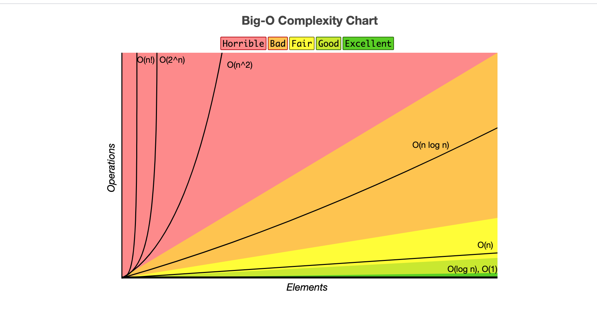
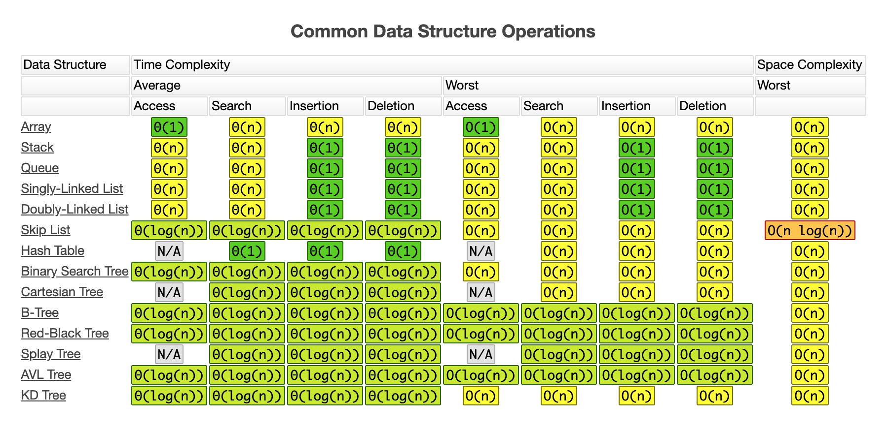
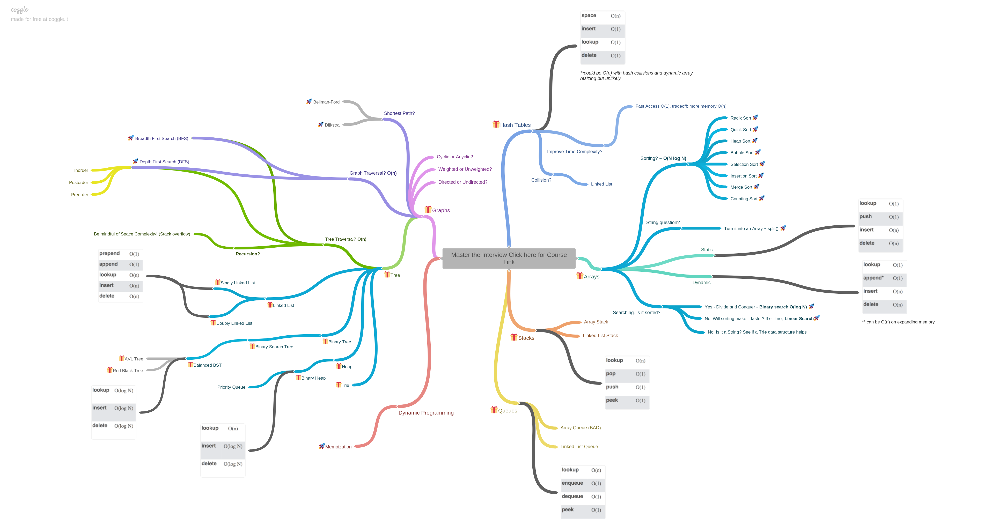

# 2021_Interview_Prep
My notes for my 2021 Interview Preparation.

We'll cover the following:
* [1: Resources](#1-resources)
* [2: Data Structures](#2-data-structures)
* [3: Algorithms](#3-algorithms)

## 1. Resources

* [Time-Complexity-Visualization](./python_notebooks/Time-Complexities.ipynb) - This ipynb contains a visualization to the time-complexity analysis - which function grows faster? Why we omit the constants, or why we take the highest degree?
* [Resource.md](./docs/Resource.md) - `Resource` for coding interview (**keep updating**)
* [ref.md](./docs/ref.md) - Leetcode ref
* [CodeInterviewCheatsheet](./docs/cheatsheet/code_interview_cheatsheet.pdf) - Coding interview cheetsheet
* [repl.it](https://repl.it/) - Coding online!
* Visualization
	- [visualgo - DFS / BFS](https://visualgo.net/en/dfsbfs?slide=1) - DFS, BFS visualization
	- [visualgo - linkedlist](https://visualgo.net/en/list) - Linkedlist visualization
	- [visualgo - BST](https://visualgo.net/bn/bst) - binary search tree visualization
	- [toptal-sorting-algorithms](https://www.toptal.com/developers/sorting-algorithms)- sorting algorithms online 
* [How to: Work at Google](https://www.youtube.com/watch?v=XKu_SEDAykw) — Example Coding/Engineering Interview
* [bit_manipulation.md](./docs/bit_manipulation.md) - Bit Manipulation Cheet Sheet
* [Py TimeComplexity](https://wiki.python.org/moin/TimeComplexity) - Python TimeComplexity doc
* [Py data model](https://docs.python.org/3/reference/datamodel.html) - Python data model doc 
* [SQL exercises](https://www.w3resource.com/sql-exercises/) - w3resource SQL exercises
* [SQL tutorial](https://mode.com/sql-tutorial/) - mode.com sql tutorial
* [SQL zoo](https://sqlzoo.net/) - SQL test
* [Books](books)
* [freecodecamp - data-structures](https://www.freecodecamp.org/news/tag/data-structures/)
* [LC interview-experience](https://leetcode.com/discuss/interview-experience?currentPage=1&orderBy=hot&query=)
* [Cheatsheet](https://github.com/yennanliu/CS_basics/tree/master/doc/cheatsheet)
* LC Pattern
	- [leetcode-patterns](https://github.com/SeanPrashad/leetcode-patterns)
	- [14-patterns-to-ace-any-coding-interview-question](https://hackernoon.com/14-patterns-to-ace-any-coding-interview-question-c5bb3357f6ed)
	- [LC pattern @ blind](https://www.teamblind.com/post/New-Year-Gift---Curated-List-of-Top-100-LeetCode-Questions-to-Save-Your-Time-OaM1orEU)
	- [grokking-the-coding-interview](https://www.educative.io/courses/grokking-the-coding-interview)
* LC problems
	- [leetcode_company_V1](./docs/leetcode_company_V1)
	- [leetcode_company_V1](./docs/leetcode_company_V2.md)
	- [leetcode_classics_collection](./docs/leetcode_classics_collection.md)
	- [leetcode_classics_collection_extra](./docs/leetcode_classics_collection_extra.md)
* [Mega Project List](https://github.com/karan/Projects) 

## 2. Data Structures

|**[Arrays](./001_Data_Structures/arrays/README.md)**| | |
|:---|:---|:---|
|Arrays|[code](./001_Data_Structures/arrays/Arrays.py)|[notes](./001_Data_Structures/arrays/README.md)|
|**[Lists](./001_Data_Structures/lists/README.md)**| | |
|Lists|[code](./001_Data_Structures/lists/Lists.py)|[notes](./001_Data_Structures/lists/README.md)|
|**[Linked Lists](./001_Data_Structures/linked-lists/LinkedLists.md)**| | |
|Singly Linked List|[code](./001_Data_Structures/linked-lists/SinglyLinkedList.py)|[notes](./001_Data_Structures/linked-lists/README.md#singly-linked-list)|
|Doubly Linked List|[code](./001_Data_Structures/linked-lists/DoublyLinkedList.py)|[notes](./001_Data_Structures/linked-lists/README.md#doubly-linked-list)|
|Circular Linked List|[code](./001_Data_Structures/linked-lists/circular_linked_list.py)|[notes](./001_Data_Structures/linked-lists/LinkedLists.md#circular-linked-list)|
|**[Stacks](./001_Data_Structures/stacks/Stacks.md)**|||
|LIFO|[code](./001_Data_Structures/stacks/Stacks.py)|[notes](./001_Data_Structures/stacks/README.md)|
|**[Queues](./001_Data_Structures/queues/Queues.md)**|||
|FIFO|[code](./001_Data_Structures/queues/Queue.py)|[notes](./001_Data_Structures/queues/README.md#FIFO)|
|Deque|[code](./001_Data_Structures/queues/Deque.py)|[notes](./001_Data_Structures/queues/README.md#deque)|
|Priority Queue|[code](./001_Data_Structures/queues/PriorityQueue.py)|[notes](./001_Data_Structures/queues/README.md#priority-queue)|
|Circular Queue|[code](./001_Data_Structures/queues/CircularQueue.py)|[notes](./001_Data_Structures/queues/Queues.md#circular-queue)|
|**[Trees](./001_Data_Structures/trees/Trees.md)**|||
|BST|[code](./001_Data_Structures/trees/trees/BinarySearchTree.py)|[notes](./001_Data_Structures/trees/README.md#binary-search-tree-bst)|
|AVL|[code](./001_Data_Structures/trees/trees/avl.py)|[notes](./001_Data_Structures/trees/trees/README.md#adelson-velskii-and-landis-avl-tree)|
|Red-Black|[code](./001_Data_Structures/trees/trees/rb_tree.py)|[notes](./001_Data_Structures/trees/trees/README.md#red-black-tree)|
|**[Hash Tables](./001_Data_Structures/hash-tables/HashTable.md)**|||
|Hash Table|[code](./001_Data_Structures/hash-tables/hash_table.py)|notes|
|Hash Table w/ Linked List|[code](./001_Data_Structures/hash-tables/hash_table_with_linked_list.py)|notes|
|Double Hash|[code](./001_Data_Structures/hash-tables/double_hash.py)|notes|
|Open Addressing|[code](./001_Data_Structures/hash-tables/open_addressing.py)|[notes](./001_Data_Structures/hash-tables/README.md#open-addressing)|
|Separate Chaining|[code](./001_Data_Structures/hash-tables/separate_chaining.py)|[notes](./001_Data_Structures/hash-tables/README.md#separate-chaining)|
|**[Heaps](./001_Data_Structures/heaps/README.md)**|||
|Heaps|[code](./001_Data_Structures/heaps/Heap.py)|[notes](./001_Data_Structures/hash-tables/README.md)|
|**[Graphs](./001_Data_Structures/graphs/Graphs.md)**|||
|Graph|[code](./001_Data_Structures/graphs/Graph.py)|[notes](./001_Data_Structures/graphs/Graphs.md)|
|Adjacency List|[code](./001_Data_Structures/graphs/adjacency_list.py)|[notes](./001_Data_Structures/graphs/README.md#adjacency-list)|
|Adjacency Matrix|[code](./001_Data_Structures/graphs/adjacency_matrix.py)|[notes](./001_Data_Structures/graphs/README.md#adjacency-matrix)|

|data structure| to build | insert | search | delete | Notes|
|---|:--------:|:------:|:------:|:------:|------|
|bst | `O(nlgn)` | `O(lgn)` | `O(lgn)` | `O(lgn)` | This tree can break down to `O(n)` search performance if the input is sorted, and `O(n**2)` to build it in initially |
|b-tree| `O(nlogn)` | `O(logn)` | `O(logn)` | `O(logn)` | The base of the logarithm is the maximum children per block.|
|trie | `O(nm)` | `O(m)` | `O(m)` | `O(m)` | `m` is the item length in pieces. | 
|linked list|`O(n)` | `O(1)` | `O(n)` | `O(1)` | Building the list requires simply appending or prepending items, inserting is therefore constant, however, deleting assumes you've already found it, so it's constant time. |
|sorted linked list|`O(n**2)`| `O(n)` | `O(n)` | `O(1)` | Every node you insert might need to go to the end, there are ways to optimize against sorted input such as using a doubly-linked list and keeping track of the median value.|
|hashtable| `O(n+m)` | `O(1)` | `O(1)` | `O(1)` | `m` is the size of the table.  These really are amortized values because occasionally we'll need to grow or shrink the table.  Also if we're using a data structure to handle collisions, there can be some extra work there but it can be kept minimal by a good hashing function.|

## 3. Algorithms

|sorting algorithm| Best Case | Average Case | Worst Case | Notes |
|---|:---------:|:------------:|:----------:|-------|
|mergesort| `O(nlgn)` | `O(nlgn)` | `O(nlgn)` | It builds the new array separately using `O(n)` space|
|insertion sort| `O(n)` | `O(n**2)` | `O(n**2)` | If the list is sorted or mostly this is fast.|
|counting sort| `O(n+k)` | `O(n+k)` | `O(n+k)` | `k` is highest value possible, because it builds the counting table|
|quicksort| `O(nlgn)` | `O(nlgn)` | `O(n**2)` | You can force `O(nlgn)` worst case by randomizing the input.  Traditionally isn't great on sorted input, however, by different partition schemes you can get it to `O(n)` if presorted.|

* [Algorithm-Notes](./003_Algorithms/README.md)
* [Algorithm-Notes](./003_Algorithms/README.md)
